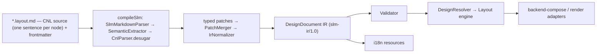

# Semantic Layout Markdown с i18n

[← Оглавление](README.md)

`Semantic Layout Markdown` (`SLM`) - это markdown-like формат, который описывает
экран, а затем компилируется в строгий JSON IR.

**Авторская поверхность SLM — это CNL (controlled natural language): английский,
одно предложение на узел, на полном паритете с IR, полностью двунаправленный** —
разбор (`CnlParser`) + детерминированный эмит (`CnlEmitter`, управляемый общим
реестром дескрипторов `CnlGrammar`) + хирургический write-back (`CnlWriter`).
Авторского escape-слоя нет. CNL-предложения десугарятся **напрямую** в типизированные
патчи (`CnlDirectDesugar` → `DirectPatchEntry`) — внутри компилятора нет никакого
YAML-прохода. Сырые типизированные YAML-блоки (`node:` / `layout:` / `style:` / …)
**больше не поддерживаются как авторская поверхность**: такая строка получает
предупреждение `Raw YAML typed blocks are no longer supported; author CNL instead`
и остаётся прозой. `` ```ir ``-фенсы тоже не поддерживаются (любой fenced-блок
игнорируется с предупреждением). YAML живёт **только во frontmatter**.

## Две i18n-задачи

С поддержкой i18n архитектура должна решать две разные задачи:

```text
1. Authoring language
   CNL-исходник пишется только на английском; локализуемая копия — в text-литералах «…».

2. Product localization
   UI, полученный из IR, может рендериться на разных языках.
```

Главный принцип:

```text
Язык видимого текста не должен попадать в структуру приложения.
Видимая копия живёт в text-литералах «…» и выносится в i18n resources.
IR должен быть language-neutral.
```

## Цель

Формат должен:

- выглядеть как обычный Markdown;
- требовать минимум служебных вставок;
- поддерживать переменные, условия, повторы и действия;
- выражать каждый узел одним CNL-предложением на полном паритете с IR;
- генерировать i18n-ключи и resource bundles из text-литералов;
- компилироваться в строгий JSON IR;
- быть независимым от renderer: Figma, React, HTML, Canvas, Native;
- быть достаточно точным, чтобы описать финальный Figma-like screen/frame.

## CNL: узел = предложение (основной формат авторинга)

Авторская поверхность SLM — **контролируемый естественный язык (CNL)**: каждый элемент
описывается одной строкой-**предложением** из фраз `keyword value…`. **CNL — английский**,
на полном паритете с IR, полностью двунаправленный. Это не «удобство поверх YAML»:
альтернативного способа авторинга нет, а внутренняя цель desugar — типизированные
Kotlin-патчи, не YAML.

```md
## AutoLayout: Missions Panel column gap 16 padding 24 color #FFFFFF radius 12

Rectangle 120 by 15 color #00B843 radius 15
Text «Active missions» size 20 bold color #0F172A
```

- **Существительное** в начале строки задаёт тип узла (`Rectangle`/`rect`, `Ellipse`/`circle`,
  `Text`/`label`, `Button`, `Frame`/`group`/`container`, `Image`, `Icon`/`vector`, `Instance`, …;
  полный список — в разделе «CNL Phrase Reference»).
- **Фразы-свойства** идут после существительного и упорядочены детерминированно по полю `order`
  дескриптора (см. «Implicit descriptor order»): размер (`120 by 15`), цвет (`color #00B843` /
  `color $token`), радиус (`radius 15`), поворот (`rotation 30`), паддинги (`padding 24`), отступ
  (`gap 16`), направление (`column|row|grid`), выравнивание в родителе (`align center`), позиция
  (`position X Y`), прозрачность (`opacity N`); для текста — `size N`, `bold`, `font «…»`, а видимая
  копия в `«…»`/`"…"`.
- **Контейнеры — заголовки** (`##`/`###`); заголовок может нести те же layout/style-фразы после
  имени. Вложенность — уровнями заголовков.

CNL **десугарится напрямую во внутренние типизированные патчи** (`node`/`shape`/`layout`/`style`/
`text` и т.д.): `CnlParser` понижает каждое предложение через `CnlDirectDesugar` в
`DirectPatchEntry` — типизированное Kotlin-представление, без какого-либо YAML-round-trip'а
(старые YAML-block-readers удалены). Эти патчи — desugar-механика, а не авторская форма.
Реализация — пакет `engine/frontend/.../cnl/`: `CnlGrammar` (реестр дескрипторов — единый источник
истины для parse и emit), `CnlVocabulary` (таблицы ключевых слов/энумов, **только английские**),
`CnlParser` + `CnlDirectDesugar`, `CnlEmitter` (детерминированный IR→CNL), `CnlDocumentSections`
(документные секции `# Collection`/`# Styles`/`# Prototype Variables`/`# Component:`),
`CnlDiagnostics`; write-back правит предложение хирургически (`edit/CnlWriter`). Полный словарь,
примеры-экраны и каталог ошибок — в `SLM-SKILL.md` (генерация экранов моделью, напр. DeepSeek).
Диагностики CNL самообъясняющие: `[CNL:<rule>] … Правило … Как исправить …`.

## CNL Phrase Reference

Это авторитетный справочник авторской формы. Источник истины — реестр дескрипторов
`CnlGrammar.kt` (registry `descriptors`; каждый `Descriptor(kind, keyword, order, render)`
управляет **и** эмитом, **и** ключевым словом парсера) и таблицы `CnlVocabulary.kt`
(keyword/enum). Английский; каждый узел = одно предложение; дерево = вложенность markdown-заголовков.

### Structural conventions (не дескрипторы)

- **Group-scoping keystone rule.** Только *инициирующие клаузу* ключевые слова живут в
  `CnlVocabulary.propertyKeywords`. Каждое *внутригрупповое* под-слово (имена осей variant;
  `swap/text/key/data`; `min/max/allow/preferred`; `asset/focus/video/crop/vertex/segment/region/
  in/out/mirror/corner/loops/evenodd/alpha/subtract/clips/from`; `navigate/openOverlay/animate/
  overlay/to/duration/loop/frames/easing/spring/mass/stiffness/damping/closeOnOutside/offset/
  background`; `breakpoint/at/png/…`) **намеренно НЕ зарегистрировано** — оно разрешается *локально*
  внутри своего потребителя при разборе группы `( … )`. Добавление любого из них в
  `propertyKeywords` сломало бы group-parsing.
- **Nouns vs keywords.** `CnlVocabulary.nouns` матчатся **только на token[0]**; property-keywords —
  **только в середине предложения**. Поэтому `icon` — и то, и другое (noun в голове, `IconRef`
  в середине) без конфликта.
- **`( … )`-группы** — структурные разделители (`CnlParser.parseGroup`); вложенные группы разрешены.
  Record/tuple/stack-фразы используют их.
- **Implicit descriptor `order`.** Последовательность фраз в каждом предложении =
  `descriptors.sortedBy { it.order }` (`CnlEmitter.orderedDescriptors`/`phrasesOf`). Порядки
  разрежены и намеренны (2→96); совпадения order (напр. Media 50 ↔ StyleRefs 50, ShapePoints 52 ↔
  ContainerAlign 52, Mask 70 ↔ TextDecoration 70, FontSize 60 ↔ VariableModes 60) безвредны, т.к.
  рендереры kind-gated (никогда не сосуществуют), а сортировка стабильна. Именно этот канонический
  порядок проверяют round-trip/fidelity-тесты.

### Identity (голова элемента)

| Surface | Notes |
|---|---|
| `Rectangle`/`rect`, `Ellipse`/`circle`, `Line`, `Star`, `Polygon`, `Arrow`, `Text`/`label`, `Button`, `Frame`/`group`/`container`, `Image`, `Icon`/`vector`, `Instance`, `section`, `screen` | Noun на token[0] → тип узла. `Button` = text-узел с `role=button`. |
| `«visible text»` / `"visible text"` | Авторская копия text-узла, эмитится сразу после существительного. Экранирует `\\ \» \n \r`. |
| `id <token>` | Parse-only bare-token; эмитится только структурным писателем / tier-3 re-emit (`includeId=true`) — держит id узла стабильным между рекомпиляциями. |
| `name «…»` | Order 9 — невидимое имя слоя (отличается от text-литерала). |
| Заголовки `#`..`######` | Контейнер = заголовок; вложенность = глубина заголовка. Стабильная форма префиксует kind: `Frame:` / `Group:` / `Text:` / `Button:` / `Image:` / `Instance:` / shape-noun `:`. |

### Components / instances (orders 2–9)

| Phrase | Order | Notes |
|---|---|---|
| `of <ref>` | 2 | component id инстанса. var/data-bound componentId → null → ir-splice. |
| `library <id>` | 3 | |
| `variant (axis value …)` | 4 | key-sorted. |
| `props (name value …)` | 5 | формы значения: `name «text»`, `name true/false`, `name N`, `name {{expr}}`, `name (swap <id>)`, `name (text «…» key <k>)`. `SlotContent` → null (авторится через `slot`). |
| `detach` | 6 | |
| `reset` | 7 | resetOverrides. |
| `slot <name> (ref …) …` | 8 | slot-fill оверрайды. |
| `override <target> ( … )` | 9 | overrides.set — property-группы патчатся по id-пути (`target` через `/`). Пустая группа (напр. `fills:[]`) → всё предложение null → ir-splice. |
| `nested <target> (variant (…) props (…))` | 9 | чистые variant/props nested-оверрайды. |
| `name «…»` | 9 | (см. identity). |

### Geometry (10–27)

| Phrase | Order | Notes |
|---|---|---|
| `<w> by <h>` (connectors `by`/`x`/`×`/`*`) — либо per-axis `width N` / `height N` / `width (fixed\|hug\|fill N min N max N)` / `height (…)` | 10 | sizing-слова fixed/hug/fill. |
| `position X Y` | 20 | |
| `visible no` / `visible $var` / `visible {{expr}}` / `visible $prop.x` | 22 | `visible yes` дефолт-опущен (явно только внутри `override`). |
| `locked yes` | 23 | дефолт опущен. |
| `rotation N` | 24 | 0 опущен. |
| `absolute` | 26 | layoutChild.absolute. |
| `anchor (inlineStart N inlineEnd N blockStart N blockEnd N)` | 27 | **только литеральные insets** — bound-якоря не эмитятся. |

### Layout core (30–36)

| Phrase | Order | Notes |
|---|---|---|
| `column` / `row` / `grid` | 30 | `mode none` → null; `free` парсится в none. |
| `wrap` | 31 | |
| `gap N` / `gap auto` | 32 | 0 опущен; **подавляется при наличии row/column gap** (уступает GapAxes). |
| `distribute center\|end\|space-between` | 33 | `start` → null; парсер принимает и `justify`. |
| `padding N` / `padding V H` / `padding T R B L` | 34 | all-zero опущен; direction-aware (logical) форма. |
| `gap (row N column N)` | 36 | GapAxes; **владелец grid-gap**. |

### Fills (40)

Keyword `color`/`fill`. Каждая краска стека — своя фраза.
- Solid bare: `color <token>`; с props: `color (<token> opacity N blend <mode> visible no)`.
- `gradient (linear|radial|angular|diamond from (x y) to (x y) stops (<color> at N) … opacity N blend <mode> visible no)` (дефолт `from(0,0)`/`to(0,1)` опущен).
- `image (asset «id» fit|crop|tile|stretch focus (x y) replaceable opacity N blend <mode> visible no)`.
- `video (asset «id» fit|crop|… focus (x y) poster «id» autoplay loop muted no opacity N blend …)`.
- Solid-токен принимает `#hex`/`#hexAA`, `$var`, `{{expr}}`. `PropRef` (`$prop.x`) → null → ir-splice. Gradient-stops / stroke / effect-цвета — без `{{expr}}`.
- **⚠ EDGE #2 — fill-paint focal ref:** `image`/`video` `focus (x y)` эмитит только литерал, поэтому bound-focal (`$var`/`{{expr}}`) на *fill*-краске теряется как `0`; focal-привязки на *media*-узле round-trip'ятся.
- `DesignPaint.Unknown` → null.

### Strokes (42)

Keyword `stroke`/`border`.
- Flat (одиночная plain solid, без dash/cap/join/per-side): `stroke <token> [weight] [outside|center]` (inside — дефолт, опущен; weight 1 опущен).
- Record: `stroke (<paint phrase…> weight N weight-per-side (T R B L) align outside|center dash (N N …) cap <cap> join <join>)`. Каждый слой — полная fill-style paint-фраза.
- `weight-per-side (T R B L)` — только литеральное: любая bound-сторона → весь record null → ir-splice.

### Effects (43)

Keyword `effect`, одна `effect ( … )` на эффект.
- `effect (dropShadow color <c> offset (x y) blur N spread N)` / `effect (innerShadow …)`
- `effect (layerBlur N)` / `effect (backgroundBlur N)`
- blur / spread / radius / offset принимают `$var`/`{{expr}}`/`$prop.x`; color — без `{{expr}}`. visible:false-эффект → null → ir-splice. `DesignEffect.Unknown` → `rawType`.

### Corners / opacity / blend (44–47)

| Phrase | Order | Notes |
|---|---|---|
| `radius N` / `radius (tl tr br bl)` | 44 | 0 опущен; принимает `$var`/`{{expr}}`/`$prop.x`. |
| `smoothing N` | 45 | 0 опущен. |
| `opacity N` / `opacity $var\|{{expr}}\|$prop.x` | 46 | 1.0 опущен. |
| `blend <mode>` | 47 | `normal` опущен. |

### Constraints / parent-align (48–49)

- `align center|bottom|right` — order 48 — только 3 недефолтных комбо; `align top` → null.
- `constraints (horizontal <h> vertical <v>)` — order 49; **yields (null) для 4 комбо, которые уже эмитит `align`** (защита от двойного эмита). Слова: `left/right/center/left-right/scale`, `top/bottom/center/top-bottom/scale`.

### Style refs / container-behavior (50–54)

- `styles (fill <id> stroke <id> text <id> effect <id> grid <id>)` — order 50. (text-style id эмитится и здесь, и отдельно фразой `text-style` order 74.)
- `clip` — 51 (clipsContent).
- `align (block\|inline <start\|center\|end\|baseline\|stretch> baseline last)` — 52; ось `block` для horizontal-режима иначе `inline`; `start` опущен.
- `overflow (x hidden\|auto y hidden\|auto)` — 53; `visible` опущен.
- `scroll (direction horizontal\|vertical\|both fixedChildren (ids) sticky)` — 54; all-default → null.

### Grid (55–59)

- `columns (count N track <track>)` или `columns (tracks (<track> …))` — 55.
- `rows (…)` — 56; implicit `rows (auto track <track> min N)`.
- Track-слово: `N` (fixed), `Nfr` (flex), `hug`. count/track/min принимают `$var`/`{{expr}}`/`$prop.x`.
- **Bound flex-track:** flex-вес с ref-привязкой эмитит **braced**-форму `${id}fr` / `${prop.x}fr` (DataRef — `{{expr}}fr`), а **bare** `$id` / `$prop.x` — всегда Fixed, даже если id кончается на `fr` (`$railfr` = Fixed ref к `railfr`). Так `Fixed(VarRef)` и `Flex(VarRef)` однозначно различимы на reparse (S28 fix; ранее EDGE #3).
- `place (column N row N columnSpan N rowSpan N)` — 57 (дефолт 0/0/1/1 опущены).
- `guides (horizontal N) (vertical N) …` — 58.
- `grids (columns|rows|grid count N size N gutter N margin N alignment start|center|end|stretch color #hex visible false) …` — 59.

### Variable modes (60)

`modes (key value …)` — key-sorted выбор variable-mode на уровне узла.

### Typography (60–79) — text-узлы

| Phrase | Order |
|---|---|
| `size N` | 60 |
| `key <k>` (i18n) | 61 |
| `bold` / `semibold` / `thin` / `weight N` | 62 |
| `font «family»` | 63 |
| `line-height <N\|N%>` | 64 |
| `tracking <N\|N%>` | 65 |
| `paragraph-spacing N` | 66 |
| `text-align left\|center\|right\|justified` | 67 |
| `text-valign top\|center\|bottom` | 68 |
| `case upper\|lower\|title` | 69 |
| `decoration underline\|strikethrough` | 70 |
| `features ((tag on\|off) …)` (key-sorted) | 71 |
| `axes ((tag N) …)` (key-sorted) | 72 |
| `text-style $<id>` | 74 |
| `characters $var\|{{expr}}\|$prop.x` (литеральные characters → null; используется text-литерал) | 75 |
| `autosize height\|both` | 76 |
| `truncate N` (с ellipsis) | 77 |
| `maxLines N` (без ellipsis) | 78 |
| `list (bullet\|ordered\|none [indent N])` | 79 |

### Text spans / links (82–83)

- `link (range (a b) url «…»)` или `link (range (a b) to <nodeId>)` — order 82.
  - **⚠ EDGE #1 — renderLinks emit order:** links эмитятся **отсортированными по `(start, end)`**, НЕ в IR-порядке (в отличие от spans, которые сохраняют IR-порядок намеренно). Авторский порядок links может перемешаться на round-trip.
- `span (range (a b) style <ref>)` — order 83; **эмитится в порядке IR-списка** (load-bearing для overlap-precedence и write-back-veto; renderSpans намеренно НЕ сортирует).

### Media / shape / vector / mask (50–70)

| Phrase | Order | Notes |
|---|---|---|
| `media (asset <id> video fit\|crop\|tile\|stretch focus center\|(x y) alt «…» opacity N blend <mode> poster <id> autoplay loop replaceable unmuted)` | 50 | asset/poster/focal принимают `$var`/`{{expr}}`. Bare all-default media-узел эмитит просто `Image`. |
| `arc (start sweep)` | 51 | Дуга эллипса (pie/donut), градусы; эмитится, когда авторизован любой из концов дуги. |
| `points N` | 52 | |
| `inner N` | 53 | |
| `viewbox (x y w h)` | 54 | |
| `icon <ref>` | 55 | |
| `svg <ref>` | 56 | |
| `path «d» [evenodd]` (одна на путь) | 57 | |
| `network (vertex (x y in (dx dy) out (dx dy) mirror angle\|angleAndLength corner) … segment (from to) … region [evenodd] loops ((idx …) …) …)` | 58 | |
| `boolean union\|subtract\|intersect\|exclude` | 59 | **DROPPED id-list:** эмитит *только* слово операции; операнды — дочерние узлы из subtree-вложенности, не эмитируемый id-список (поле YAML `boolean.children:[…]` не имеет CNL-фразы). |
| `mask alpha\|vector\|luminance [clips (ids)] [from <id>]` | 70 | `from <id>` = источник маски. |

### Interactions (90) / Motion (92)

Каждый триггер — своя **отдельная** интеракция.
- Триггеры: `onClick`, `onHover`, `onPress`, `onDrag`, `onKey (key)`, `afterDelay (ms)`, `whileHovering`, `whilePressed`, `onVariableChange (var)`.
- Действия: `navigate (to)[ animate(…)]`, `openOverlay (dest)[ overlay(…)][ animate(…)]`, `swapOverlay (dest)[ animate(…)]`, `closeOverlay[ animate(…)]`, `back`, `openLink (url)`, `setVariable (var) to (value)`, `changeToVariant (target) variant (…)`, `scrollTo (target)[ animated (false)]`, `runActionSet (id)`. `DesignAction.Unknown` → null → ir-splice.
- `animate (type <t> easing <named>|spring mass N stiffness N damping N duration N direction <d>)` — cubic-bezier easing → null → ir-splice.
- `overlay (position <p> offset (x y) closeOnOutside (false) background <color>)` — unrenderable background → null → ir-splice.
- **Whole-descriptor veto:** если ЛЮБАЯ интеракция невыразима (cubic-bezier easing, PropRef/DataRef-значение, unknown action), **весь дескриптор interactions даёт null**, и узел падает в ir-splice.
- `motion` / `motion (ref)` `duration N loop frames (at opacity x y scale rotation) …` — order 92. Ключи кадра вне известных 5 → null → ir-splice; пустой/empty-fallback motion → null.

### Responsive / export (94/96)

- `when (breakpoint <v> devicePreset <v> platform <v> theme <v> density <v> locale <v> direction <v> brand <v> state <v>) <overrides>` — order 94. Подмножество override-фраз: size, direction, gap, gap-axes, padding, fills, stroke, radius, opacity, fontSize, fontWeight.
- `export (png|jpg|svg|pdf at N «suffix») …` — order 96.
- **`handoff` НЕ имеет дескриптора** — не эмитится per-node; `HandoffPatch` поднимается в `DesignDocument.handoff`.

### Parse-only, никогда не эмитится

- `note «…»` → handoff.annotations; `measure (…)` → handoff.measurements; `code (…)` → handoff.code. Без CNL-рендера — попадают в IR, но не round-trip'ятся обратно в предложение.
- Standalone `width N` / `height N` парсятся в `Size`.

### Document-level секции (`#`-заголовки, не предложения-элементы)

Разбирает `CnlDocumentSections.kt`, эмитит `CnlEmitter.emit{Variables,Styles,Components}`:
- `# Collection <id> [«name»] [(modes m1 m2 … default m)]` + строки `Color|Number|String|Boolean <name> <mode> <value> …`
- `# Prototype Variables` + строки `<Type> <name> [default <value>]`
- `# Styles` + строки `Paint|TextStyle|Effect|Grid <id> <cnl-properties>`
- `# Component: <title> <id/component-name/set/axis/prop phrases>` + дочернее subtree. Definition-side keywords (`component-name`, `set <id>`, `axis <name> (values)`, `prop <name> (text|boolean|instanceSwap|variant|slot|number|string|dataBinding default … preferred (…) min N max N allow (…))`) эмитит `emitComponentDefinition`.

### 2 flagged edge-ограничения (сводка)

1. **renderLinks emit order** — `link`-спаны эмитятся отсортированными по `(start,end)`, не в IR-порядке (spans сохраняют IR-порядок); авторский порядок links может перемешаться на round-trip.
2. **fill-paint focal ref** — `image`/`video` fill `focus (x y)` рендерит литерал `num(orZero)`, так что bound-focal (`$var`/`{{expr}}`) теряется как `0`; только *media*-узловые focal-привязки round-trip'ятся.

Закрыто: **$-ref/fr grid-track** — bound `GridTrack.Flex` теперь эмитит braced `${id}fr`, bare `$id`/`$prop.x` всегда Fixed; `Fixed`/`Flex` ref-треки однозначны на reparse (см. Grid 55–59).

## Уровни полноты

SLM должен различать три уровня:

| Уровень | Что покрывает | Цель для SLM |
| --- | --- | --- |
| `screen-intent complete` | Смысл экрана: sections, content, actions, data bindings, simple layout intent. | Базовый уровень semantic shorthand |
| `figma-screen complete` | Видимый frame/screen: layer tree, layout, style, typography, components, media, interactions. | Практичная цель |
| `figma-file complete` | Весь Figma file/workspace: pages, comments, permissions, versions, libraries, Dev Mode workflows. | Не основная цель |

SLM не должен моделировать историю версий, multiplayer editing, billing,
permissions or product rollout. Он должен уметь описать финальный экран,
который можно воспроизвести в Figma-like renderer или другом UI renderer.

## Одна авторская поверхность

У SLM **одна** авторская поверхность — CNL. Раньше формат описывался как два режима
(«semantic shorthand» и «explicit typed blocks»); эта модель устарела и удалена из
компилятора. Автор пишет CNL-предложения на полном паритете с IR; внутри компилятора
предложение понижается в типизированные патчи (см. «Внутренняя типизированная модель»).

CNL-предложение выражает весь узел:

```md
## AutoLayout: CTA Card row padding 16 24 gap 12 distribute space-between align center width (fill) height (hug) color color.surface radius radius.md styles (effect shadow.card)
```

Внутри компилятора это одно предложение десугарится в набор типизированных патчей
(node-патч «frame», layout-патч с mode/padding/gap/align/sizing, style-патч с
fills/radius/effect-style) — Kotlin-значения `DirectPatchEntry`, которые автор не
пишет и не видит; текстовой (YAML) формы у них нет.

Приоритет прост: CNL-предложение узла переопределяет frontmatter-defaults, которые
переопределяют renderer-defaults. Авторского уровня «explicit block» с отдельным
приоритетом больше нет — предложение и есть единственный авторский слой.

## Pipeline



## Source Format

Исходник SLM (`*.layout.md`) — это **CNL**: YAML-frontmatter (screen-level метаданные) +
тело документа, где каждый узел — одно английское CNL-предложение, а дерево задаётся
вложенностью Markdown-заголовков (`#`…`######`). Прозаического извлечения из текста и
отдельного авторского слоя «typed block» больше нет — CNL-предложение узла является
единственной авторской поверхностью (полный справочник фраз — в разделе CNL выше).
Frontmatter несёт только screen-level defaults; свойства конкретного узла задаются его
предложением. Сырые типизированные YAML-блоки компилятор больше **не разбирает вообще**
(см. следующий раздел).

## Внутренняя типизированная модель (typed patches)

CNL-предложение понижается (`CnlDirectDesugar`) **напрямую** в типизированные патчи —
Kotlin-значения `DirectPatchEntry`, сгруппированные по семьям (`node`, `layout`, `style`,
`text`, `component`/`props`, `media`, `shape`, `vector`, `mask`, `interaction`, `motion`,
`responsive`, `handoff`, `export` + payload'ы зарегистрированных расширений, напр.
`diagram`). Патчи мержатся (`PatchMerger`), нормализуются (`IrNormalizer`) и дают IR.
У этой модели **нет текстовой формы**: никакого YAML-представления патчей не существует —
ни на входе, ни внутри компилятора.

Правила поверхности:

- **Сырые YAML-блоки не разбираются.** Строка тела, начинающаяся с бывшего
  зарезервированного ключа (`node:`, `layout:`, `style:`, `text:`, `component:`, `props:`,
  `media:`, `shape:`, `vector:`, `mask:`, `action:`, `interaction:`, `motion:`,
  `responsive:`, `variables:`, `handoff:`, `export:` или ключа зарегистрированного
  расширения, напр. `diagram:`), получает предупреждение
  `Raw YAML typed blocks are no longer supported; author CNL instead ('<key>:' and its
  indented lines are kept as prose)` и вместе со своими отступными строками остаётся
  прозой. Патч не применяется; документ продолжает компилироваться (одно предупреждение
  на каждый такой ключ).
- **`` ```ir ``-фенсы не поддерживаются.** Любой fenced-блок кода игнорируется с
  предупреждением `Unsupported fenced code block '<info>' is ignored` (см. «JSON-IR»).
- **YAML остаётся только во frontmatter** (`--- … ---`).
- **Словари уровня документа авторятся CNL-секциями**, а не YAML: коллекции переменных —
  `# Collection <id> …` с рядами `Color|Number|String|Boolean …`, стили — `# Styles` с
  рядами `Paint|TextStyle|Effect|Grid …`, prototype-переменные — `# Prototype Variables`,
  определения компонентов — `# Component: …` (см. «Document-level секции»).
- **Расширения** подключаются через seam `CnlContainerExtension`: контейнерный заголовок
  `## <Noun>: …` открывает scoped-грамматику расширения, каждая строка тела — одно
  предложение его словаря, собранный payload типизированно ложится на узел контейнера.
  Единственное штатное расширение — диаграммы (`## Diagram: …`, см. раздел «Diagrams»).

Markdown-порядок задаёт layer order: порядок сиблингов = порядок строк/заголовков в
источнике. Поле `order` в IR — результат нормализации, а не авторская ручка.

Разделы ниже («Node Model», «Layout Schema», «Visual Style», …) описывают **семантику
внутренней типизированной модели** — поля и их значения; авторская форма каждой
возможности — CNL-фраза из «CNL Phrase Reference».

## Markdown Semantics

Разметка документа несёт только СТРУКТУРУ; содержимое узлов — это CNL-предложения.

| Markdown element | Роль в CNL-модели |
| --- | --- |
| Frontmatter | Screen-level метаданные (screen/frame/locales/theme/breakpoints/…) |
| `#` … `######` | Дерево узлов: заголовок = контейнер, вложенность = containment. После имени заголовок может нести CNL-фразы контейнера (напр. `## Chips grid columns (count 3 track 1fr) gap 8`) |
| Строка тела под заголовком | Один узел = одно CNL-предложение (напр. `Rectangle 120 by 15 color #00B843 radius 15`) |

Никакого прозаического извлечения смысла из абзацев/списков/ссылок нет — каждый узел задаётся явным CNL-предложением; порядок сиблингов = порядок строк (или `order`, см. выше). Внутреннее IR-представление (JSON `slm-ir/1.0`) — результат компиляции, а не авторский формат.

## Контракт `figma-screen complete`

SLM считается `figma-screen complete`, если для каждого финального screen/frame
он может выразить:

- stable ids, names and source map;
- visible node tree with layer order;
- node types: `screen`, `frame`, `group`, `section`, `component`, `instance`,
  `text`, `shape`, `vector`, `media`, `table`, `slot`, `annotation`;
- Auto layout, grid, constraints, absolute positioning, clipping and overflow;
- sizing: `hug`, `fill`, `fixed`, min/max per axis;
- visual style: fills, strokes, effects, opacity, blend, radius;
- typography and rich text behavior;
- component refs, variants, properties, slots and overrides;
- variables, styles, tokens and modes;
- media/vector/mask/export asset references;
- interactions, states, prototype variables and animations;
- responsive variants for platform, density, theme, locale and breakpoints;
- validation diagnostics for every unsupported or ambiguous feature.

Natural language может создавать эти структуры автоматически, но полнота
опирается на strict IR schema and explicit override syntax.

Feature coverage map:

| Figma-like scenario | SLM coverage (CNL) |
| --- | --- |
| Files, pages, canvas sections for screen placement | Frontmatter: `screen`, `page`, `canvas`, `frame`; optional flow metadata |
| Frames, groups, layers, visibility, lock, z/layer order | Заголовки-контейнеры + identity/geometry-фразы (`name «…»`, `visible no`, `locked yes`, `position X Y`, порядок строк) |
| Auto layout, grid, constraints, clipping, overflow, scroll | Layout-фразы: `column`/`row`/`grid`, `gap`, `padding`, `align (…)`, `constraints (…)`, `clip`, `overflow (…)`, `scroll (…)` |
| Responsive behavior and device/layout variants | Frontmatter `breakpoints` + фразы `when (…) <overrides>` |
| Components, instances, variants, properties, slots | `Instance of …` + `variant`/`props`/`slot`/`override`/`nested`; определение — секция `# Component:` |
| Styles, variables, tokens, modes | Секции `# Collection …`/`# Styles`; `$var`-привязки и `styles (…)`-рефы в предложениях |
| Text layers, typography, rich text, truncation, links, lists | Text-литерал `«…»` + typography-фразы, `span (…)`/`link (…)`, `truncate`/`maxLines`, `list (…)` |
| Fills, strokes, effects, opacity, blend, radius | `color`/`gradient`/`image`/`video`, `stroke (…)`, `effect (…)`, `opacity`, `blend`, `radius` |
| Shapes, vector paths, boolean operations, masks | Shape-nouns + `points`/`inner`/`arc`, `path «d»`, `network (…)`, `boolean <op>` (операнды — вложенность), `mask …` |
| Images and videos as fills | `media (…)` (нормализуется в fill-поведение) |
| Diagrams (UML / flowchart / ER / tables) | CNL-контейнер `## Diagram: …` + предложения `Node`/`Edge`/`Layer`/`Group` (см. «Diagrams») |
| Prototype triggers, overlays, state variables, transitions | Interaction-фразы (`onClick … navigate (…)`, …) + секция `# Prototype Variables` |
| Motion and micro-interactions | Фраза `motion (…)` |
| Dev notes, annotations, measurements | Parse-only фразы `note «…»`/`measure (…)`/`code (…)` |
| Exportable assets | Фраза `export (…)` |
| AI, Make, Sites, Buzz, Slides outputs | Scope boundary: represent outputs as screen primitives, not workflow history |

## Node Model

> Авторская форма — CNL-предложение (`Frame: Header id header name «Header» position 0 0
> rotation 0 constraints (horizontal left vertical top)`); ниже — семантика общего
> контракта узла во внутренней типизированной модели/IR (поля, не синтаксис).

Каждый node в IR имеет общий контракт:

| Поле | Семантика | Авторская CNL-форма |
| --- | --- | --- |
| `id` | стабильный идентификатор узла | `id <token>` (обычно минтится компилятором/структурным писателем) |
| `type` | тип узла (таблица ниже) | существительное предложения / префикс заголовка (`Frame:`, `Text:`, …) |
| `name` | человекочитаемое имя слоя | `name «…»` |
| `role` | семантическая роль (`topbar`, `main`, `card`, `primaryAction`, …) | выводится из существительного (напр. `Button` → `role=button`) |
| `visible` / `locked` | видимость / блокировка (defaults `true` / `false`) | `visible no` / `locked yes` |
| `position` | `mode` (`auto` \| `absolute`), `x`/`y`, `rotation` (градусы) | `position X Y`, `absolute`, `rotation N` |
| `constraints` | horizontal: `left`\|`right`\|`center`\|`left-right`\|`scale`; vertical: `top`\|`bottom`\|`center`\|`top-bottom`\|`scale` | `constraints (horizontal … vertical …)` / короткое `align center\|bottom\|right` |
| `order` | детерминированный layer order (результат нормализации) | порядок строк/заголовков в источнике |
| `sourceMap` | файл + строка авторского предложения | ведёт компилятор |
| `children` | дочерние узлы | вложенность markdown-заголовков |

Node types:

| Type | Назначение |
| --- | --- |
| `screen` | Root frame or rendered viewport |
| `frame` | Layout container with Auto layout, constraints, clipping, style |
| `group` | Structural grouping without layout contract |
| `section` | Semantic region, often compiles to frame |
| `component` | Main component definition |
| `instance` | Linked component instance with props and overrides |
| `text` | Text layer with content and typography |
| `shape` | Rectangle, ellipse, line, polygon, star, arrow |
| `vector` | Path/network, icon, boolean result |
| `media` | Convenience node for image/video-backed layer |
| `table` | Structured table or grid-like data display |
| `slot` | Component slot content target |
| `annotation` | Handoff note, comment-like marker, measurement |

`group` не должен скрывать layout-смысл. Если node влияет на spacing,
responsive behavior or clipping, он должен быть `frame` or `section`, not
generic `group`.

## Layout Schema

Авторская форма — layout-фразы в CNL-предложении узла:

```md
## AutoLayout: Mission Detail Panel column padding 20 24 gap (row 16 column 8) align (inline stretch) width (fill min 320 max 520) height (hug) clip overflow (x hidden y auto) scroll (direction vertical fixedChildren (missionPanelHeader))
```

Layout-часть внутренней модели покрывает Auto layout, grid, absolute positioning,
constraints, clipping и scroll behavior. Семантика полей:

| Поле модели | Семантика | CNL-фраза |
| --- | --- | --- |
| `mode` | направление потока: none \| column \| row \| grid | `column` / `row` / `grid` (нет фразы = free/none) |
| `padding` | logical-отступы (block/inline или все 4 стороны), токен-биндинги | `padding N` / `padding V H` / `padding T R B L` |
| `gap` | межэлементный отступ; per-axis row/column; `auto` = space-between-подобный | `gap N` / `gap auto` / `gap (row N column N)` |
| `align` | выравнивание детей по осям inline/block + baseline | `align (block\|inline start\|center\|end\|baseline\|stretch)` |
| `distribution` | распределение по главной оси (packed/center/end/space-between) | `distribute center\|end\|space-between` |
| `wrap` | перенос строк auto layout | `wrap` |
| `sizing` | per-axis `fixed`\|`hug`\|`fill` + значение + `min`/`max` | `<w> by <h>`, `width (fill 320 min 240 max 720)`, `height (hug)` |
| `clipContent` | обрезка содержимого | `clip` |
| `overflow` | per-axis visible\|hidden\|auto | `overflow (x hidden y auto)` |
| `scroll` | направление скролла, fixed-дети, sticky | `scroll (direction vertical fixedChildren (…) sticky)` |
| `columns`/`rows` (grid) | count + track (`N`/`Nfr`/`hug`) либо явный список tracks; implicit rows: auto + min | `columns (count 12 track 1fr)`, `rows (auto track 80 min 96)` |
| `placement` (grid-ребёнок) | column/row + span'ы (defaults 0/0/1/1) | `place (column 1 row 0 columnSpan 8 rowSpan 2)` |
| `ignoreAutoLayout`/absolute | ребёнок вне auto-layout-потока + literal-insets-якоря | `absolute`, `anchor (inlineStart N inlineEnd N blockStart N blockEnd N)` |

Absolute-ребёнок с constraints — одним предложением:

```md
Ellipse 8 by 8 absolute anchor (inlineEnd 4 blockStart 4) constraints (horizontal right vertical top)
```

SLM использует logical directions: `start`, `end`, `inlineStart`,
`inlineEnd`, `blockStart`, `blockEnd`. Physical directions `left` and `right`
разрешены только как import compatibility and should normalize to logical
directions with locale context.

## Responsive and Mode Overrides

Авторская форма — фраза `when (…) <overrides>` в конце предложения узла; каждый
`when` — один responsive-вариант (selector + подмножество override-фраз: size,
direction, gap, padding, fills, stroke, radius, opacity, fontSize, fontWeight —
см. «CNL Phrase Reference», Responsive):

```md
## AutoLayout: Card row gap 16 when (breakpoint mobile) column padding 16 gap 12 radius 0 when (breakpoint desktop density compact) row gap 8
```

Во внутренней модели это список `responsive.variants`, каждый — пара
`when` (карта dimension → значение) + typed-overrides (layout/style-патч варианта).

Допустимые dimensions for overrides:

- `breakpoint`;
- `devicePreset`;
- `platform`;
- `theme`;
- `density`;
- `locale`;
- `direction`;
- `brand`;
- `state`.

Renderer chooses the best matching variant from the normalized IR. If two
variants match equally, validator must report ambiguity.

Layout grids and guides are screen/frame properties — авторятся фразами контейнера:

```md
## Frame: Canvas guides (vertical 72) grids (columns count 12 gutter 24 margin 72 alignment stretch)
```

## Components, Instances and Slots

Figma-like screens часто состоят из design-system instances. SLM различает
component definition и instance usage; и то и другое — CNL.

Инстанс — одно предложение (все фразы instance-семьи):

```md
Instance of ds/Button library ds variant (size md state default type primary) props (label «Create mission» iconLeading (swap ds/Icon/Plus) loading false) onClick navigate (missions/new)
```

Оверрайды инстанса — фразами того же предложения:

```md
Instance of ds/Card override header/title (color #111111 bold) slot actions (Button «Open» color #2563EB) nested statusBadge (variant (tone warning))
```

Data-bound значения props — `{{expr}}`: `props (title {{mission.name}})`.

Определение компонента — документная секция `# Component:` с definition-side
фразами (`component-name`, `set <id>`, `axis <name> (values)`, `prop <name> (…)`)
и дочерним subtree (см. «Document-level секции»):

```md
# Component: Mission Card component-name ds/MissionCard axis status (nominal warning critical) axis density (compact comfortable) prop title (text default «Mission name») prop showBadge (boolean default true) prop icon (instanceSwap preferred (ds/Icon/Rocket ds/Icon/Alert)) prop actions (slot min 0 max 3)
```

Во внутренней модели инстанс несёт `component.ref`/`libraryRef`, карту `variant`,
типизированные `props` (значение + опциональный i18n-key для текстовых) и
`overrides` (slots / nestedInstances / property-патчи по id-пути); определение —
`component.name`, оси вариантов со значениями и property-декларации с
default/preferred/min/max.

Allowed component property types:

- `boolean`;
- `text`;
- `variant`;
- `instanceSwap`;
- `slot`;
- `number`;
- `string`;
- `dataBinding`.

SLM can model `resetOverrides` and `detach` (фразы `reset` / `detach`), but they
are authoring operations, not preferred screen state.

## Styles, Variables and Tokens

SLM must separate semantic tokens, reusable styles and raw variables. Всё это
авторится документными CNL-секциями (см. «Document-level секции») — YAML-формы нет.

Коллекции переменных с режимами:

```md
# Collection theme (modes light dark default light)

Color color.surface light #FFFFFF dark #101114
Number radius.card light 8 dark 8

# Collection density (modes compact comfortable default compact)

Number space.4 compact 12 comfortable 16
```

Во внутренней модели это `variables.collections`: у коллекции — id, список режимов
и default-режим; у переменной — тип (`color`/`number`/`string`/`boolean`) и значение
на каждый режим.

Style references:

Переиспользуемые стили определяются секцией `# Styles` (ряды
`Paint|TextStyle|Effect|Grid <id> <cnl-properties>`), ссылки из узла — фразой
`styles (…)`:

```md
Frame styles (fill color.surface.default text typography.heading.lg effect shadow.card grid grid.desktop.12)
```

Variable bindings — `$var` в любой значимой фразе:

```md
Frame color $color.surface radius $radius.card gap $space.4
```

Во внутренней модели style-refs хранятся как `fillStyle`/`textStyle`/`effectStyle`/
`gridStyle`, а привязки переменных — как `Bindable`-значения (`variable: <id>`)
на соответствующих полях fills/radius/gap и т.д.

Rules:

- tokens and variables are technical identifiers and are not translated;
- modes must be explicit: theme, density, platform, locale, brand or custom;
- aliases must resolve to a concrete value for every rendered mode;
- unresolved token/style/variable refs are validation errors.

## Text and Typography

Text content is i18n-managed, but text layer behavior is layout-managed.
Авторская форма — CNL-предложение text-узла:

```md
Text «Mission Control» key missionDashboard.title size 24 bold font «Inter» line-height 32 text-align left text-valign center autosize both truncate 1 text-style $typography.heading.lg
```

Семантика текстовой части внутренней модели:

| Поле | Семантика | CNL-фраза |
| --- | --- | --- |
| `key` / `defaultText` | i18n-ключ + видимая копия source-локали | `key <k>` + text-литерал `«…»`/`"…"` |
| `style` | реф на shared text style | `text-style $<id>` |
| `characters` | bound-контент (переменная/выражение/prop) | `characters $var\|{{expr}}\|$prop.x` |
| `fontFamily` / `fontSize` / `fontWeight` / italic | базовая типографика | `font «…»`, `size N`, `bold`/`semibold`/`thin`/`weight N` |
| `lineHeight` / `letterSpacing` | px либо процент; omit = auto | `line-height <N\|N%>`, `tracking <N\|N%>` |
| `paragraphSpacing` | межабзацный отступ | `paragraph-spacing N` |
| `horizontalAlign` / `verticalAlign` | выравнивание текста | `text-align left\|center\|right\|justified`, `text-valign top\|center\|bottom` |
| `case` / `decoration` | трансформация регистра; подчёркивание/зачёркивание | `case upper\|lower\|title`, `decoration underline\|strikethrough` |
| `openType` / `variableFont` | OpenType-фичи; оси variable-шрифта | `features ((tag on\|off) …)`, `axes ((tag N) …)` |
| `resizing` | autosize-поведение text-бокса | `autosize height\|both` |
| `maxLines` / `overflow` | ограничение строк; ellipsis-трункация | `maxLines N` (без ellipsis), `truncate N` (с ellipsis) |
| `list` | тип списка + indent | `list (bullet\|ordered\|none [indent N])` |

Расширенный Figma-набор типографики (decoration style/color/thickness/skip-ink,
small caps, super/subscript, leading trim, hanging punctuation) живёт в типизированной
модели typography-подсистемы; из CNL сейчас авторится перечисленное выше подмножество.

Rich text — спаны поверх `defaultText`: каждый спан несёт `range [start, end)`
(offsets индексируют source-locale текст) плюс style-реф или link. Авторская форма:

```md
Text «Read the mission brief» key header.brief size 14 span (range (5 12) style typography.link) link (range (5 12) url «https://example.com/brief»)
```

- `span (range (a b) style <ref>)` — стилизованный диапазон; спаны эмитятся в
  IR-порядке (важно для overlap-precedence).
- `link (range (a b) url «…»)` / `link (range (a b) to <nodeId>)` — ссылка на URL
  или узел; links пере-сортируются по `(start, end)` на round-trip (edge #1).

Text validation must check:

- missing content keys;
- invalid typography values;
- unsupported fonts;
- max lines and truncation policy;
- overflow behavior for every target locale;
- inline link targets;
- list indentation and paragraph spacing;
- rich text spans after translation.

## Visual Style

Style-часть внутренней модели описывает visible layer appearance. Авторская форма —
фразы стиля в CNL-предложении узла (`color`/`fill`, `gradient`/`image`/`video`,
`stroke`/`border`, `effect (…)`, `opacity`, `blend`, `radius`, `smoothing`):

```md
## Frame: Card color $color.surface gradient (linear stops ($color.accent.start at 0) ($color.accent.end at 1) opacity 0.12) stroke $color.border.subtle 2 effect (dropShadow color #0F172A offset (0 8) blur 24 spread 0) radius 12 smoothing 0.6 opacity 0.96
```

Семантика полей:

| Поле | Семантика | CNL-фраза |
| --- | --- | --- |
| `fills[]` | стек красок снизу вверх; каждая — solid/gradient/image/video с opacity/blend/visible | по одной фразе на краску: `color <token>`, `color (… opacity N blend <mode>)`, `gradient (…)`, `image (…)`, `video (…)` |
| `strokes[]` | стек обводок: paint + weight (или per-side), align inside/center/outside, dash, cap, join | `stroke <token> [weight] [outside\|center]` / `stroke (… weight N weight-per-side (T R B L) align … dash (…) cap … join …)` |
| `effects[]` | dropShadow / innerShadow (color, offset, blur, spread), layerBlur / backgroundBlur | `effect (dropShadow color <c> offset (x y) blur N spread N)`, `effect (layerBlur N)`, … |
| `radius` | единый или per-corner радиус; принимает биндинги | `radius N` / `radius (tl tr br bl)` |
| `cornerSmoothing` | squircle-сглаживание 0..1 | `smoothing N` |
| `opacity` / `blendMode` | прозрачность узла; режим смешивания | `opacity N`, `blend <mode>` |

Supported fills:

- `solid`;
- `image`;
- `video`;
- `linearGradient`;
- `radialGradient`;
- `angularGradient`;
- `diamondGradient`.

Supported effects:

- `dropShadow`;
- `innerShadow`;
- `layerBlur`;
- `backgroundBlur`;
- effect style refs.

## Shapes, Vectors and Masks

Всё авторится CNL-предложениями. Примитив — shape-noun + геометрия:

```md
Ellipse 10 by 10 color $color.status.success
Star 24 by 24 points 5 inner 0.5 color #F59E0B
```

Вектор — asset-реф для переиспользуемых иконок, инлайн-путь для собственных фигур:

```md
Icon icon ds/Icon/Alert svg assets/icons/alert.svg viewbox (0 0 24 24) color $color.icon.warning
Icon path «M12 2L22 20H2L12 2Z»
Icon path «M0 0 L24 0 L24 24 Z» evenodd
```

Сложные фигуры — векторная сеть `network (vertex (…) … segment (…) … region loops (…))`.

Маска:

```md
Rectangle 96 by 96 mask alpha clips (avatarImage)
```

`mask alpha|vector|luminance [clips (ids)] [from <id>]` — тип маски, явные цели
(иначе — следующие сиблинги), `from <id>` — внешний узел-источник.

**Boolean-операции авторятся вложенностью, а не id-списком.** Фраза `boolean
union|subtract|intersect|exclude` несёт только слово операции; операнды — дочерние
узлы в дереве (heading-вложенность). Внутреннее поле `boolean.children` в IR
CNL-фразы не имеет.

Во внутренней модели примитив — `shape.kind` + размеры (+ `points`/`innerRadius`/дуга),
вектор — `vector.iconRef`/`pathRef`/`viewBox`, инлайн-пути с winding rule, либо
`vector.network`; маска — `mask.type` + `source`/`appliesTo`.

Rules:

- use `shape` for primitive geometry;
- use `vector.pathRef` or `iconRef` for reusable icons;
- use inline vector paths only when the file itself owns the shape;
- boolean operations must preserve child source maps.

### Figure-возможности (Figma parity)

- **Ellipse arc / donut** — дуга эллипса: `arcStart`/`arcSweep` (градусы; 0° = 3 часа,
  положительный sweep по часовой на экране) и `innerRadius` (доля дырки 0..1).
  `|arcSweep| ≥ 360` или отсутствие = полный эллипс. CNL: `Ellipse 64 by 64 arc (-90 270) inner 0.5`.
- **Per-vertex corner radius** — вершина `network`-сети может нести радиус
  (скругляется на стыке двух прямых сегментов; clamp до половины короткого сегмента):
  `vertex (x y … radius N)`-форма внутри `network (…)`.
- **Region fills** — регион сети может нести собственные краски (замещают объектные
  для этого региона; регионы без красок наследуют объектные).
- **Stroke join** — `join miter|round|bevel` внутри `stroke ( … )`-record.
- **Fill rule** — `nonzero` по умолчанию; `evenodd` — суффикс `path «…» evenodd` /
  флаг региона в `network (…)`.
- **Flatten / Outline stroke** — операции редактора, не новые поля: результат
  персистится как обычные `path`/`network`-фразы с нужным winding rule.

## Images and Media

Figma treats images and videos as fills. В SLM media-узел — convenience-форма:
авторская фраза `media (…)` на `Image`-узле, а normalized IR моделирует fill-поведение.

```md
Image media (asset assets/mission-map.png crop focus (0.48 0.42) alt «Active missions map» replaceable)
Image media (asset assets/launch-preview.mp4 video fit poster assets/launch-preview-poster.jpg autoplay loop)
```

Семантика полей media-части: `asset` (+ `poster` для видео), kind image/video
(слово `video`), `fillMode`, `focalPoint` (нормализованные x/y), `alt`
(i18n-managed копия), `replaceable`, `opacity`/`blendMode`, `autoplay`/`loop`/
`muted` (CNL: `unmuted` — default muted). `asset`/`poster`/`focus` принимают
привязки `$var`/`{{expr}}` — у media-узла они сохраняются при round-trip
(в отличие от focal-точки fill-краски, см. edge #2).

Fill modes:

- `fill`;
- `fit`;
- `crop`;
- `tile`;
- `stretch`;
- focal point with normalized x/y coordinates.

## Diagrams (CNL-контейнер `## Diagram:`)

Диаграммы (draw.io-like графы: UML, flowchart, ER, таблицы, swimlane, BPMN) авторятся
**и персистятся** как CNL — контейнерный заголовок + предложения тела. Это единственное
штатное расширение seam'а `CnlContainerExtension` (грамматика живёт в
`subsystems/diagrams-slm/.../DiagramCnlReader.kt` / `DiagramCnlWriter.kt`; регистрируется
через `SlmCompileOptions.extensions`, в редакторе — `EditorSlmExtensions`). YAML-формы
у диаграмм **нет**.

### Контейнер

```md
## Diagram: Class Diagram id class_canvas 600 by 400 position 20 30
```

- Префикс `Diagram:` → design-узел `DesignNodeKind.Diagram(graph)`. Заголовок несёт
  **design-node-сторону** как любой контейнер: имя после двоеточия (или фразой
  `name «…»`), `id`, размер `W by H`, `position X Y`, стили и т.д.
- **Тело** (до следующего same-or-higher заголовка) разбирается **scoped-словарём
  диаграмм**: каждая непустая строка — одно предложение `Layer` / `Node` / `Edge` /
  `Group` (существительное на token[0], регистронезависимо). Глобальные CNL-nouns
  внутри тела неактивны; у диаграммного контейнера нет design-node-детей.
- Координаты внутри тела — **диаграммно-локальные** (относительно origin контейнера).
- Пустое тело — валидная пустая диаграмма. Строка, не начинающаяся с одного из четырёх
  nouns, остаётся прозой (с предупреждением); дубликат id — ошибка, первый выигрывает.
- Канонический порядок эмита: `Layer*` → `Node*` → `Edge*` → `Group*` (внутри — в
  порядке модели); порядок предложений задаёт порядок слоёв (bottom→top) и z-order
  узлов. `parse(emit(graph)) == graph` для любого валидного графа — write-back
  редактора персистит диаграмму этими же предложениями.

Лексемы — общие с CNL: числа `-?N(.N)?` (хвостовой `.0` опускается), текст `«…»`/`"…"`
(экранирование `\\`, `\»`, `\n`, `\r`), id — bare-токен (кавычится `«…»` только при
пробелах/скобках/кавычках), цвета `#RRGGBB[AA]` (uppercase, альфа-суффикс — **последние**
две цифры, `FF` опускается), enum-слова lowercase с `-` (`rounded-rectangle`), булевы
флаги `visible no` / `locked yes` / `animated yes`.

### `Layer` — слой

```text
Layer <id> [«name»] [visible no] [locked yes]
```

```md
Layer wiring «Wiring» visible no
Layer base locked yes
```

### `Node` — узел графа

```text
Node <type-word> <id> <payload-head…> <w> by <h> position <x> <y> [rotate <deg>]
     <payload-items…> {port (…)} [style (…)] {label …} [parent <id>] [layer <id>]
     [locked yes] [visible no]
```

Type-word выбирает payload (все 17 вариантов): базовые фигуры `rectangle`,
`rounded-rectangle`, `ellipse`, `text`, `rhombus`, `triangle`, `hexagon`,
`parallelogram`, `trapezoid`, `cylinder`, `cloud` (без payload-полей — подпись через
`label`), плюс:

| type-word | payload-head (после id) | payload-items (после size/position) |
|---|---|---|
| `container` | `[title «…»] [collapsed]` | — |
| `swimlane` | `[vertical] [title «…»]` | `lane («Title» [size])` / `lane <size>` ×n |
| `flowchart` | kind-слово `process\|decision\|input-output\|terminator` (обязательно) | — |
| `entity` | `«name»` | `attribute («name» [type «…»] [pk] [fk])` ×n |
| `bpmn` | kind-слово `task\|event\|gateway` (обязательно) | — |
| `table` | — | `row <h>`/`row (<h> header)` ×n, `col <w>`/`col (<w> header)` ×n, `cell (row col [span R by C] [«label»] [style (…)])` ×n |
| `class` | `«name» [stereotype «…»] [abstract]` | `field (<vis> [static] [abstract] «text»)` ×n, `method (…)` ×n; `<vis>`: `+` public, `-` private, `#` protected, `~` package |
| `lifeline` | `«name» [actor]` | `activation (start end)` ×n (0..1) |
| `state` | `[«name»] [initial\|final\|composite]` (simple/безымянный — опущены) | — |
| `activity` | kind-слово `action\|decision\|fork\|join\|start\|end` (обязательно), `[«name»]` | — |
| `actor` / `use-case` / `package` | `«name»` | — |
| `component` / `deployment` | `«name» [stereotype «…»]` | — |
| `note` | `«text»` | — |

Порты: `port (<id> top|right|bottom|left [offset])` (offset 0..1, default 0.5) или
`port (<id> at <x> <y>)` (относительная точка 0..1 бокса).

Style-группа (общая для узлов, рёбер и table-cells):
`style ([fill #hex] [stroke #hex] [weight N] [pattern solid|dashed|dotted] [opacity N]
[corners sharp|rounded|curved] [sketch] [shadow])`; полностью дефолтный стиль опущен.
Дефолт `corners` — `rounded` (углы ортогональных рёбер скругляются из коробки);
`corners sharp` возвращает жёсткие углы.

Примеры (проверены компилятором):

```md
Node component android_app «androidApp» stereotype «app» 150 by 56 position 100 20
Node class shape «Shape» abstract 180 by 120 position 40 40 field (+ «origin: Point») method (+ abstract «area(): Double»)
Node entity customer «Customer» 200 by 140 position 60 60 attribute («id» type «UUID» pk) attribute («name» type «String»)
Node flowchart f1 decision 140 by 80 position 300 300 label «valid?»
Node state s0 initial 24 by 24 position 40 40
Node swimlane pool vertical title «Fulfilment» 640 by 360 position 20 200 lane («Intake» 140) lane («Review») lane 100
Node table pricing 360 by 128 position 40 600 row (32 header) row 32 col (160 header) col 100 cell (0 0 «Plans») cell (1 1 «9€»)
Node rounded-rectangle card1 220 by 120 position 40 380 style (fill #F4F7FB corners sharp) label «Draft card»
```

### `Edge` — коннектор

```text
Edge <id> from <endpoint> to <endpoint> [relation <…>] [routing <…>]
     {via (x y)} {label …} [style (…)] [arrow source <ah>] [arrow target <ah>]
     [jumps none|arc|gap|sharp] [mode link|arrow] [animated yes] [layer <id>]
```

- **Endpoint**: `nodeId` (плавающий якорь по периметру), `nodeId.portId`
  (фиксированный порт), `(x y)` (свободная точка), `(node <id> [port <id>])`
  (явная форма — обязательна, когда id содержит точку; неоднозначный `a.b` —
  ошибка с подсказкой).
- **relation** (семантика + нотация по умолчанию): `association [directed]`,
  `aggregation`, `composition`, `generalization`, `dependency`, `realization`,
  `transition`, `include`, `extend`, `message sync|async|return|create|destroy`,
  `er [<card> to <card>]` (`one`, `zero-or-one`, `many`, `one-or-many`,
  `zero-or-many`; `one to many` — дефолт, эмитится как bare `relation er`).
  Без фразы — plain-линия.
- **routing**: `straight|orthogonal|simple|isometric|curved|entity-relation`
  (default `orthogonal`, опущен); `via (x y)` — обязательные waypoint'ы.
- **label** — до 3, по одной на позицию: короткая форма `label «text»` (одиночный
  middle-label без смещений) или группа `label («text» [markdown] [at source|target]
  [dx N] [dy N])`.
- **arrow source/target** — явные наконечники поверх нотации relation:
  kind-слово (`none|open|block|block-filled|diamond|diamond-filled|triangle|
  triangle-filled|oval|oval-filled|cross|dash|er-one|er-many|er-one-or-many|
  er-zero-or-one|er-zero-or-many`) или группа `(kind [size N] [inset N])`.
- **jumps** — декор пересечений с другими рёбрами; дефолт `none` (опущен в
  каноне — пересечения без декора). `jumps arc|gap|sharp` включает перескок;
  прыгает всегда горизонтальная сторона пересечения (Lucid-style), горб смотрит
  вверх независимо от направления хода.

```md
Edge e_extends from circle to shape relation generalization
Edge e_owns from drawing to circle relation composition label «owns»
Edge e_er from customer to order relation er one to zero-or-many label («places» at source dx 4 dy -6)
Edge e_fixed from gateway.out to service.in routing straight via (420 160) via (420 240)
Edge e_flow from intake to review relation transition jumps arc mode link animated yes layer wiring
```

### `Group` — selection-группа

```text
Group <id> [«name»] members (<id> …)
```

```md
Group g_engine «Engine cluster» members (frontend ir backend_compose)
```

### Валидация и write-back

После сборки тела выполняется cross-reference-валидация (те же правила, что
IR-группа `IR-DIAGRAM`): битые endpoint'ы/порты/parent/layer — ошибки на строке
предложения, битые члены групп — предупреждения. Reader lenient: сломанное значение
коэрсится или отбрасывается с диагностикой, неизвестное type/kind/enum-слово роняет
предложение с ошибкой — компилятор никогда не падает. Правки редактора персистятся
через `DiagramCnlWriter` — канонические предложения, минимальные диффы.

Полный рабочий пример — `project-structure.layout.md` (module dependency diagram)
и `shared/src/commonTest/.../editor/data/MissionDiagramsSlm.kt` (class diagram + state machine;
живой bundled-пример — `welcome-uml.layout.md` в `WelcomeUmlSlm.kt`).

## Prototype Interactions and Motion

Авторская форма — CNL: каждый триггер начинает отдельную интеракцию, фразы идут в
самом предложении узла:

```md
Button «Create» onClick openOverlay (createMissionDialog) overlay (position center closeOnOutside true background #00000052) animate (type smartAnimate easing easeOut duration 220)
```

Во внутренней модели интеракция — `trigger` + `action` (+ destination, `overlay`-
настройки: position/offset/closeOnOutsideClick/background, `animation`-переход:
type/easing/duration/direction, spring-параметры).

Supported triggers:

- `onClick`;
- `onHover`;
- `onPress`;
- `onDrag`;
- `onKey`;
- `afterDelay`;
- `whileHovering`;
- `whilePressed`;
- `onVariableChange`.

Supported actions:

- `navigate`;
- `openOverlay`;
- `swapOverlay`;
- `closeOverlay`;
- `back`;
- `openLink`;
- `setVariable`;
- `changeToVariant`;
- `scrollTo`;
- `runActionSet`.

Prototype variables — документная секция + действия в предложениях узлов:

```md
# Prototype Variables

String selectedMissionId default «»
Boolean isCreateDialogOpen default false
```

```md
Button «Select» onClick setVariable (selectedMissionId) to ({{mission.id}})
Button «Highlight» onClick changeToVariant (missionCard) variant (state selected)
```

Motion — animation references или простые keyframes; полный Motion-таймлайн может
быть внешним. Авторская фраза:

```md
Rectangle 24 by 24 color #2563EB motion (duration 900 loop frames (at 0 opacity 0.4) (at 0.5 opacity 1) (at 1 opacity 0.4))
```

Во внутренней модели motion — реф (`motion (<ref>)`) либо keyframes-fallback:
durationMs, loop и кадры `at` (0..1) с ключами `opacity`/`x`/`y`/`scale`/`rotation`.

## Handoff, Annotations and Export

SLM can include handoff metadata without becoming a full Dev Mode clone.

- Handoff-заметки — parse-only CNL-фразы `note «…»`, `measure (…)`, `code (…)`: они
  попадают в IR (`DesignDocument.handoff`: annotations с target/text/audience,
  measurements from/to/axis/value, code-hints framework/componentHint), но **не
  эмитятся обратно** при round-trip (у `handoff` нет дескриптора).
- Export — фраза узла `export (png at 2 «@2x») (svg at 1 «»)`; во внутренней
  модели — список настроек format/scale/suffix.

Annotations, measurements and export settings are screen artifacts. Version
history, permissions, billing, branch state and multiplayer comments remain out
of scope.

## JSON-IR и `` ```ir ``-фенсы (не поддерживаются в документе)

`` ```ir ``-фенсы в `*.layout.md` **не поддерживаются**: компилятор игнорирует любой
fenced-блок кода с предупреждением `Unsupported fenced code block '<info>' is ignored`.
Узел из такого блока не создаётся.

JSON-сериализация IR (`slm-ir/1.0`) существует как **API-механизм** модуля
`:engine:ir` `serialization` (`parseDesignNode` и полные document-readers) — для
тулинга и импорта из внешних design-source. Это отдельный вход в пайплайн, а не
синтаксис внутри SLM-документа. Поскольку CNL на полном паритете с IR, любая
узловая возможность выразима предложением.

## Multilingual Semantic Extraction (legacy)

> **Устарело для CNL.** CNL-исходник — только английский; мультиязычного авторинга нет.
> Локализуема только видимая копия в text-литералах `«…»`/`"…"`, которая выносится в i18n
> resources (product localization — раздел ниже). Таблицы лексиконов ниже описывают старый
> путь prose-extraction, а не CNL, и сохранены как исторический материал.

Для каждого языка нужен semantic lexicon.

Пример русских правил:

| Phrase | Meaning |
| --- | --- |
| `верхняя панель` | `role=topbar`, `layout=row` |
| `справа` | `justify=between` / `align=end` |
| `основная кнопка` | `role=primaryAction`, `component=button`, `variant.type=primary` |
| `вторичная кнопка` | `component=button`, `variant.type=secondary` |
| `пустое состояние` | `emptyState` |
| `как badge` | `badge` |
| `карточка для каждой` | `card + repeat` |
| `компактно` | `density=compact` |

Английские эквиваленты:

| Phrase | Meaning |
| --- | --- |
| `top bar` | `role=topbar`, `layout=row` |
| `on the right` | `justify=between` / `align=end` |
| `primary button` | `role=primaryAction`, `component=button`, `variant.type=primary` |
| `secondary button` | `component=button`, `variant.type=secondary` |
| `empty state` | `emptyState` |
| `as badge` | `badge` |
| `card for each` | `card + repeat` |
| `compact` | `density=compact` |

Результат должен быть одинаковым независимо от языка source-документа.

Внутренние desugar-ключи language-neutral. CNL-авторинг — только английский; ключи
внутреннего представления `layout`, `style`, `component`, `text`, `media`, `shape`,
`vector`, `mask`, `action`, `interaction`, `motion`, `responsive`, `variables`,
`handoff`, `export` and nested enum values стабильны. Локализуема только видимая копия
в text-литералах `«…»`, которая выносится в i18n resources.

## Canonical JSON IR

IR должен быть language-neutral.

```json
{
  "id": "createMission",
  "type": "instance",
  "role": "primaryAction",
  "component": {
    "ref": "ds/Button",
    "variant": {
      "type": "primary"
    },
    "props": {
      "label": {
        "type": "text",
        "content": {
          "key": "missionDashboard.actions.createMission",
          "defaultLocale": "ru-RU",
          "defaultText": "Создать миссию"
        }
      }
    }
  },
  "interactions": [
    {
      "trigger": "onClick",
      "action": {
        "type": "navigate",
        "to": "/missions/new"
      }
    }
  ],
  "sourceMap": {
    "file": "mission-dashboard.layout.md",
    "line": 12
  }
}
```

В IR хранятся:

- `id`;
- `type`;
- `name`;
- `role`;
- `visible`;
- `locked`;
- `order`;
- `position`;
- `layout`;
- `constraints`;
- `style`;
- `text`;
- `component`;
- `props`;
- `overrides`;
- content refs and i18n keys;
- bindings;
- conditions;
- repeat;
- actions;
- states;
- interactions;
- motion;
- variables;
- design tokens and style refs;
- assets;
- masks;
- export settings;
- annotations and handoff metadata;
- source map.

IR не должен зависеть от языка в этих частях:

- layout roles;
- component types;
- bindings;
- conditions;
- routes;
- actions;
- tokens;
- ids.

Expanded IR skeleton:

```json
{
  "schemaVersion": "slm-ir/1.0",
  "screen": {
    "id": "missionDashboard",
    "name": "Mission Dashboard",
    "page": "Operations",
    "sourceLocale": "ru-RU",
    "targetLocales": ["ru-RU", "en-US"],
    "modes": {
      "platform": "web",
      "theme": "light",
      "density": "compact"
    },
    "frame": {
      "width": 1440,
      "height": 1024,
      "preset": "desktop-1440"
    },
    "flow": {
      "id": "missionOperations",
      "node": "dashboard",
      "next": ["createMissionDialog"]
    }
  },
  "libraries": [
    {
      "id": "ds",
      "source": "@company/design-system"
    }
  ],
  "variables": {
    "collections": []
  },
  "nodes": [
    {
      "id": "createMissionButton",
      "type": "instance",
      "name": "Create Mission Button",
      "role": "primaryAction",
      "visible": true,
      "locked": false,
      "order": 20,
      "layout": {
        "sizing": {
          "width": {
            "type": "hug"
          },
          "height": {
            "type": "hug"
          }
        }
      },
      "component": {
        "ref": "ds/Button",
        "variant": {
          "type": "primary",
          "size": "md"
        },
        "props": {
          "label": {
            "type": "text",
            "content": {
              "key": "missionDashboard.actions.createMission",
              "defaultLocale": "ru-RU",
              "defaultText": "Создать миссию"
            }
          }
        }
      },
      "interactions": [
        {
          "trigger": "onClick",
          "action": {
            "type": "navigate",
            "to": "/missions/new"
          }
        }
      ],
      "sourceMap": {
        "file": "mission-dashboard.layout.md",
        "line": 12
      }
    }
  ],
  "resources": {
    "ru-RU": {},
    "en-US": {}
  }
}
```

Нормализация должна сохранять source map на каждом node and property group.
Это нужно, чтобы diagnostics могли указывать не только Markdown line, но и
конкретную property-группу: `layout`, `style`, `component`, `text`, `interaction`.

## i18n Resources

Тексты выносятся отдельно:

```json
{
  "ru-RU": {
    "missionDashboard.title": "Панель миссий",
    "missionDashboard.actions.createMission": "Создать миссию",
    "missionDashboard.actions.open": "Открыть",
    "missionDashboard.empty.title": "Миссий пока нет"
  },
  "en-US": {
    "missionDashboard.title": "Mission Dashboard",
    "missionDashboard.actions.createMission": "Create mission",
    "missionDashboard.actions.open": "Open",
    "missionDashboard.empty.title": "No missions yet"
  }
}
```

Компилятор может автоматически генерировать ключи:

```text
{screen}.title
{screen}.sections.filters.title
{screen}.actions.createMission
{screen}.empty.title
{screen}.missions.card.status
```

Для сложных случаев нужен override:

```md
[Создать миссию](/missions/new) <!-- i18n:key=mission.actions.create -->
```

Это escape hatch, а не основной стиль.

## Что не переводится

Не переводятся технические части:

```md
{{missions.length == 0}}
{{mission in missions}}
{{mission.status}}
/missions/new
$space.4
missionDashboard
createMission
ds/Button
color.surface
typography.heading.lg
assets/icons/alert.svg
selectedMissionId
```

То есть expressions, routes, ids, tokens and data bindings должны быть
стабильными между языками. Также не переводятся component refs, library refs,
style refs, variable names, asset paths, node ids, action types, trigger names,
breakpoint ids and mode ids.

## Pluralization and Formatting

Нужна поддержка ICU-like сообщений:

```json
{
  "ru-RU": {
    "missions.count": "{count, plural, one {# миссия} few {# миссии} many {# миссий} other {# миссии}}"
  },
  "en-US": {
    "missions.count": "{count, plural, one {# mission} other {# missions}}"
  }
}
```

Также форматируются:

- date;
- time;
- number;
- currency;
- relative time;
- percent.

IR должен хранить не готовую строку, а intent:

```json
{
  "type": "text",
  "content": {
    "key": "missions.count",
    "params": {
      "count": "{{missions.length}}"
    }
  }
}
```

## Layout and Text Expansion

i18n влияет на верстку. Поэтому Layout Resolver должен проверять:

- длинные переводы;
- переносы строк;
- минимальную ширину кнопок;
- truncation policy;
- wrapping policy;
- responsive behavior;
- compact/comfortable density;
- RTL-направление.

В IR лучше использовать логические направления:

```text
start / end
inlineStart / inlineEnd
blockStart / blockEnd
```

А не:

```text
left / right
```

Это нужно для RTL-языков.

## Validation

Validator проверяет и UI, и i18n:

- schema version поддерживается;
- все node ids уникальны и стабильны;
- node tree не содержит циклов;
- layer order однозначен;
- node types допустимы;
- visibility, lock, position and constraints валидны;
- Auto layout параметры допустимы;
- grid tracks, placement and spans валидны;
- sizing не конфликтует with parent layout;
- absolute or ignored Auto layout children имеют constraints or explicit anchors;
- clip, overflow and scroll settings совместимы;
- responsive variants не конфликтуют;
- device presets and breakpoints покрыты;
- все content keys существуют;
- нет дублирующихся i18n keys;
- все target locales покрыты переводами;
- rich text spans валидны после translation mapping;
- typography values допустимы;
- fonts and variable font axes доступны;
- max lines, truncation and wrapping policy заданы для bounded text;
- styles, variables, tokens and aliases resolve for every mode;
- component refs and library refs существуют;
- component variant values допустимы;
- component props имеют правильные types;
- slot content соответствует allowed content rules;
- instance overrides target existing nested nodes;
- reset/detach semantics не теряют required overrides;
- fills, strokes, effects, opacity and blend modes валидны;
- gradients have valid stops;
- image/video assets существуют and have supported formats;
- media fillMode and focalPoint are valid;
- vector path refs and inline paths are valid;
- boolean operations reference compatible vector/shape nodes;
- masks reference existing source and targets;
- bindings валидны;
- conditions валидны;
- action targets существуют;
- interaction triggers and action types допустимы;
- overlay destination and close/back behavior are resolvable;
- prototype variables exist and have compatible values;
- animation/motion refs доступны or fallback defined;
- export formats/scales/suffixes valid;
- annotations and handoff targets exist;
- semantic extraction не оставила ambiguity;
- тексты не нарушают layout constraints;
- pluralization rules корректны для locale;
- RTL locale не ломает directions;
- unsupported imported Figma features reported as diagnostics.

Если компилятор не уверен, он возвращает diagnostic:

```text
Ambiguous semantic instruction:
"Добавить блок управления"

Cannot infer whether this is toolbar, control panel, or form section.

Suggested fixes:
- "Добавить toolbar с кнопками ..."
- "Добавить панель фильтров ..."
- "Добавить секцию формы ..."
```

Unsupported feature diagnostic:

```text
Unsupported Figma feature:
"vectorNetwork.brushTexture" at mission-dashboard.layout.md:84

The current SLM schema cannot encode this vector brush texture.

Suggested fixes:
- author it as CNL: Icon svg assets/illustrations/mission-brush.svg
- import the subtree through the :engine:ir JSON serialization API (tooling only)
- mark the layer as external asset with export settings
```

Validation should be lossless by default: if a Figma import contains a visible
property that SLM cannot represent, the import tooling must either preserve it via
the `:engine:ir` JSON serialization (outside the SLM document) or fail with a
diagnostic.

## Renderer Boundary

Renderer не читает Layout Markdown.

Правильная граница:

```text
SLM (*.layout.md)
  -> compiler
  -> JSON IR + i18n resources
  -> renderer
```

Renderer получает:

- IR;
- locale;
- theme tokens;
- variables and active modes;
- design-system libraries;
- assets;
- data;
- platform target;
- viewport or export target;
- prototype state when interactions are rendered.

Renderer возвращает:

- Figma nodes;
- React components;
- HTML/CSS;
- Native UI;
- Canvas scene;
- export assets;
- prototype wiring where supported.

Renderer must not infer missing semantics from source prose. If a renderer needs
layout, style, text, component or interaction data, it must be present in
normalized IR.

## Scope Boundary

SLM includes final screen primitives:

- visible node tree;
- layout;
- visual style;
- text and i18n;
- components and instances;
- variables and modes;
- media, vectors and masks;
- interactions and motion references;
- handoff annotations;
- export settings.

SLM does not include full Figma workspace workflows:

- version history;
- multiplayer cursor state;
- permissions and billing;
- library publishing workflow;
- comments lifecycle;
- AI prompt history;
- Make, Sites, Buzz or Slides product workflows as workflows.

Outputs from those workflows can still be represented as screens, components,
assets, prototypes, sites or documents when they map to the primitives above.

## Итоговая формула

```text
Semantic Layout Markdown with i18n =
  CNL authoring (English, one sentence per node, IR parity)
  + minimal formal expressions
  + internal desugar to typed patches
  + language-neutral JSON IR
  + Figma-like screen node/property schema
  + generated i18n resources
  + validation diagnostics
  + renderer-independent layout model
```

Ключевая идея: CNL остается удобным языком намерения на полном паритете с IR, IR
становится строгим языком исполнения, а i18n слой отделяет язык видимой копии от
языка готового интерфейса.

Автор пишет только CNL-предложения (одно на узел) и документные секции. Типизированные
патчи — внутренняя desugar-механика компилятора без текстовой формы; сырые YAML-блоки и
`` ```ir ``-фенсы не компилируются (warning + проза). Полнота Figma-like screen
достигается тем, что каждая узловая возможность выразима CNL-фразой, а не расширением
ручного YAML.
