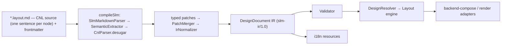

# Semantic Layout Markdown с i18n

[← Оглавление](README.md)

`Semantic Layout Markdown` (`SLM`) - это markdown-like формат, который описывает
экран, а затем компилируется в строгий JSON IR.

**Авторская поверхность SLM — это CNL (controlled natural language): английский,
одно предложение на узел, на полном паритете с IR, полностью двунаправленный** —
разбор (`CnlParser`) + детерминированный эмит (`CnlEmitter`, управляемый общим
реестром дескрипторов `CnlGrammar`) + хирургический write-back (`CnlWriter`).
Авторского escape-слоя нет. Типизированные YAML-блоки и `` ```ir ``-фенсы,
описанные ниже, — это **внутренняя desugar-механика / сериализация IR**, а не
поверхность, которую пишет автор.

## Две i18n-задачи

С поддержкой i18n архитектура должна решать две разные задачи:

```text
1. Authoring language
   CNL-исходник пишется только на английском; локализуемая копия — в text-литералах «…».

2. Product localization
   UI, полученный из IR, может рендериться на разных языках.
```

Главный принцип:

```text
Язык видимого текста не должен попадать в структуру приложения.
Видимая копия живёт в text-литералах «…» и выносится в i18n resources.
IR должен быть language-neutral.
```

## Цель

Формат должен:

- выглядеть как обычный Markdown;
- требовать минимум служебных вставок;
- поддерживать переменные, условия, повторы и действия;
- выражать каждый узел одним CNL-предложением на полном паритете с IR;
- генерировать i18n-ключи и resource bundles из text-литералов;
- компилироваться в строгий JSON IR;
- быть независимым от renderer: Figma, React, HTML, Canvas, Native;
- быть достаточно точным, чтобы описать финальный Figma-like screen/frame.

## CNL: узел = предложение (основной формат авторинга)

Авторская поверхность SLM — **контролируемый естественный язык (CNL)**: каждый элемент
описывается одной строкой-**предложением** из фраз `keyword value…`. **CNL — английский**,
на полном паритете с IR, полностью двунаправленный. Это не «удобство поверх YAML»: YAML-блоки
ниже — внутренняя desugar-цель, а не альтернативный способ авторинга.

```md
## Frame: Missions Panel column gap 16 padding 24 color #FFFFFF radius 12

Rectangle 120 by 15 color #00B843 radius 15
Text «Active missions» size 20 bold color #0F172A
```

- **Существительное** в начале строки задаёт тип узла (`Rectangle`/`rect`, `Ellipse`/`circle`,
  `Text`/`label`, `Button`, `Frame`/`group`/`container`, `Image`, `Icon`/`vector`, `Instance`, …;
  полный список — в разделе «CNL Phrase Reference»).
- **Фразы-свойства** идут после существительного и упорядочены детерминированно по полю `order`
  дескриптора (см. «Implicit descriptor order»): размер (`120 by 15`), цвет (`color #00B843` /
  `color $token`), радиус (`radius 15`), поворот (`rotation 30`), паддинги (`padding 24`), отступ
  (`gap 16`), направление (`column|row|grid`), выравнивание в родителе (`align center`), позиция
  (`position X Y`), прозрачность (`opacity N`); для текста — `size N`, `bold`, `font «…»`, а видимая
  копия в `«…»`/`"…"`.
- **Контейнеры — заголовки** (`##`/`###`); заголовок может нести те же layout/style-фразы после
  имени. Вложенность — уровнями заголовков.

CNL **разворачивается во внутренние типизированные патчи** (`node`/`shape`/`layout`/`style`/`text`
и т.д.): `CnlParser` понижает каждое предложение в те же патчи, что потребляют block-readers. Эти
патчи и YAML-блоки — desugar-механика, а не авторская форма. Реализация — пакет
`engine/frontend/.../cnl/`: `CnlGrammar` (реестр дескрипторов — единый источник истины для parse и
emit), `CnlVocabulary` (таблицы ключевых слов/энумов, **только английские**), `CnlParser`,
`CnlEmitter` (детерминированный IR→CNL), `CnlDocumentSections` (документные секции
`# Collection`/`# Styles`/`# Prototype Variables`/`# Component:`), `CnlDiagnostics`; write-back
правит предложение хирургически (`edit/CnlWriter`). Полный словарь, примеры-экраны и каталог ошибок —
в `SLM-SKILL.md` (генерация экранов моделью, напр. DeepSeek). Диагностики CNL самообъясняющие:
`[CNL:<rule>] … Правило … Как исправить …`.

## CNL Phrase Reference

Это авторитетный справочник авторской формы. Источник истины — реестр дескрипторов
`CnlGrammar.kt` (registry `descriptors`; каждый `Descriptor(kind, keyword, order, render)`
управляет **и** эмитом, **и** ключевым словом парсера) и таблицы `CnlVocabulary.kt`
(keyword/enum). Английский; каждый узел = одно предложение; дерево = вложенность markdown-заголовков.

### Structural conventions (не дескрипторы)

- **Group-scoping keystone rule.** Только *инициирующие клаузу* ключевые слова живут в
  `CnlVocabulary.propertyKeywords`. Каждое *внутригрупповое* под-слово (имена осей variant;
  `swap/text/key/data`; `min/max/allow/preferred`; `asset/focus/video/crop/vertex/segment/region/
  in/out/mirror/corner/loops/evenodd/alpha/subtract/clips/from`; `navigate/openOverlay/animate/
  overlay/to/duration/loop/frames/easing/spring/mass/stiffness/damping/closeOnOutside/offset/
  background`; `breakpoint/at/png/…`) **намеренно НЕ зарегистрировано** — оно разрешается *локально*
  внутри своего потребителя при разборе группы `( … )`. Добавление любого из них в
  `propertyKeywords` сломало бы group-parsing.
- **Nouns vs keywords.** `CnlVocabulary.nouns` матчатся **только на token[0]**; property-keywords —
  **только в середине предложения**. Поэтому `icon` — и то, и другое (noun в голове, `IconRef`
  в середине) без конфликта.
- **`( … )`-группы** — структурные разделители (`CnlParser.parseGroup`); вложенные группы разрешены.
  Record/tuple/stack-фразы используют их.
- **Implicit descriptor `order`.** Последовательность фраз в каждом предложении =
  `descriptors.sortedBy { it.order }` (`CnlEmitter.orderedDescriptors`/`phrasesOf`). Порядки
  разрежены и намеренны (2→96); совпадения order (напр. Media 50 ↔ StyleRefs 50, ShapePoints 52 ↔
  ContainerAlign 52, Mask 70 ↔ TextDecoration 70, FontSize 60 ↔ VariableModes 60) безвредны, т.к.
  рендереры kind-gated (никогда не сосуществуют), а сортировка стабильна. Именно этот канонический
  порядок проверяют round-trip/fidelity-тесты.

### Identity (голова элемента)

| Surface | Notes |
|---|---|
| `Rectangle`/`rect`, `Ellipse`/`circle`, `Line`, `Star`, `Polygon`, `Arrow`, `Text`/`label`, `Button`, `Frame`/`group`/`container`, `Image`, `Icon`/`vector`, `Instance`, `section`, `screen` | Noun на token[0] → тип узла. `Button` = text-узел с `role=button`. |
| `«visible text»` / `"visible text"` | Авторская копия text-узла, эмитится сразу после существительного. Экранирует `\\ \» \n \r`. |
| `id <token>` | Parse-only bare-token; эмитится только структурным писателем / tier-3 re-emit (`includeId=true`) — держит id узла стабильным между рекомпиляциями. |
| `name «…»` | Order 9 — невидимое имя слоя (отличается от text-литерала). |
| Заголовки `#`..`######` | Контейнер = заголовок; вложенность = глубина заголовка. Стабильная форма префиксует kind: `Frame:` / `Group:` / `Text:` / `Button:` / `Image:` / `Instance:` / shape-noun `:`. |

### Components / instances (orders 2–9)

| Phrase | Order | Notes |
|---|---|---|
| `of <ref>` | 2 | component id инстанса. var/data-bound componentId → null → ir-splice. |
| `library <id>` | 3 | |
| `variant (axis value …)` | 4 | key-sorted. |
| `props (name value …)` | 5 | формы значения: `name «text»`, `name true/false`, `name N`, `name {{expr}}`, `name (swap <id>)`, `name (text «…» key <k>)`. `SlotContent` → null (авторится через `slot`). |
| `detach` | 6 | |
| `reset` | 7 | resetOverrides. |
| `slot <name> (ref …) …` | 8 | slot-fill оверрайды. |
| `override <target> ( … )` | 9 | overrides.set — property-группы патчатся по id-пути (`target` через `/`). Пустая группа (напр. `fills:[]`) → всё предложение null → ir-splice. |
| `nested <target> (variant (…) props (…))` | 9 | чистые variant/props nested-оверрайды. |
| `name «…»` | 9 | (см. identity). |

### Geometry (10–27)

| Phrase | Order | Notes |
|---|---|---|
| `<w> by <h>` (connectors `by`/`x`/`×`/`*`) — либо per-axis `width N` / `height N` / `width (fixed\|hug\|fill N min N max N)` / `height (…)` | 10 | sizing-слова fixed/hug/fill. |
| `position X Y` | 20 | |
| `visible no` / `visible $var` / `visible {{expr}}` / `visible $prop.x` | 22 | `visible yes` дефолт-опущен (явно только внутри `override`). |
| `locked yes` | 23 | дефолт опущен. |
| `rotation N` | 24 | 0 опущен. |
| `absolute` | 26 | layoutChild.absolute. |
| `anchor (inlineStart N inlineEnd N blockStart N blockEnd N)` | 27 | **только литеральные insets** — bound-якоря не эмитятся. |

### Layout core (30–36)

| Phrase | Order | Notes |
|---|---|---|
| `column` / `row` / `grid` | 30 | `mode none` → null; `free` парсится в none. |
| `wrap` | 31 | |
| `gap N` / `gap auto` | 32 | 0 опущен; **подавляется при наличии row/column gap** (уступает GapAxes). |
| `distribute center\|end\|space-between` | 33 | `start` → null; парсер принимает и `justify`. |
| `padding N` / `padding V H` / `padding T R B L` | 34 | all-zero опущен; direction-aware (logical) форма. |
| `gap (row N column N)` | 36 | GapAxes; **владелец grid-gap**. |

### Fills (40)

Keyword `color`/`fill`. Каждая краска стека — своя фраза.
- Solid bare: `color <token>`; с props: `color (<token> opacity N blend <mode> visible no)`.
- `gradient (linear|radial|angular|diamond from (x y) to (x y) stops (<color> at N) … opacity N blend <mode> visible no)` (дефолт `from(0,0)`/`to(0,1)` опущен).
- `image (asset «id» fit|crop|tile|stretch focus (x y) replaceable opacity N blend <mode> visible no)`.
- `video (asset «id» fit|crop|… focus (x y) poster «id» autoplay loop muted no opacity N blend …)`.
- Solid-токен принимает `#hex`/`#hexAA`, `$var`, `{{expr}}`. `PropRef` (`$prop.x`) → null → ir-splice. Gradient-stops / stroke / effect-цвета — без `{{expr}}`.
- **⚠ EDGE #2 — fill-paint focal ref:** `image`/`video` `focus (x y)` эмитит только литерал, поэтому bound-focal (`$var`/`{{expr}}`) на *fill*-краске теряется как `0`; focal-привязки на *media*-узле round-trip'ятся.
- `DesignPaint.Unknown` → null.

### Strokes (42)

Keyword `stroke`/`border`.
- Flat (одиночная plain solid, без dash/cap/join/per-side): `stroke <token> [weight] [outside|center]` (inside — дефолт, опущен; weight 1 опущен).
- Record: `stroke (<paint phrase…> weight N weight-per-side (T R B L) align outside|center dash (N N …) cap <cap> join <join>)`. Каждый слой — полная fill-style paint-фраза.
- `weight-per-side (T R B L)` — только литеральное: любая bound-сторона → весь record null → ir-splice.

### Effects (43)

Keyword `effect`, одна `effect ( … )` на эффект.
- `effect (dropShadow color <c> offset (x y) blur N spread N)` / `effect (innerShadow …)`
- `effect (layerBlur N)` / `effect (backgroundBlur N)`
- blur / spread / radius / offset принимают `$var`/`{{expr}}`/`$prop.x`; color — без `{{expr}}`. visible:false-эффект → null → ir-splice. `DesignEffect.Unknown` → `rawType`.

### Corners / opacity / blend (44–47)

| Phrase | Order | Notes |
|---|---|---|
| `radius N` / `radius (tl tr br bl)` | 44 | 0 опущен; принимает `$var`/`{{expr}}`/`$prop.x`. |
| `smoothing N` | 45 | 0 опущен. |
| `opacity N` / `opacity $var\|{{expr}}\|$prop.x` | 46 | 1.0 опущен. |
| `blend <mode>` | 47 | `normal` опущен. |

### Constraints / parent-align (48–49)

- `align center|bottom|right` — order 48 — только 3 недефолтных комбо; `align top` → null.
- `constraints (horizontal <h> vertical <v>)` — order 49; **yields (null) для 4 комбо, которые уже эмитит `align`** (защита от двойного эмита). Слова: `left/right/center/left-right/scale`, `top/bottom/center/top-bottom/scale`.

### Style refs / container-behavior (50–54)

- `styles (fill <id> stroke <id> text <id> effect <id> grid <id>)` — order 50. (text-style id эмитится и здесь, и отдельно фразой `text-style` order 74.)
- `clip` — 51 (clipsContent).
- `align (block\|inline <start\|center\|end\|baseline\|stretch> baseline last)` — 52; ось `block` для horizontal-режима иначе `inline`; `start` опущен.
- `overflow (x hidden\|auto y hidden\|auto)` — 53; `visible` опущен.
- `scroll (direction horizontal\|vertical\|both fixedChildren (ids) sticky)` — 54; all-default → null.

### Grid (55–59)

- `columns (count N track <track>)` или `columns (tracks (<track> …))` — 55.
- `rows (…)` — 56; implicit `rows (auto track <track> min N)`.
- Track-слово: `N` (fixed), `Nfr` (flex), `hug`. count/track/min принимают `$var`/`{{expr}}`/`$prop.x`.
- **⚠ EDGE #3 — $-ref/fr grid-track:** `GridTrack.Flex` рендерит `${token}fr`; VarRef/DataRef flex-track эмитит `$idfr`/`{{expr}}fr` — неоднозначно/неразбираемо на reparse.
- `place (column N row N columnSpan N rowSpan N)` — 57 (дефолт 0/0/1/1 опущены).
- `guides (horizontal N) (vertical N) …` — 58.
- `grids (columns|rows|grid count N size N gutter N margin N alignment start|center|end|stretch color #hex visible false) …` — 59.

### Variable modes (60)

`modes (key value …)` — key-sorted выбор variable-mode на уровне узла.

### Typography (60–79) — text-узлы

| Phrase | Order |
|---|---|
| `size N` | 60 |
| `key <k>` (i18n) | 61 |
| `bold` / `semibold` / `thin` / `weight N` | 62 |
| `font «family»` | 63 |
| `line-height <N\|N%>` | 64 |
| `tracking <N\|N%>` | 65 |
| `paragraph-spacing N` | 66 |
| `text-align left\|center\|right\|justified` | 67 |
| `text-valign top\|center\|bottom` | 68 |
| `case upper\|lower\|title` | 69 |
| `decoration underline\|strikethrough` | 70 |
| `features ((tag on\|off) …)` (key-sorted) | 71 |
| `axes ((tag N) …)` (key-sorted) | 72 |
| `text-style $<id>` | 74 |
| `characters $var\|{{expr}}\|$prop.x` (литеральные characters → null; используется text-литерал) | 75 |
| `autosize height\|both` | 76 |
| `truncate N` (с ellipsis) | 77 |
| `maxLines N` (без ellipsis) | 78 |
| `list (bullet\|ordered\|none [indent N])` | 79 |

### Text spans / links (82–83)

- `link (range (a b) url «…»)` или `link (range (a b) to <nodeId>)` — order 82.
  - **⚠ EDGE #1 — renderLinks emit order:** links эмитятся **отсортированными по `(start, end)`**, НЕ в IR-порядке (в отличие от spans, которые сохраняют IR-порядок намеренно). Авторский порядок links может перемешаться на round-trip.
- `span (range (a b) style <ref>)` — order 83; **эмитится в порядке IR-списка** (load-bearing для overlap-precedence и write-back-veto; renderSpans намеренно НЕ сортирует).

### Media / shape / vector / mask (50–70)

| Phrase | Order | Notes |
|---|---|---|
| `media (asset <id> video fit\|crop\|tile\|stretch focus center\|(x y) alt «…» opacity N blend <mode> poster <id> autoplay loop replaceable unmuted)` | 50 | asset/poster/focal принимают `$var`/`{{expr}}`. Bare all-default media-узел эмитит просто `Image`. |
| `points N` | 52 | |
| `inner N` | 53 | |
| `viewbox (x y w h)` | 54 | |
| `icon <ref>` | 55 | |
| `svg <ref>` | 56 | |
| `path «d» [evenodd]` (одна на путь) | 57 | |
| `network (vertex (x y in (dx dy) out (dx dy) mirror angle\|angleAndLength corner) … segment (from to) … region [evenodd] loops ((idx …) …) …)` | 58 | |
| `boolean union\|subtract\|intersect\|exclude` | 59 | **DROPPED id-list:** эмитит *только* слово операции; операнды — дочерние узлы из subtree-вложенности, не эмитируемый id-список (поле YAML `boolean.children:[…]` не имеет CNL-фразы). |
| `mask alpha\|vector\|luminance [clips (ids)] [from <id>]` | 70 | `from <id>` = источник маски. |

### Interactions (90) / Motion (92)

Каждый триггер — своя **отдельная** интеракция.
- Триггеры: `onClick`, `onHover`, `onPress`, `onDrag`, `onKey (key)`, `afterDelay (ms)`, `whileHovering`, `whilePressed`, `onVariableChange (var)`.
- Действия: `navigate (to)[ animate(…)]`, `openOverlay (dest)[ overlay(…)][ animate(…)]`, `swapOverlay (dest)[ animate(…)]`, `closeOverlay[ animate(…)]`, `back`, `openLink (url)`, `setVariable (var) to (value)`, `changeToVariant (target) variant (…)`, `scrollTo (target)[ animated (false)]`, `runActionSet (id)`. `DesignAction.Unknown` → null → ir-splice.
- `animate (type <t> easing <named>|spring mass N stiffness N damping N duration N direction <d>)` — cubic-bezier easing → null → ir-splice.
- `overlay (position <p> offset (x y) closeOnOutside (false) background <color>)` — unrenderable background → null → ir-splice.
- **Whole-descriptor veto:** если ЛЮБАЯ интеракция невыразима (cubic-bezier easing, PropRef/DataRef-значение, unknown action), **весь дескриптор interactions даёт null**, и узел падает в ir-splice.
- `motion` / `motion (ref)` `duration N loop frames (at opacity x y scale rotation) …` — order 92. Ключи кадра вне известных 5 → null → ir-splice; пустой/empty-fallback motion → null.

### Responsive / export (94/96)

- `when (breakpoint <v> devicePreset <v> platform <v> theme <v> density <v> locale <v> direction <v> brand <v> state <v>) <overrides>` — order 94. Подмножество override-фраз: size, direction, gap, gap-axes, padding, fills, stroke, radius, opacity, fontSize, fontWeight.
- `export (png|jpg|svg|pdf at N «suffix») …` — order 96.
- **`handoff` НЕ имеет дескриптора** — не эмитится per-node; `HandoffPatch` поднимается в `DesignDocument.handoff`.

### Parse-only, никогда не эмитится

- `note «…»` → handoff.annotations; `measure (…)` → handoff.measurements; `code (…)` → handoff.code. Без CNL-рендера — попадают в IR, но не round-trip'ятся обратно в предложение.
- Standalone `width N` / `height N` парсятся в `Size`.

### Document-level секции (`#`-заголовки, не предложения-элементы)

Разбирает `CnlDocumentSections.kt`, эмитит `CnlEmitter.emit{Variables,Styles,Components}`:
- `# Collection <id> [«name»] [(modes m1 m2 … default m)]` + строки `Color|Number|String|Boolean <name> <mode> <value> …`
- `# Prototype Variables` + строки `<Type> <name> [default <value>]`
- `# Styles` + строки `Paint|TextStyle|Effect|Grid <id> <cnl-properties>`
- `# Component: <title> <id/component-name/set/axis/prop phrases>` + дочернее subtree. Definition-side keywords (`component-name`, `set <id>`, `axis <name> (values)`, `prop <name> (text|boolean|instanceSwap|variant|slot|number|string|dataBinding default … preferred (…) min N max N allow (…))`) эмитит `emitComponentDefinition`.

### 3 flagged edge-ограничения (сводка)

1. **renderLinks emit order** — `link`-спаны эмитятся отсортированными по `(start,end)`, не в IR-порядке (spans сохраняют IR-порядок); авторский порядок links может перемешаться на round-trip.
2. **fill-paint focal ref** — `image`/`video` fill `focus (x y)` рендерит литерал `num(orZero)`, так что bound-focal (`$var`/`{{expr}}`) теряется как `0`; только *media*-узловые focal-привязки round-trip'ятся.
3. **$-ref/fr grid-track** — bound `GridTrack.Flex` эмитит `$idfr`/`{{expr}}fr`, неоднозначно/неразбираемо на reparse.

## Уровни полноты

SLM должен различать три уровня:

| Уровень | Что покрывает | Цель для SLM |
| --- | --- | --- |
| `screen-intent complete` | Смысл экрана: sections, content, actions, data bindings, simple layout intent. | Базовый уровень semantic shorthand |
| `figma-screen complete` | Видимый frame/screen: layer tree, layout, style, typography, components, media, interactions. | Практичная цель |
| `figma-file complete` | Весь Figma file/workspace: pages, comments, permissions, versions, libraries, Dev Mode workflows. | Не основная цель |

SLM не должен моделировать историю версий, multiplayer editing, billing,
permissions or product rollout. Он должен уметь описать финальный экран,
который можно воспроизвести в Figma-like renderer или другом UI renderer.

## Одна авторская поверхность

У SLM **одна** авторская поверхность — CNL. Раньше формат описывался как два режима
(«semantic shorthand» и «explicit typed blocks»); эта модель устарела. Теперь автор пишет
CNL-предложения на полном паритете с IR, а типизированные блоки — только внутренняя
desugar-цель (см. «Внутреннее desugar-представление (typed blocks)»).

CNL-предложение выражает весь узел:

```md
## Frame: CTA Card row padding (16 24) gap 12 distribute space-between align center width (fill) height (hug) color color.surface radius radius.md styles (effect shadow.card)
```

То же предложение внутри компилятора понижается в типизированный набор патчей —
эквивалентное IR-представление, которое автор не пишет вручную:

```yaml
# внутреннее desugar-представление (не авторская форма)
node: frame
layout:
  mode: row
  padding:
    block: $space.4
    inline: $space.6
  gap: $space.3
  align:
    inline: space-between
    block: center
  sizing:
    width: fill
    height: hug
style:
  fills:
    - token: color.surface
  radius: $radius.md
  effects:
    - style: shadow.card
```

Приоритет прост: CNL-предложение узла переопределяет frontmatter-defaults, которые
переопределяют renderer-defaults. Авторского уровня «explicit block» с отдельным
приоритетом больше нет — предложение и есть единственный авторский слой.

## Pipeline



## Source Format

Исходник SLM (`*.layout.md`) — это **CNL**: YAML-frontmatter (screen-level метаданные) +
тело документа, где каждый узел — одно английское CNL-предложение, а дерево задаётся
вложенностью Markdown-заголовков (`#`…`######`). Прозаического извлечения из текста и
отдельного авторского слоя «typed block» больше нет — CNL-предложение узла является
единственной авторской поверхностью (полный справочник фраз — в разделе CNL выше).
Frontmatter несёт только screen-level defaults; свойства конкретного узла задаются его
предложением. Типизированные YAML-блоки — это внутреннее desugar-представление (см.
следующий раздел), а не авторский формат.

## Внутреннее desugar-представление (typed blocks)

> **Это не авторская форма.** Типизированные блоки — внутренняя цель, в которую
> `CnlParser` понижает CNL-предложения, и вход, который потребляют block-readers
> (`engine/frontend/.../blocks/readers`). Таблица ниже — внутренний справочник по IR,
> а не синтаксис, который пишет автор. Авторская форма каждой из этих возможностей —
> CNL-фраза (см. «CNL Phrase Reference»).

> **Статус.** Типизированные блоки — это **внутренняя типизированная модель**, в которую
> десугарит [CNL](#cnl-узел--предложение-основной-формат-авторинга); block-readers и эта
> схема остаются как compile-путь. Как **поверхность авторинга** (писать YAML-блоки/`ir`
> руками) они легаси и выводятся из употребления — новый код авторится CNL-предложениями.
> Разделы ниже описывают семантику каждого ключа (это же — контракт соответствующих
> CNL-фраз). Исключения, которые пока авторятся именно так: словари уровня документа
> (`variables`/`component`-definition/`styles`) и часть reader-gap'ов — см. миграцию.

Typed attribute block - это YAML-like блок с зарезервированным top-level ключом,
который относится к ближайшему предыдущему heading, list item, image, table or
explicit node marker.

Зарезервированные ключи:

| Block | Назначение |
| --- | --- |
| `node` | Тип, id, имя, visibility, lock, order, position |
| `layout` | Auto layout, grid, constraints, sizing, overflow |
| `style` | Fills, strokes, effects, opacity, blend, radius |
| `text` | Content, typography, rich text, truncation, links, lists |
| `component` | Component definition or instance binding |
| `props` | Component properties and instance overrides |
| `media` | Image/video fill or asset reference |
| `shape` | Shape primitive and geometry |
| `vector` | Vector path/network, icon ref, boolean operations |
| `mask` | Mask source and mask relationship |
| `action` | Shorthand for a single default `onClick` interaction |
| `interaction` | Prototype trigger, action, destination, transition |
| `motion` | Animation or motion reference |
| `responsive` | Breakpoint, platform, theme, density, locale overrides |
| `variables` | Local prototype or design variables |
| `handoff` | Dev notes, annotations, measurements |
| `export` | Export settings for assets |
| `ir` | Внутренний/import-механизм: точная JSON-сериализация IR (не авторская форма) |

`node: frame` is shorthand for:

```yaml
node:
  type: frame
```

Пример полного node block:

```md
## Active Missions Grid
node:
  type: frame
  id: activeMissionsGrid
  name: Active Missions Grid
  visible: true
  locked: false
  order: 30
layout:
  mode: grid
  columns:
    count: 3
    track: 1fr
  rows:
    auto: true
    min: 160
  gap:
    row: $space.4
    column: $space.4
  sizing:
    width: fill
    height: hug
```

Markdown порядок задает layer order по умолчанию. Для точного восстановления
Figma-like tree можно указать `node.order`; siblings сортируются по нему, а при
равенстве сохраняют Markdown order.

## Markdown Semantics

Разметка документа несёт только СТРУКТУРУ; содержимое узлов — это CNL-предложения.

| Markdown element | Роль в CNL-модели |
| --- | --- |
| Frontmatter | Screen-level метаданные (screen/frame/locales/theme/breakpoints/…) |
| `#` … `######` | Дерево узлов: заголовок = контейнер, вложенность = containment. После имени заголовок может нести CNL-фразы контейнера (напр. `## Chips grid columns (count 3 track 1fr) gap 8`) |
| Строка тела под заголовком | Один узел = одно CNL-предложение (напр. `Rectangle 120 by 15 color #00B843 radius 15`) |

Никакого прозаического извлечения смысла из абзацев/списков/ссылок нет — каждый узел задаётся явным CNL-предложением; порядок сиблингов = порядок строк (или `order`, см. выше). Внутреннее IR-представление (JSON `slm-ir/1.0`) — результат компиляции, а не авторский формат.

## Контракт `figma-screen complete`

SLM считается `figma-screen complete`, если для каждого финального screen/frame
он может выразить:

- stable ids, names and source map;
- visible node tree with layer order;
- node types: `screen`, `frame`, `group`, `section`, `component`, `instance`,
  `text`, `shape`, `vector`, `media`, `table`, `slot`, `annotation`;
- Auto layout, grid, constraints, absolute positioning, clipping and overflow;
- sizing: `hug`, `fill`, `fixed`, min/max per axis;
- visual style: fills, strokes, effects, opacity, blend, radius;
- typography and rich text behavior;
- component refs, variants, properties, slots and overrides;
- variables, styles, tokens and modes;
- media/vector/mask/export asset references;
- interactions, states, prototype variables and animations;
- responsive variants for platform, density, theme, locale and breakpoints;
- validation diagnostics for every unsupported or ambiguous feature.

Natural language может создавать эти структуры автоматически, но полнота
опирается на strict IR schema and explicit override syntax.

Feature coverage map:

| Figma-like scenario | SLM coverage |
| --- | --- |
| Files, pages, canvas sections for screen placement | Frontmatter: `screen`, `page`, `canvas`, `frame`; optional flow metadata |
| Frames, groups, layers, visibility, lock, z/layer order | `node` block and common node contract |
| Auto layout, grid, constraints, clipping, overflow, scroll | `layout` block |
| Responsive behavior and device/layout variants | `breakpoints`, `responsive` block and mode overrides |
| Components, instances, variants, properties, slots | `component`, `props`, `overrides` blocks |
| Styles, variables, tokens, modes | `variables`, `style`, token/style refs |
| Text layers, typography, rich text, truncation, links, lists | `text` block |
| Fills, strokes, effects, opacity, blend, radius | `style` block |
| Shapes, vector paths, boolean operations, masks | `shape`, `vector`, `mask` blocks |
| Images and videos as fills | `media` block normalized to fill behavior |
| Prototype triggers, overlays, state variables, transitions | `interaction`, `variables.prototype` blocks |
| Motion and micro-interactions | `motion` block or external motion refs |
| Dev notes, annotations, measurements | `handoff` block |
| Exportable assets | `export` block |
| AI, Make, Sites, Buzz, Slides outputs | Scope boundary: represent outputs as screen primitives, not workflow history |

## Node Model

> Авторская форма — CNL-предложение (`Frame: Header id header name «Header» position 0 0
> rotation 0 constraints (horizontal left vertical top)`); YAML ниже — внутренний контракт
> узла в IR.

Каждый node в IR имеет общий контракт:

```yaml
id: stableNodeId
type: frame
name: Human readable layer name
role: topbar | main | sidebar | card | primaryAction
visible: true
locked: false
order: 10
position:
  mode: auto | absolute
  x: 0
  y: 0
  rotation: 0
constraints:
  horizontal: left | right | center | left-right | scale
  vertical: top | bottom | center | top-bottom | scale
sourceMap:
  file: mission-dashboard.layout.md
  line: 24
children: []
```

Node types:

| Type | Назначение |
| --- | --- |
| `screen` | Root frame or rendered viewport |
| `frame` | Layout container with Auto layout, constraints, clipping, style |
| `group` | Structural grouping without layout contract |
| `section` | Semantic region, often compiles to frame |
| `component` | Main component definition |
| `instance` | Linked component instance with props and overrides |
| `text` | Text layer with content and typography |
| `shape` | Rectangle, ellipse, line, polygon, star, arrow |
| `vector` | Path/network, icon, boolean result |
| `media` | Convenience node for image/video-backed layer |
| `table` | Structured table or grid-like data display |
| `slot` | Component slot content target |
| `annotation` | Handoff note, comment-like marker, measurement |

`group` не должен скрывать layout-смысл. Если node влияет на spacing,
responsive behavior or clipping, он должен быть `frame` or `section`, not
generic `group`.

## Layout Schema

> Авторская форма — layout-фразы в CNL-предложении узла:
> `Frame: Mission Detail Panel column padding (20 24) gap (row 16 column 8) align (inline stretch)
> width (fill min 320 max 520) height (hug) clip overflow (x hidden y auto)
> scroll (direction vertical fixedChildren (missionPanelHeader))`.
> YAML ниже — внутреннее desugar-представление того же layout-контракта.

Layout block покрывает Auto layout, grid, absolute positioning, constraints,
clipping and scroll behavior.

```md
## Mission Detail Panel
node: frame
layout:
  mode: column
  padding:
    top: $space.5
    right: $space.6
    bottom: $space.5
    left: $space.6
  gap:
    row: $space.4
    column: $space.2
  align:
    inline: stretch
    block: start
    baseline: first
  distribution: packed
  wrap: false
  sizing:
    width:
      type: fill
      min: 320
      max: 520
    height:
      type: hug
  clipContent: true
  overflow:
    x: hidden
    y: auto
  scroll:
    direction: vertical
    fixedChildren:
      - missionPanelHeader
```

Grid layout:

```md
layout:
  mode: grid
  columns:
    count: 12
    track: 1fr
    gap: $space.4
  rows:
    auto: true
    min: 96
    gap: $space.4
  placement:
    column: 1
    columnSpan: 8
    row: 1
    rowSpan: 2
```

Absolute or ignored Auto layout child:

```md
### Notification Dot
node:
  type: shape
  id: notificationDot
layout:
  ignoreAutoLayout: true
  position:
    mode: absolute
    inlineEnd: 4
    blockStart: 4
  sizing:
    width:
      type: fixed
      value: 8
    height:
      type: fixed
      value: 8
constraints:
  horizontal: right
  vertical: top
```

SLM использует logical directions: `start`, `end`, `inlineStart`,
`inlineEnd`, `blockStart`, `blockEnd`. Physical directions `left` and `right`
разрешены только как import compatibility and should normalize to logical
directions with locale context.

## Responsive and Mode Overrides

> Авторская форма — фраза `when (…)` в конце предложения узла:
> `when (breakpoint mobile) column padding (16) gap 12 radius 0` и
> `when (breakpoint desktop density compact) row gap 8`. Допустимое подмножество
> override-фраз перечислено в «CNL Phrase Reference» (Responsive). Layout-grids/guides
> авторятся фразами `grids (…)` / `guides (…)`. YAML ниже — внутреннее представление.

Responsive behavior задается через breakpoints and modes:

```md
responsive:
  variants:
    - when:
        breakpoint: mobile
      layout:
        mode: column
        padding:
          inline: $space.4
        gap: $space.3
      style:
        radius: 0
    - when:
        breakpoint: desktop
        density: compact
      layout:
        mode: row
        gap: $space.2
```

Допустимые dimensions for overrides:

- `breakpoint`;
- `devicePreset`;
- `platform`;
- `theme`;
- `density`;
- `locale`;
- `direction`;
- `brand`;
- `state`.

Renderer chooses the best matching variant from the normalized IR. If two
variants match equally, validator must report ambiguity.

Layout grids and guides are screen/frame properties:

```md
layout:
  guides:
    - orientation: vertical
      position: 72
  grids:
    - type: columns
      count: 12
      gutter: 24
      margin: 72
      alignment: stretch
```

## Components, Instances and Slots

> Авторская форма — CNL. Инстанс:
> `Instance of ds/Button library ds variant (size md state default type primary)
> props (label «Create mission» iconLeading (swap ds/Icon/Plus) loading false)
> onClick navigate (/missions/new)`. Оверрайды:
> `Instance of ds/Card override header/title (color #111 bold)`,
> `slot actions (ds/Button props (label «Open»))`,
> `nested statusBadge (variant (tone warning))`, `detach`, `reset`. Определение
> компонента авторится документной секцией `# Component: …` (см. «Document-level sections»).
> YAML ниже — внутреннее представление.

Figma-like screens часто состоят из design-system instances. SLM должен
различать component definition and instance usage.

Instance example:

```md
### Button: Создать миссию
node:
  type: instance
  id: createMissionButton
component:
  ref: ds/Button
  libraryRef: ds
  variant:
    type: primary
    size: md
    state: default
  props:
    label:
      type: text
      value: Создать миссию
      i18nKey: missionDashboard.actions.createMission
    iconLeading:
      type: instanceSwap
      value: ds/Icon/Plus
    loading:
      type: boolean
      value: false
action:
  type: navigate
  to: /missions/new
```

Component definition example:

```md
## Component: Mission Card
node:
  type: component
  id: componentMissionCard
component:
  name: ds/MissionCard
  variants:
    status:
      values: [nominal, warning, critical]
    density:
      values: [compact, comfortable]
  properties:
    title:
      type: text
      default: Mission name
    showBadge:
      type: boolean
      default: true
    icon:
      type: instanceSwap
      preferredValues:
        - ds/Icon/Rocket
        - ds/Icon/Alert
    actions:
      type: slot
      minItems: 0
      maxItems: 3
```

Instance overrides:

```md
props:
  title: "{{mission.name}}"
  showBadge: "{{mission.status != 'archived'}}"
overrides:
  slots:
    actions:
      - instance: ds/Button
        props:
          label: Открыть
          type: secondary
  nestedInstances:
    statusBadge:
      variant:
        tone: "{{mission.statusTone}}"
```

Allowed component property types:

- `boolean`;
- `text`;
- `variant`;
- `instanceSwap`;
- `slot`;
- `number`;
- `string`;
- `dataBinding`.

SLM can model `resetOverrides` and `detach`, but they are authoring operations,
not preferred screen state:

```md
component:
  ref: ds/LegacyCard
  detach: false
  resetOverrides: false
```

## Styles, Variables and Tokens

> Авторская форма — документные секции CNL: `# Collection theme (modes light dark default light)`
> с рядами `Color color.surface light #ffffff dark #101114`, `# Styles` с рядами
> `Paint|TextStyle|Effect|Grid <id> <cnl-properties>`, `# Prototype Variables`
> (см. «Document-level sections»). Ссылки на стили из узла — фразой `styles (fill … stroke …
> text … effect … grid …)`; привязка переменных — `$var` в любой фразе (`color $color.surface`,
> `radius radius.card`, `gap space.4`). YAML ниже — внутреннее представление.

SLM must separate semantic tokens, reusable styles and raw variables.

```md
variables:
  collections:
    - id: theme
      modes: [light, dark]
      variables:
        color.surface:
          type: color
          values:
            light: "#ffffff"
            dark: "#101114"
        radius.card:
          type: number
          values:
            light: 8
            dark: 8
    - id: density
      modes: [compact, comfortable]
      variables:
        space.4:
          type: number
          values:
            compact: 12
            comfortable: 16
```

Style references:

```md
style:
  fillStyle: color.surface.default
  textStyle: typography.heading.lg
  effectStyle: shadow.card
  gridStyle: grid.desktop.12
```

Variable bindings:

```md
style:
  fills:
    - variable: color.surface
  radius:
    variable: radius.card
layout:
  gap:
    variable: space.4
```

Rules:

- tokens and variables are technical identifiers and are not translated;
- modes must be explicit: theme, density, platform, locale, brand or custom;
- aliases must resolve to a concrete value for every rendered mode;
- unresolved token/style/variable refs are validation errors.

## Text and Typography

> Авторская форма — CNL-предложение text-узла:
> `Text «Mission Control» key missionDashboard.title size 24 bold font «Inter»
> line-height 32 text-align left text-valign center autosize both truncate 1
> text-style typography.heading.lg`. Rich-text — фразами `span (range (0 10) style
> typography.body.strong)` и `link (range (a b) url «…»)` / `link (range (a b) to <nodeId>)`;
> списки — `list (none)`. YAML ниже — внутреннее представление.

Text content is i18n-managed, but text layer behavior is layout-managed.

```md
### Text: Mission Control
node:
  type: text
  id: missionTitle
text:
  key: missionDashboard.title
  defaultText: Mission Control
  style: typography.heading.lg
  typography:
    fontFamily: Inter
    fontWeight: 700
    italic: false
    fontSize: 24
    lineHeight: 32            # bare number = px; {unit: percent, value: 135} = %; omit = Auto
    letterSpacing: 0
    paragraphSpacing: 0
    paragraphIndent: 0
    horizontalAlign: start
    verticalAlign: center
    decoration: none          # none | underline | strikethrough
    decorationStyle: solid    # solid | dashed | dotted | wavy
    decorationColor: "#3366FF"  # omit = follows the glyph color
    decorationThickness: 1    # px number, or {unit: percent, value}; omit = auto
    decorationSkipInk: false
    case: none                # none | upper | lower | title | smallCaps | smallCapsForced
    position: none            # none | superscript | subscript
    leadingTrim: none         # none | capHeight
    hangingPunctuation: false
    hangingList: false
    openType:
      liga: true
      tnum: true
    variableFont:
      weight: 700
      opticalSize: 24
  resizing:
    width: fill
    height: hug
  maxLines: 1
  overflow: truncate
```

Rich text spans — each span carries a `range: [start, end]` (or `text:` substring matched
against `defaultText`) plus any of a shared `style:` ref, an inline `typography:` map, inline
`fills:`, and a `link:`. Offsets index the source-locale `defaultText`.

```md
text:
  key: missionDashboard.notice
  defaultText: "Проверьте SLA перед запуском миссии."
  spans:
    - range: [0, 10]
      typography:
        fontWeight: 700
        italic: true
      fills:
        - "#FF3366"
    - text: SLA
      link:
        type: url
        href: https://example.com/sla
      style: typography.link
  list:
    type: none
    indent: 0
```

Text validation must check:

- missing content keys;
- invalid typography values;
- unsupported fonts;
- max lines and truncation policy;
- overflow behavior for every target locale;
- inline link targets;
- list indentation and paragraph spacing;
- rich text spans after translation.

## Visual Style

> Авторская форма — фразы стиля в CNL-предложении узла: `color`/`fill`, `stroke`/`border`,
> `effect (…)`, `opacity`, `blend`, `radius`, `smoothing`. Пример:
> `Frame: Card color $color.surface gradient (linear stops ($color.accent.start at 0)
> ($color.accent.end at 1) opacity 0.12) stroke $color.border.subtle 2
> effect (dropShadow color $shadow.card.color offset (0 8) blur 24 spread 0)
> radius 12 smoothing 0.6 opacity 0.96`. YAML ниже — внутреннее представление.

Style block describes visible layer appearance.

```md
style:
  opacity: 0.96
  blendMode: normal
  radius:
    topLeft: $radius.md
    topRight: $radius.md
    bottomRight: $radius.md
    bottomLeft: $radius.md
  cornerSmoothing: 0.6
  fills:
    - type: solid
      token: color.surface
      opacity: 1
    - type: linearGradient
      stops:
        - position: 0
          token: color.accent.start
        - position: 1
          token: color.accent.end
      opacity: 0.12
  strokes:
    - token: color.border.subtle
      weight: 1
      position: inside
      dash: []
      caps: none
      joins: round
  effects:
    - type: dropShadow
      x: 0
      y: 8
      blur: 24
      spread: 0
      token: shadow.card.color
      opacity: 0.18
```

Supported fills:

- `solid`;
- `image`;
- `video`;
- `linearGradient`;
- `radialGradient`;
- `angularGradient`;
- `diamondGradient`.

Supported effects:

- `dropShadow`;
- `innerShadow`;
- `layerBlur`;
- `backgroundBlur`;
- effect style refs.

## Shapes, Vectors and Masks

> Авторская форма — CNL. Примитив: `Ellipse 10 by 10 color color.status.success` (плюс
> `points N` / `inner N` для star/polygon). Вектор: `Icon icon ds/Icon/Alert svg
> assets/icons/alert.svg viewbox (0 0 24 24) color color.icon.warning`, инлайн-путь —
> `path «M12 2L22 20H2L12 2Z»` (при необходимости `path «…» evenodd`), сложные фигуры —
> `network (vertex (…) segment (…) region loops (…))`. Маска — `mask alpha from avatarMask
> clips (avatarImage)`.
>
> **Boolean-операции авторятся вложенностью, а не id-списком.** Фраза `boolean union|subtract|
> intersect|exclude` эмитит только слово операции; операнды — это дочерние узлы в дереве
> (heading-вложенность), а не эмитируемый список. Поле `boolean.children:[…]` в YAML ниже — только
> внутреннее представление и не имеет CNL-фразы.
>
> YAML ниже — внутреннее представление.

Simple shapes can be declarative:

```md
### Status Indicator
node:
  type: shape
shape:
  kind: ellipse
  width: 10
  height: 10
style:
  fills:
    - token: color.status.success
```

Vectors should use asset refs for complex paths:

```md
### Alert Icon
node:
  type: vector
vector:
  iconRef: ds/Icon/Alert
  pathRef: assets/icons/alert.svg
  viewBox: [0, 0, 24, 24]
style:
  fills:
    - token: color.icon.warning
```

Inline vector data is allowed for generated or imported assets:

```md
vector:
  paths:
    - d: "M12 2L22 20H2L12 2Z"
      windingRule: nonzero
  boolean:
    op: union
    children:
      - triangleBase
      - alertCutout
```

Mask relationship:

```md
mask:
  type: alpha
  source: avatarMask
  appliesTo:
    - avatarImage
```

Rules:

- use `shape` for primitive geometry;
- use `vector.pathRef` or `iconRef` for reusable icons;
- use inline vector paths only when the file itself owns the shape;
- boolean operations must preserve child source maps.

### Figure keys (Figma parity)

- **Ellipse arc / donut** — under `shape:` (`kind: ellipse`): `arcStart` and `arcSweep`
  (degrees; 0° = 3 o'clock, positive sweep clockwise on screen), and `innerRadius`
  (donut-hole ratio 0..1). `|arcSweep| ≥ 360` or omitted = full ellipse.
  ```md
  shape:
    kind: ellipse
    arcStart: -90
    arcSweep: 270
    innerRadius: 0.5   # donut
  ```
- **Per-vertex corner radius** — each `network.vertices[]` may carry `radius: N`
  (rounds the vertex when it joins two straight segments; clamped to half the shorter
  adjacent segment).
- **Region fills** — each `network.regions[]` may carry `fills:` (same schema as
  `style.fills`); a region's fills replace the object fills for that region, and regions
  without fills inherit the object fills.
- **Stroke join** — `style.strokes[].joins` = `miter` | `round` | `bevel`.
- **Fill rule** — `vector.paths[].windingRule` / `network.regions[].windingRule` =
  `nonzero` | `evenodd`.
- **Flatten / Outline stroke** are editor operations, not new keys: they persist as
  plain `vector.paths` (or `vector.network`) with the appropriate winding rule.

## Images and Media

> Авторская форма — фраза `media (…)`:
> `Image media (asset assets/mission-map.png crop focus (0.48 0.42) alt «Active missions map»
> replaceable)` или для видео `Image media (asset assets/launch-preview.mp4 video fit
> poster assets/launch-preview-poster.jpg autoplay loop)`. `asset`/`poster`/`focus` принимают
> привязки `$var`/`{{expr}}` (у media-узла они сохраняются при round-trip — в отличие от focal-точки
> fill-краски, см. edge #2). YAML ниже — внутреннее представление.

Figma treats images and videos as fills. SLM can expose a `media` convenience
block, but normalized IR should still model the fill behavior.

```md
### Mission Map
node:
  type: media
  id: missionMap
media:
  asset: assets/mission-map.png
  kind: image
  fillMode: crop
  focalPoint:
    x: 0.48
    y: 0.42
  alt:
    key: missionDashboard.map.alt
    defaultText: Карта активных миссий
  replaceable: true
  opacity: 1
  blendMode: normal
```

Video settings:

```md
media:
  asset: assets/launch-preview.mp4
  kind: video
  fillMode: fit
  poster: assets/launch-preview-poster.jpg
  autoplay: false
  loop: true
  muted: true
```

Fill modes:

- `fill`;
- `fit`;
- `crop`;
- `tile`;
- `stretch`;
- focal point with normalized x/y coordinates.

## Prototype Interactions and Motion

> Авторская форма — CNL. Каждый триггер начинает отдельную интеракцию:
> `Button «Create» onClick openOverlay (createMissionDialog) overlay (position center
> closeOnOutside true background #00000052) animate (type smartAnimate easing easeOut
> duration 220)`. Другие триггеры: `onHover`, `onPress`, `onDrag`, `onKey (…)`,
> `afterDelay (ms)`, `whileHovering`, `whilePressed`, `onVariableChange (var)`. Действия:
> `navigate`, `openOverlay`, `swapOverlay`, `closeOverlay`, `back`, `openLink`, `setVariable`,
> `changeToVariant`, `scrollTo`, `runActionSet`. Motion — фразой `motion (…)`:
> `motion (duration 900 loop frames (at 0 opacity 0.4) (at 0.5 opacity 1) (at 1 opacity 0.4))`.
> Prototype-переменные объявляются секцией `# Prototype Variables`. YAML ниже — внутреннее
> представление.

Markdown links are shorthand for navigation. Complete prototype behavior uses
`interaction` blocks.

```md
### Create Mission Button
interaction:
  trigger: onClick
  action: openOverlay
  destination: createMissionDialog
  overlay:
    position: center
    closeOnOutsideClick: true
    background: rgba(0,0,0,0.32)
  animation:
    type: smartAnimate
    easing: easeOut
    durationMs: 220
```

Supported triggers:

- `onClick`;
- `onHover`;
- `onPress`;
- `onDrag`;
- `onKey`;
- `afterDelay`;
- `whileHovering`;
- `whilePressed`;
- `onVariableChange`.

Supported actions:

- `navigate`;
- `openOverlay`;
- `swapOverlay`;
- `closeOverlay`;
- `back`;
- `openLink`;
- `setVariable`;
- `changeToVariant`;
- `scrollTo`;
- `runActionSet`.

Prototype variables:

```md
variables:
  prototype:
    selectedMissionId:
      type: string
      default: ""
    isCreateDialogOpen:
      type: boolean
      default: false
interaction:
  trigger: onClick
  actions:
    - type: setVariable
      variable: selectedMissionId
      value: "{{mission.id}}"
    - type: changeToVariant
      target: missionCard
      variant:
        state: selected
```

Motion block is for animation references or simple keyframes. Full Motion
timeline authoring can be externalized.

```md
motion:
  ref: motion/loading-pulse.json
  fallback:
    type: keyframes
    durationMs: 900
    loop: true
    frames:
      - at: 0
        opacity: 0.4
      - at: 0.5
        opacity: 1
      - at: 1
        opacity: 0.4
```

## Handoff, Annotations and Export

> Export авторится фразой узла `export (png at 2 «@2x») (svg at 1 «»)`. Handoff-заметки
> `note «…»`, `measure (…)`, `code (…)` — parse-only фразы: они попадают в IR (`DesignDocument.handoff`),
> но **не эмитятся обратно** отдельным предложением при round-trip (у `handoff` нет дескриптора).
> YAML ниже — внутреннее представление.

SLM can include handoff metadata without becoming a full Dev Mode clone.

```md
handoff:
  annotations:
    - id: note-loading
      target: missionGrid
      text: Показывать skeleton после 250 ms ожидания.
      audience: engineering
  measurements:
    - from: missionGrid
      to: missionPanel
      axis: inline
      value: $space.6
  code:
    framework: react
    componentHint: MissionDashboard
```

Export settings:

```md
export:
  enabled: true
  settings:
    - format: png
      scale: 2
      suffix: "@2x"
    - format: svg
      suffix: ""
```

Annotations, measurements and export settings are screen artifacts. Version
history, permissions, billing, branch state and multiplayer comments remain out
of scope.

## Exact IR (внутренний/import-механизм)

`` ```ir `` — это **не авторский escape-слой**, а внутренний механизм импорта: точная
JSON-сериализация IR-поддерева. Он существует для машинных сценариев — импорта из внешнего
design-source или временного носителя узла, который ещё не выражен предложением, — и не
предназначен для ручного авторинга.

````md
```ir
{
  "type": "vector",
  "id": "customAlertIcon",
  "name": "Custom alert icon",
  "vector": {
    "pathRef": "assets/icons/custom-alert.svg"
  }
}
```
````

Поскольку CNL на полном паритете с IR, любая узловая возможность выразима предложением;
`` ```ir `` остаётся только как import/serialization-механизм для тулинга, а не как форма,
которую пишет автор.

## Multilingual Semantic Extraction (legacy)

> **Устарело для CNL.** CNL-исходник — только английский; мультиязычного авторинга нет.
> Локализуема только видимая копия в text-литералах `«…»`/`"…"`, которая выносится в i18n
> resources (product localization — раздел ниже). Таблицы лексиконов ниже описывают старый
> путь prose-extraction, а не CNL, и сохранены как исторический материал.

Для каждого языка нужен semantic lexicon.

Пример русских правил:

| Phrase | Meaning |
| --- | --- |
| `верхняя панель` | `role=topbar`, `layout=row` |
| `справа` | `justify=between` / `align=end` |
| `основная кнопка` | `role=primaryAction`, `component=button`, `variant.type=primary` |
| `вторичная кнопка` | `component=button`, `variant.type=secondary` |
| `пустое состояние` | `emptyState` |
| `как badge` | `badge` |
| `карточка для каждой` | `card + repeat` |
| `компактно` | `density=compact` |

Английские эквиваленты:

| Phrase | Meaning |
| --- | --- |
| `top bar` | `role=topbar`, `layout=row` |
| `on the right` | `justify=between` / `align=end` |
| `primary button` | `role=primaryAction`, `component=button`, `variant.type=primary` |
| `secondary button` | `component=button`, `variant.type=secondary` |
| `empty state` | `emptyState` |
| `as badge` | `badge` |
| `card for each` | `card + repeat` |
| `compact` | `density=compact` |

Результат должен быть одинаковым независимо от языка source-документа.

Внутренние desugar-ключи language-neutral. CNL-авторинг — только английский; ключи
внутреннего представления `layout`, `style`, `component`, `text`, `media`, `shape`,
`vector`, `mask`, `action`, `interaction`, `motion`, `responsive`, `variables`,
`handoff`, `export` and nested enum values стабильны. Локализуема только видимая копия
в text-литералах `«…»`, которая выносится в i18n resources.

## Canonical JSON IR

IR должен быть language-neutral.

```json
{
  "id": "createMission",
  "type": "instance",
  "role": "primaryAction",
  "component": {
    "ref": "ds/Button",
    "variant": {
      "type": "primary"
    },
    "props": {
      "label": {
        "type": "text",
        "content": {
          "key": "missionDashboard.actions.createMission",
          "defaultLocale": "ru-RU",
          "defaultText": "Создать миссию"
        }
      }
    }
  },
  "interactions": [
    {
      "trigger": "onClick",
      "action": {
        "type": "navigate",
        "to": "/missions/new"
      }
    }
  ],
  "sourceMap": {
    "file": "mission-dashboard.layout.md",
    "line": 12
  }
}
```

В IR хранятся:

- `id`;
- `type`;
- `name`;
- `role`;
- `visible`;
- `locked`;
- `order`;
- `position`;
- `layout`;
- `constraints`;
- `style`;
- `text`;
- `component`;
- `props`;
- `overrides`;
- content refs and i18n keys;
- bindings;
- conditions;
- repeat;
- actions;
- states;
- interactions;
- motion;
- variables;
- design tokens and style refs;
- assets;
- masks;
- export settings;
- annotations and handoff metadata;
- source map.

IR не должен зависеть от языка в этих частях:

- layout roles;
- component types;
- bindings;
- conditions;
- routes;
- actions;
- tokens;
- ids.

Expanded IR skeleton:

```json
{
  "schemaVersion": "slm-ir/1.0",
  "screen": {
    "id": "missionDashboard",
    "name": "Mission Dashboard",
    "page": "Operations",
    "sourceLocale": "ru-RU",
    "targetLocales": ["ru-RU", "en-US"],
    "modes": {
      "platform": "web",
      "theme": "light",
      "density": "compact"
    },
    "frame": {
      "width": 1440,
      "height": 1024,
      "preset": "desktop-1440"
    },
    "flow": {
      "id": "missionOperations",
      "node": "dashboard",
      "next": ["createMissionDialog"]
    }
  },
  "libraries": [
    {
      "id": "ds",
      "source": "@company/design-system"
    }
  ],
  "variables": {
    "collections": []
  },
  "nodes": [
    {
      "id": "createMissionButton",
      "type": "instance",
      "name": "Create Mission Button",
      "role": "primaryAction",
      "visible": true,
      "locked": false,
      "order": 20,
      "layout": {
        "sizing": {
          "width": {
            "type": "hug"
          },
          "height": {
            "type": "hug"
          }
        }
      },
      "component": {
        "ref": "ds/Button",
        "variant": {
          "type": "primary",
          "size": "md"
        },
        "props": {
          "label": {
            "type": "text",
            "content": {
              "key": "missionDashboard.actions.createMission",
              "defaultLocale": "ru-RU",
              "defaultText": "Создать миссию"
            }
          }
        }
      },
      "interactions": [
        {
          "trigger": "onClick",
          "action": {
            "type": "navigate",
            "to": "/missions/new"
          }
        }
      ],
      "sourceMap": {
        "file": "mission-dashboard.layout.md",
        "line": 12
      }
    }
  ],
  "resources": {
    "ru-RU": {},
    "en-US": {}
  }
}
```

Нормализация должна сохранять source map на каждом node and property group.
Это нужно, чтобы diagnostics могли указывать не только Markdown line, но и
конкретный block: `layout`, `style`, `component`, `text`, `interaction`.

## i18n Resources

Тексты выносятся отдельно:

```json
{
  "ru-RU": {
    "missionDashboard.title": "Панель миссий",
    "missionDashboard.actions.createMission": "Создать миссию",
    "missionDashboard.actions.open": "Открыть",
    "missionDashboard.empty.title": "Миссий пока нет"
  },
  "en-US": {
    "missionDashboard.title": "Mission Dashboard",
    "missionDashboard.actions.createMission": "Create mission",
    "missionDashboard.actions.open": "Open",
    "missionDashboard.empty.title": "No missions yet"
  }
}
```

Компилятор может автоматически генерировать ключи:

```text
{screen}.title
{screen}.sections.filters.title
{screen}.actions.createMission
{screen}.empty.title
{screen}.missions.card.status
```

Для сложных случаев нужен override:

```md
[Создать миссию](/missions/new) <!-- i18n:key=mission.actions.create -->
```

Это escape hatch, а не основной стиль.

## Что не переводится

Не переводятся технические части:

```md
{{missions.length == 0}}
{{mission in missions}}
{{mission.status}}
/missions/new
$space.4
missionDashboard
createMission
ds/Button
color.surface
typography.heading.lg
assets/icons/alert.svg
selectedMissionId
```

То есть expressions, routes, ids, tokens and data bindings должны быть
стабильными между языками. Также не переводятся component refs, library refs,
style refs, variable names, asset paths, node ids, action types, trigger names,
breakpoint ids and mode ids.

## Pluralization and Formatting

Нужна поддержка ICU-like сообщений:

```json
{
  "ru-RU": {
    "missions.count": "{count, plural, one {# миссия} few {# миссии} many {# миссий} other {# миссии}}"
  },
  "en-US": {
    "missions.count": "{count, plural, one {# mission} other {# missions}}"
  }
}
```

Также форматируются:

- date;
- time;
- number;
- currency;
- relative time;
- percent.

IR должен хранить не готовую строку, а intent:

```json
{
  "type": "text",
  "content": {
    "key": "missions.count",
    "params": {
      "count": "{{missions.length}}"
    }
  }
}
```

## Layout and Text Expansion

i18n влияет на верстку. Поэтому Layout Resolver должен проверять:

- длинные переводы;
- переносы строк;
- минимальную ширину кнопок;
- truncation policy;
- wrapping policy;
- responsive behavior;
- compact/comfortable density;
- RTL-направление.

В IR лучше использовать логические направления:

```text
start / end
inlineStart / inlineEnd
blockStart / blockEnd
```

А не:

```text
left / right
```

Это нужно для RTL-языков.

## Validation

Validator проверяет и UI, и i18n:

- schema version поддерживается;
- все node ids уникальны и стабильны;
- node tree не содержит циклов;
- layer order однозначен;
- node types допустимы;
- visibility, lock, position and constraints валидны;
- Auto layout параметры допустимы;
- grid tracks, placement and spans валидны;
- sizing не конфликтует with parent layout;
- absolute or ignored Auto layout children имеют constraints or explicit anchors;
- clip, overflow and scroll settings совместимы;
- responsive variants не конфликтуют;
- device presets and breakpoints покрыты;
- все content keys существуют;
- нет дублирующихся i18n keys;
- все target locales покрыты переводами;
- rich text spans валидны после translation mapping;
- typography values допустимы;
- fonts and variable font axes доступны;
- max lines, truncation and wrapping policy заданы для bounded text;
- styles, variables, tokens and aliases resolve for every mode;
- component refs and library refs существуют;
- component variant values допустимы;
- component props имеют правильные types;
- slot content соответствует allowed content rules;
- instance overrides target existing nested nodes;
- reset/detach semantics не теряют required overrides;
- fills, strokes, effects, opacity and blend modes валидны;
- gradients have valid stops;
- image/video assets существуют and have supported formats;
- media fillMode and focalPoint are valid;
- vector path refs and inline paths are valid;
- boolean operations reference compatible vector/shape nodes;
- masks reference existing source and targets;
- bindings валидны;
- conditions валидны;
- action targets существуют;
- interaction triggers and action types допустимы;
- overlay destination and close/back behavior are resolvable;
- prototype variables exist and have compatible values;
- animation/motion refs доступны or fallback defined;
- export formats/scales/suffixes valid;
- annotations and handoff targets exist;
- semantic extraction не оставила ambiguity;
- тексты не нарушают layout constraints;
- pluralization rules корректны для locale;
- RTL locale не ломает directions;
- unsupported imported Figma features reported as diagnostics.

Если компилятор не уверен, он возвращает diagnostic:

```text
Ambiguous semantic instruction:
"Добавить блок управления"

Cannot infer whether this is toolbar, control panel, or form section.

Suggested fixes:
- "Добавить toolbar с кнопками ..."
- "Добавить панель фильтров ..."
- "Добавить секцию формы ..."
```

Unsupported feature diagnostic:

```text
Unsupported Figma feature:
"vectorNetwork.brushTexture" at mission-dashboard.layout.md:84

The current SLM schema cannot encode this vector brush texture.

Suggested fixes:
- author it as CNL: Icon svg assets/illustrations/mission-brush.svg
- import the node via the internal ```ir mechanism (tooling only)
- mark the layer as external asset with export settings
```

Validation should be lossless by default: if a Figma import contains a visible
property that SLM cannot represent, compiler must either preserve it via the
internal `ir` serialization or fail with a diagnostic.

## Renderer Boundary

Renderer не читает Layout Markdown.

Правильная граница:

```text
SLM (*.layout.md)
  -> compiler
  -> JSON IR + i18n resources
  -> renderer
```

Renderer получает:

- IR;
- locale;
- theme tokens;
- variables and active modes;
- design-system libraries;
- assets;
- data;
- platform target;
- viewport or export target;
- prototype state when interactions are rendered.

Renderer возвращает:

- Figma nodes;
- React components;
- HTML/CSS;
- Native UI;
- Canvas scene;
- export assets;
- prototype wiring where supported.

Renderer must not infer missing semantics from source prose. If a renderer needs
layout, style, text, component or interaction data, it must be present in
normalized IR.

## Scope Boundary

SLM includes final screen primitives:

- visible node tree;
- layout;
- visual style;
- text and i18n;
- components and instances;
- variables and modes;
- media, vectors and masks;
- interactions and motion references;
- handoff annotations;
- export settings.

SLM does not include full Figma workspace workflows:

- version history;
- multiplayer cursor state;
- permissions and billing;
- library publishing workflow;
- comments lifecycle;
- AI prompt history;
- Make, Sites, Buzz or Slides product workflows as workflows.

Outputs from those workflows can still be represented as screens, components,
assets, prototypes, sites or documents when they map to the primitives above.

## Итоговая формула

```text
Semantic Layout Markdown with i18n =
  CNL authoring (English, one sentence per node, IR parity)
  + minimal formal expressions
  + internal desugar to typed patches
  + language-neutral JSON IR
  + Figma-like screen node/property schema
  + generated i18n resources
  + validation diagnostics
  + renderer-independent layout model
```

Ключевая идея: CNL остается удобным языком намерения на полном паритете с IR, IR
становится строгим языком исполнения, а i18n слой отделяет язык видимой копии от
языка готового интерфейса.

Автор пишет только CNL-предложения (одно на узел) и документные секции. Типизированные
блоки и `` ```ir ``-сериализация — внутренняя desugar-механика компилятора; полнота
Figma-like screen достигается тем, что каждая узловая возможность выразима CNL-фразой,
а не расширением ручного YAML.
