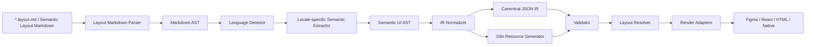

# Semantic Layout Markdown с i18n

[← Оглавление](README.md)

`Semantic Layout Markdown` (`SLM`) - это markdown-like формат, который описывает
экран на естественном языке, а затем компилируется в строгий JSON IR.

Это развитие идеи `Layout Markdown`: обычный `*.layout.md` может быть более
структурным и формальным, а `Semantic Layout Markdown` добавляет semantic
extraction, multilingual authoring and i18n resource generation.

## Две i18n-задачи

С поддержкой i18n архитектура должна решать две разные задачи:

```text
1. Multilingual authoring
   SLM-файл можно писать на русском, английском и других языках.

2. Product localization
   UI, полученный из IR, может рендериться на разных языках.
```

Главный принцип:

```text
Язык исходного Markdown не должен попадать в структуру приложения.
Markdown может быть русским.
IR должен быть language-neutral.
Тексты интерфейса должны быть вынесены в i18n resources.
```

## Цель

Формат должен:

- выглядеть как обычный Markdown;
- требовать минимум служебных вставок;
- поддерживать переменные, условия, повторы и действия;
- извлекать layout-семантику из структуры и текста;
- поддерживать несколько языков исходного описания;
- генерировать i18n-ключи и resource bundles;
- компилироваться в строгий JSON IR;
- быть независимым от renderer: Figma, React, HTML, Canvas, Native;
- быть достаточно точным, чтобы описать финальный Figma-like screen/frame.

## CNL: узел = предложение (основной формат авторинга)

**Контролируемый естественный язык (CNL)** — основной способ описывать вёрстку в SLM. Один
узел — **одно предложение**: существительное (тип узла) + последовательность фраз
`ключевое-слово значение…`. Дерево берётся из **вложенности markdown-заголовков**, а не из
отступов. Язык авторинга — **английский** (i18n-рантайм — `sourceLocale`/`targetLocales`,
ключи переводов — остаётся; см. [Две i18n-задачи](#две-i18n-задачи)).

```md
## Mission panel  column gap 16 padding 24 color #FFFFFF radius 12

Rectangle 120 by 15 color #00B843 radius 15
Text «Active missions» size 20 bold color #0F172A
Button «Create mission» size 16 bold color #22C55E
```

CNL при полном покрытии выражает **весь IR-паритет** для узла (это цель формата — см.
[Итоговая формула](#итоговая-формула)): любое свойство пишется инлайновой фразой, при
необходимости — со структурным значением в круглых скобках `( … )`. Реализация — пакет
`engine/frontend/.../cnl/`.

### Двунаправленность

CNL — не «shorthand поверх YAML», а **двусторонний** формат:

- **понимать** (`parse`): CNL → IR (`CnlParser`, десугар в типизированные патчи);
- **генерировать** (`emit`): IR → CNL детерминированно (`CnlEmitter`) — используется для
  write-back новых узлов, регенерации документа и тестов;
- **обновлять** (`write-back`): правка редактора хирургически патчит предложение
  (`edit/CnlWriter`), при неизбежности — перегенерирует всё предложение эмиттером.

Единый источник истины — реестр `CnlGrammar` (`Descriptor(kind, keyword, order, render)`):
одно ключевое слово работает в обе стороны, поэтому держится инвариант
`parse(emit(node)) ≡ node` (round-trip) и идемпотентность `emit`. Генерация
**детерминированная** (код, а не языковая модель). Диагностики самообъясняющие:
`[CNL:<rule>] … Правило … Как исправить …`.

### Существительные (тип узла)

Только в начале предложения:

| Существительное | Узел |
| --- | --- |
| `Rectangle` (`Rect`), `Ellipse` (`Circle`), `Line`, `Star`, `Polygon`, `Arrow` | shape |
| `Text` (`Label`) | текст |
| `Button` | текст с ролью `button` |
| `Frame` (`Container`), `Group` | контейнер |
| `Image` | media |
| `Vector` (`Icon`) | вектор/иконка |
| `Instance` | инстанс компонента |

**Контейнеры — это заголовки** `##`/`###`: заголовок несёт имя и те же layout/style-фразы
после имени; вложенность даёт дерево. Видимый текст узла — в `«…»` (или `"…"`). Явный
`id <nodeId>` пишет только структурный райтер (id-стабильные вставки), в ручном авторинге не
нужен.

### Значения и токены

| Форма | Значение |
| --- | --- |
| `12`, `0.5`, `-8` | число (хвостовой `.0` опускается) |
| `#RRGGBB`, `#RRGGBBAA` | цвет (альфа — когда ≠ FF) |
| `$id`, `$color.accent` | ссылка на переменную (var-ref) |
| `{{expr}}` | data-binding (выражение) |
| `«text»` | строковый литерал (текст, имя ассета, URL) |
| `1fr`, `2fr` | flex-трек grid; `hug` — трек по содержимому |
| `140%` | доля (line-height/tracking) |
| `( … )` | **структурная группа** (см. ниже) |

### Группы `( … )` и локальный scope

Богатые свойства пишутся группой. **Ключевое правило (keystone): под-ключи внутри `( )`
резолвятся ЛОКАЛЬНОй таблицей своего бакета и не «утекают» на уровень узла.** Например
`opacity`/`blend` внутри `color ( … )` — свойства этой заливки, а не узла; `duration` внутри
`animate ( … )` — параметр перехода, а не отдельная фраза. Группы вложены рекурсивно
(`stops (#hex at 0) (#hex at 1)`, `frames (0 rotation 0) (1 rotation 360)`).

### Каталог фраз (проверено round-trip-тестами)

**Геометрия и трансформация**

```md
Rectangle 520 by 8 color #22C55E radius 4
Rectangle 40 by 40 color #2563EB opacity 0.5 rotation 30
Rectangle 120 by 80 color #111827 radius (12 12 0 0) smoothing 0.6 blend multiply
```
`W by H` (fixed) · `radius N` / `radius (tl tr br bl)` · `smoothing N` · `opacity N|$id|{{expr}}`
· `rotation N` · `position x y` · `blend <mode>`.

**Размеры (sizing-режимы)**

```md
Rectangle width (fill min 320 max 520) height hug
Rectangle width (fixed 200 min 100) height (fill max 400)
```
`width|height fixed|hug|fill` или группа `(fixed N min N max N)`.

**Заливки (fills)** — можно несколько подряд (стек по порядку IR)

```md
Rectangle 40 by 40 color #FF0000 color #00FF0080
Rectangle 40 by 40 color $color.accent
Rectangle 40 by 40 color (#4F46E5 opacity 0.5 blend multiply visible no)
Rectangle 200 by 120 gradient (linear from (0 0) to (0 1) stops (#4F46E5 at 0) (#9333EA at 1))
Rectangle 300 by 200 image (asset «hero.jpg» crop focus (0.5 0.5) replaceable)
Rectangle 300 by 200 video (asset «promo.mp4» poster «promo.jpg» autoplay loop muted no)
```
`color <token>` (solid) · per-fill `color (<token> opacity N blend M visible no)` ·
`gradient (linear|radial|angular|diamond from (x y) to (x y) stops (<token> at p) …)` ·
`image (asset «id» fit|crop|tile|stretch focus (x y) replaceable)` ·
`video (asset «id» poster «id» autoplay loop muted no)`.

**Обводки (strokes) и эффекты**

```md
Rectangle 96 by 32 color #14532D stroke #1F2937 2 outside
Rectangle 40 by 40 stroke (color #4F46E5 color $accent weight 2 align outside dash (4 2) cap round join round)
Rectangle 40 by 40 color #FFFFFF effect (dropShadow color #00000040 offset (0 2) blur 8)
Rectangle 40 by 40 effect (innerShadow color $shadow offset (0 1) blur 4 spread 1) effect (backgroundBlur 12)
```
Тривиальная обводка: `stroke <token> [weight] [outside|center]`. Запись:
`stroke (color … weight N align … dash (…) cap butt|round|square join miter|round|bevel)`.
Эффекты (повторяются): `effect (dropShadow|innerShadow color <token> offset (x y) blur N spread N)`,
`effect (layerBlur N)`, `effect (backgroundBlur N)`.

**Общие (shared) стили**

```md
Frame styles (fill card.primary effect shadow.card grid layout.12col)
```

**Auto-layout контейнера**

```md
Frame column align (inline stretch) distribute space-between wrap clip
Frame grid gap (row 24 column 24)
Frame row gap auto
```
Направление: `column|row|grid|free`. `gap N` / `gap auto` / `gap (row N column N)`.
`padding N` / `padding v h` / `padding t r b l`. `align (inline start|center|end|stretch
block … baseline last)`. `distribute center|end|space-between`. `wrap` · `clip`.

**Позиционирование ребёнка и constraints**

```md
Frame absolute anchor (inlineEnd 4 blockStart 4) width (fixed 8) height (fixed 8)
Rectangle 40 by 40 constraints (horizontal left-right vertical scale)
```
`absolute` · `anchor (inlineStart|inlineEnd|blockStart|blockEnd N …)` ·
`constraints (horizontal left|right|center|left-right|scale vertical top|bottom|center|top-bottom|scale)`
· краткое выравнивание в родителе `align center|bottom|right`.

**Grid**

```md
Frame grid columns (count 12 track 1fr) rows (auto min 96) gap (row 24 column 24)
Rectangle place (column 1 row 1 columnSpan 8 rowSpan 2)
Frame guides (vertical 72) (horizontal 120) grids (columns count 12 gutter 24 margin 72 alignment stretch color #EEEEEE)
Frame overflow (x hidden y auto) scroll (direction vertical fixedChildren (missionPanelHeader))
```

**Типографика (Text)**

```md
Text «Active missions» size 20 bold color #F8FAFC
Text «Ship status» font «Inter Display» line-height 140% tracking 0.5 paragraph-spacing 8 text-align center text-valign top case upper decoration underline
Text «Metrics» features (liga on) (tnum off) axes (opsz 28) (wght 620) autosize height truncate 2 list (bullet indent 1)
Text «Caption» line-height 20 decoration strikethrough case title text-align justified maxLines 3 text-style $body
```
`size N` · веса `bold|semibold|thin` · `font «…»` · `line-height N|N%` · `tracking N|N%` ·
`paragraph-spacing N` · `text-align left|center|right|justified` · `text-valign top|center|bottom` ·
`case upper|lower|title` · `decoration underline|strikethrough` · `features (<tag> on|off) …` ·
`axes (<tag> N) …` · `autosize height|both` · `truncate N` · `maxLines N` ·
`list (bullet|ordered indent N)` · `text-style $id` · `key <i18nKey>` (обычно ключи
генерируются автоматически).

**Ссылки в тексте**

```md
Text «Read more» link (range (0 9) url «https://a.co»)
Text «Open cart» link (range (0 9) to checkout)
```

**Компоненты (сторона инстанса)**

```md
Instance of ds/Button variant (size md tone primary) props (label «Save» loading true count 3)
Instance of ds/Button library acme/ui props (total {{cart.total}} icon (swap ds/Icon/Check))
Instance of ds/Card slot actions (ds/Button props (label «Save»)) (ds/Button props (label «Cancel»)) nested title (variant (size sm) props (text «Overview»))
Instance of ds/Card detach reset
```
`of <ref>` · `library <id>` · `variant (axis value …)` · `props (name «text» | name true |
name N | name {{expr}} | name (swap <ref>) | name (text «…» key <id>))` · `detach` · `reset` ·
`slot <name> (<ref> props (…)) …` · `nested <path> (variant (…) props (…))`.

**Медиа-узел**

```md
Image media (asset media/hero video crop focus center alt «Hero banner» opacity 0.85 blend multiply poster media/hero_thumb autoplay loop unmuted)
Image media (asset icons/avatar fit)
```

**Фигуры и вектор**

```md
Star points 5 inner 0.45
Vector viewbox (0 0 24 24) icon ds/Icon/Plus
Vector viewbox (0 0 24 24) path «M4 12L20 12» path «M12 4L12 20» evenodd
Vector network (vertex (0 0 corner) vertex (24 0) vertex (24 24 in (-8 0) out (8 0) mirror angle) segment (0 1) segment (1 2) segment (2 0) region evenodd loops (0 1 2))
Frame boolean subtract
```
`points N` · `inner F` · `viewbox (x y w h)` · `icon <ref>` · `svg <ref>` ·
`path «d» [evenodd] …` · `network ( vertex ( x y [in (dx dy)] [out (dx dy)]
[mirror angle|angleAndLength] [corner] ) … segment (from to) … region [evenodd] loops (i …) )` ·
`boolean union|subtract|intersect|exclude`.

**Маска**

```md
Rectangle mask alpha clips (title_bar hero_image)
Ellipse mask luminance
```

**Интеракции и motion**

```md
Button onClick navigate (home) animate (type smartAnimate duration 400)
Frame onKey (Enter) setVariable (isOpen) to (true) closeOverlay
Rectangle onClick openOverlay (menu) overlay (position bottomCenter closeOnOutside false) whileHovering changeToVariant (self) variant (state hover)
Frame afterDelay (3000) navigate (splash) animate (easing spring stiffness 120 damping 14 duration 500)
Vector motion (loader) duration 800 loop frames (0 rotation 0) (1 rotation 360)
```
Триггеры (каждый начинает отдельную интеракцию): `onClick|onHover|onPress|onDrag|onKey (Key)|
afterDelay (ms)|whileHovering|whilePressed|onVariableChange (var)`. Действия:
`navigate (dest)|back|openOverlay (id)|swapOverlay (id)|closeOverlay|openLink (url)|
scrollTo (id)|setVariable (v) to (val)|changeToVariant (target) variant (…)|runActionSet (id)`.
Переход: `animate (type smartAnimate|dissolve|push|… direction … duration N)` или
`animate (easing spring stiffness N damping N mass N duration N)`; `animated (false)`; overlay —
`overlay (position … closeOnOutside false background …)`. Motion:
`motion (<ref>) duration N loop frames (t <prop> <val> …) …`.

**Data-binding**

```md
Rectangle 120 by 40 color {{theme.bg}}
Rectangle 120 by 40 color ({{theme.bg}} opacity 0.5)
Rectangle 120 by 40 color #FFFFFF opacity $anim.fade
```

**Отзывчивость, экспорт, handoff**

```md
Frame column gap 12 when (breakpoint sm) column gap 8
Frame when (platform ios density high) radius 12 when (breakpoint lg) row gap 24
Image export (png at 2 «@2x») (svg)
Rectangle 40 by 40 note «Keep 8pt spacing» (target card audience dev) measure (from title to cta inline value 16) code (framework «Compose» component «MissionCard»)
```
`when (dim value [dim value …]) <фразы>` — `dim` ∈ `breakpoint|theme|platform|density|locale`
(повторяется). `export (png|svg|jpg|pdf [at N] [«suffix»]) …` / `export off`. `note`/`measure`/
`code` — авторятся, но поднимаются в `DesignDocument.handoff` (per-node не эмитятся обратно).

### Статус и сосуществование с YAML

- **Готово (в `main`):** двусторонняя грамматика всех нод-уровневых бакетов выше
  (`parse` + `emit` + write-back).
- **Пока авторится YAML (в миграции):** словари уровня документа — **variable collections**,
  **component definitions**, **shared styles** (не свойства узла, а `DesignDocument.{variables,
  components,styles}`), а также несколько reader-gap'ов (гетерогенные grid-треки,
  `weightPerSide`, per-node `variableModes`, `overrides.set`, rich-text style-спаны, `$ref` в
  literal-only слотах и др.). План их переноса и удаления YAML/`ir`-авторинга — в
  [4-ОСТАЛОСЬ](../4-ОСТАЛОСЬ.md); цель — в [1-ЦЕЛЬ](../1-ЦЕЛЬ.md).
- **Внутренняя машинерия (не авторинг):** CNL десугарит в те же типизированные патчи
  (`node`/`layout`/`style`/`text`/…) через block-readers — они остаются как внутренний
  compile-путь, но **не** как поверхность авторинга. Frontmatter остаётся YAML (метаданные).
  Типизированные YAML-блоки и `ir` как способ **авторинга** — легаси, выводятся из
  употребления.

Полный словарь для генерации экранов моделью и каталог ошибок — в `SLM-SKILL.md`.

## Уровни полноты

SLM должен различать три уровня:

| Уровень | Что покрывает | Цель для SLM |
| --- | --- | --- |
| `screen-intent complete` | Смысл экрана: sections, content, actions, data bindings, simple layout intent. | Базовый уровень semantic shorthand |
| `figma-screen complete` | Видимый frame/screen: layer tree, layout, style, typography, components, media, interactions. | Практичная цель |
| `figma-file complete` | Весь Figma file/workspace: pages, comments, permissions, versions, libraries, Dev Mode workflows. | Не основная цель |

SLM не должен моделировать историю версий, multiplayer editing, billing,
permissions or product rollout. Он должен уметь описать финальный экран,
который можно воспроизвести в Figma-like renderer или другом UI renderer.

## Слои authoring

SLM различает слои авторинга (от свободного к точному):

```text
1. Semantic shorthand
   Markdown и естественный язык для смысла экрана (sections, actions, bindings).

2. CNL — узел = предложение
   Точный слой на IR-паритете. Основной формат авторинга вёрстки.

3. Typed YAML blocks / ```ir  (легаси)
   Внутренняя типизированная форма, в которую CNL десугарит. Как поверхность
   АВТОРИНГА — выводится из употребления (см. миграцию).
```

Semantic shorthand удобен для частых паттернов:

```md
Верхняя панель: заголовок Mission Control, справа основная кнопка [Создать миссию](/missions/new).
```

Точные свойства задаёт **CNL-предложение** (контейнер — заголовок с фразами после имени):

```md
## CTA Card  row distribute space-between align (block center) padding 24 gap 12 width fill height hug color $color.surface radius 12 styles (effect shadow.card)
```

Под капотом это разворачивается в те же типизированные патчи — раньше их писали YAML-блоком
напрямую (легаси-форма, эквивалент строки выше):

```md
## CTA Card
node: frame
layout:
  mode: row
  padding:
    block: $space.4
    inline: $space.6
  gap: $space.3
  align:
    inline: space-between
    block: center
  sizing:
    width: fill
    height: hug
style:
  fills:
    - token: color.surface
  radius: $radius.md
  effects:
    - style: shadow.card
```

Правило приоритета (на уровне патчей, куда десугарят и CNL, и легаси-блоки):

```text
явный патч (CNL / typed-block) > frontmatter defaults > semantic extraction > renderer defaults
```

Если явный патч конфликтует с natural-language extraction, compiler использует явный патч и
выдаёт diagnostic с source map.

## Pipeline



## Source Format

SLM остается Markdown-first:

```md
---
screen: missionDashboard
page: Operations
sourceLocale: ru-RU
targetLocales:
  - ru-RU
  - en-US
density: compact
platform: web
theme: light
frame:
  preset: desktop-1440
  width: 1440
  height: 1024
canvas:
  section: Mission Flow
  position:
    x: 1200
    y: 400
flow:
  id: missionOperations
  node: dashboard
  next:
    - createMissionDialog
breakpoints:
  - id: desktop
    minWidth: 1024
  - id: mobile
    maxWidth: 767
libraries:
  - id: ds
    source: "@company/design-system"
---

# Панель миссий

Верхняя панель: заголовок Mission Control, справа основная кнопка [Создать миссию](/missions/new).

Фильтры:
- Поиск по {{query.search}}
- Статус из {{query.status}}

Если {{missions.length == 0}}:
> Пустое состояние: миссий пока нет. Основное действие [Создать миссию](/missions/new).

Миссии:
- Карточка для каждой {{mission in missions}}:
  - Название: {{mission.name}}
  - Статус: {{mission.status}} как badge
  - Действие: [Открыть](/missions/{{mission.id}})
```

Явные конструкции нужны только для формальных вещей:

| Конструкция | Значение |
| --- | --- |
| `{{variable.path}}` | Binding |
| `{{item in collection}}` | Repeat |
| `Если {{condition}}:` | Conditional block |
| `[Label](/target)` | Action/navigation |
| Frontmatter | Metadata |

Остальное извлекается из структуры и текста.

Frontmatter может задавать только screen-level defaults. Точные свойства
конкретного layer/node задаются typed blocks рядом с соответствующим Markdown
узлом.

## Typed Attribute Blocks

> **Статус.** Типизированные блоки — это **внутренняя типизированная модель**, в которую
> десугарит [CNL](#cnl-узел--предложение-основной-формат-авторинга); block-readers и эта
> схема остаются как compile-путь. Как **поверхность авторинга** (писать YAML-блоки/`ir`
> руками) они легаси и выводятся из употребления — новый код авторится CNL-предложениями.
> Разделы ниже описывают семантику каждого ключа (это же — контракт соответствующих
> CNL-фраз). Исключения, которые пока авторятся именно так: словари уровня документа
> (`variables`/`component`-definition/`styles`) и часть reader-gap'ов — см. миграцию.

Typed attribute block - это YAML-like блок с зарезервированным top-level ключом,
который относится к ближайшему предыдущему heading, list item, image, table or
explicit node marker.

Зарезервированные ключи:

| Block | Назначение |
| --- | --- |
| `node` | Тип, id, имя, visibility, lock, order, position |
| `layout` | Auto layout, grid, constraints, sizing, overflow |
| `style` | Fills, strokes, effects, opacity, blend, radius |
| `text` | Content, typography, rich text, truncation, links, lists |
| `component` | Component definition or instance binding |
| `props` | Component properties and instance overrides |
| `media` | Image/video fill or asset reference |
| `shape` | Shape primitive and geometry |
| `vector` | Vector path/network, icon ref, boolean operations |
| `mask` | Mask source and mask relationship |
| `action` | Shorthand for a single default `onClick` interaction |
| `interaction` | Prototype trigger, action, destination, transition |
| `motion` | Animation or motion reference |
| `responsive` | Breakpoint, platform, theme, density, locale overrides |
| `variables` | Local prototype or design variables |
| `handoff` | Dev notes, annotations, measurements |
| `export` | Export settings for assets |
| `ir` | Exact JSON IR escape hatch |

`node: frame` is shorthand for:

```yaml
node:
  type: frame
```

Пример полного node block:

```md
## Active Missions Grid
node:
  type: frame
  id: activeMissionsGrid
  name: Active Missions Grid
  visible: true
  locked: false
  order: 30
layout:
  mode: grid
  columns:
    count: 3
    track: 1fr
  rows:
    auto: true
    min: 160
  gap:
    row: $space.4
    column: $space.4
  sizing:
    width: fill
    height: hug
```

Markdown порядок задает layer order по умолчанию. Для точного восстановления
Figma-like tree можно указать `node.order`; siblings сортируются по нему, а при
равенстве сохраняют Markdown order.

## Markdown Semantics

Базовое сопоставление:

| Markdown element | Semantic meaning |
| --- | --- |
| Frontmatter | Screen metadata |
| `#` | Screen title |
| `##` | Major section |
| `###` | Nested section |
| Paragraph | Semantic instruction |
| List | Group / collection / repeated content |
| Link | Action / navigation |
| Image | Media node |
| Table | Table node |
| Blockquote | Callout / empty state / warning |
| Code block | Explicit override |

Пример:

```md
Верхняя панель: заголовок Mission Control, справа основная кнопка [Создать миссию](/missions/new).
```

Компилятор извлекает:

```json
{
  "type": "frame",
  "role": "topbar",
  "layout": {
    "mode": "row",
    "align": {
      "block": "center"
    },
    "distribution": "space-between"
  },
  "children": [
    {
      "type": "text",
      "role": "title",
      "content": {
        "defaultText": "Mission Control"
      }
    },
    {
      "type": "instance",
      "role": "primaryAction",
      "component": {
        "ref": "ds/Button",
        "variant": {
          "type": "primary"
        },
        "props": {
          "label": {
            "type": "text",
            "content": {
              "defaultText": "Создать миссию"
            }
          }
        }
      },
      "interactions": [
        {
          "trigger": "onClick",
          "action": {
            "type": "navigate",
            "to": "/missions/new"
          }
        }
      ]
    }
  ]
}
```

## Контракт `figma-screen complete`

SLM считается `figma-screen complete`, если для каждого финального screen/frame
он может выразить:

- stable ids, names and source map;
- visible node tree with layer order;
- node types: `screen`, `frame`, `group`, `section`, `component`, `instance`,
  `text`, `shape`, `vector`, `media`, `table`, `slot`, `annotation`;
- Auto layout, grid, constraints, absolute positioning, clipping and overflow;
- sizing: `hug`, `fill`, `fixed`, min/max per axis;
- visual style: fills, strokes, effects, opacity, blend, radius;
- typography and rich text behavior;
- component refs, variants, properties, slots and overrides;
- variables, styles, tokens and modes;
- media/vector/mask/export asset references;
- interactions, states, prototype variables and animations;
- responsive variants for platform, density, theme, locale and breakpoints;
- validation diagnostics for every unsupported or ambiguous feature.

Natural language может создавать эти структуры автоматически, но полнота
опирается на strict IR schema and explicit override syntax.

Feature coverage map:

| Figma-like scenario | SLM coverage |
| --- | --- |
| Files, pages, canvas sections for screen placement | Frontmatter: `screen`, `page`, `canvas`, `frame`; optional flow metadata |
| Frames, groups, layers, visibility, lock, z/layer order | `node` block and common node contract |
| Auto layout, grid, constraints, clipping, overflow, scroll | `layout` block |
| Responsive behavior and device/layout variants | `breakpoints`, `responsive` block and mode overrides |
| Components, instances, variants, properties, slots | `component`, `props`, `overrides` blocks |
| Styles, variables, tokens, modes | `variables`, `style`, token/style refs |
| Text layers, typography, rich text, truncation, links, lists | `text` block |
| Fills, strokes, effects, opacity, blend, radius | `style` block |
| Shapes, vector paths, boolean operations, masks | `shape`, `vector`, `mask` blocks |
| Images and videos as fills | `media` block normalized to fill behavior |
| Prototype triggers, overlays, state variables, transitions | `interaction`, `variables.prototype` blocks |
| Motion and micro-interactions | `motion` block or external motion refs |
| Dev notes, annotations, measurements | `handoff` block |
| Exportable assets | `export` block |
| AI, Make, Sites, Buzz, Slides outputs | Scope boundary: represent outputs as screen primitives, not workflow history |

## Node Model

Каждый node в IR имеет общий контракт:

```yaml
id: stableNodeId
type: frame
name: Human readable layer name
role: topbar | main | sidebar | card | primaryAction
visible: true
locked: false
order: 10
position:
  mode: auto | absolute
  x: 0
  y: 0
  rotation: 0
constraints:
  horizontal: left | right | center | left-right | scale
  vertical: top | bottom | center | top-bottom | scale
sourceMap:
  file: mission-dashboard.layout.md
  line: 24
children: []
```

Node types:

| Type | Назначение |
| --- | --- |
| `screen` | Root frame or rendered viewport |
| `frame` | Layout container with Auto layout, constraints, clipping, style |
| `group` | Structural grouping without layout contract |
| `section` | Semantic region, often compiles to frame |
| `component` | Main component definition |
| `instance` | Linked component instance with props and overrides |
| `text` | Text layer with content and typography |
| `shape` | Rectangle, ellipse, line, polygon, star, arrow |
| `vector` | Path/network, icon, boolean result |
| `media` | Convenience node for image/video-backed layer |
| `table` | Structured table or grid-like data display |
| `slot` | Component slot content target |
| `annotation` | Handoff note, comment-like marker, measurement |

`group` не должен скрывать layout-смысл. Если node влияет на spacing,
responsive behavior or clipping, он должен быть `frame` or `section`, not
generic `group`.

## Layout Schema

Layout block покрывает Auto layout, grid, absolute positioning, constraints,
clipping and scroll behavior.

```md
## Mission Detail Panel
node: frame
layout:
  mode: column
  padding:
    top: $space.5
    right: $space.6
    bottom: $space.5
    left: $space.6
  gap:
    row: $space.4
    column: $space.2
  align:
    inline: stretch
    block: start
    baseline: first
  distribution: packed
  wrap: false
  sizing:
    width:
      type: fill
      min: 320
      max: 520
    height:
      type: hug
  clipContent: true
  overflow:
    x: hidden
    y: auto
  scroll:
    direction: vertical
    fixedChildren:
      - missionPanelHeader
```

Grid layout:

```md
layout:
  mode: grid
  columns:
    count: 12
    track: 1fr
    gap: $space.4
  rows:
    auto: true
    min: 96
    gap: $space.4
  placement:
    column: 1
    columnSpan: 8
    row: 1
    rowSpan: 2
```

Absolute or ignored Auto layout child:

```md
### Notification Dot
node:
  type: shape
  id: notificationDot
layout:
  ignoreAutoLayout: true
  position:
    mode: absolute
    inlineEnd: 4
    blockStart: 4
  sizing:
    width:
      type: fixed
      value: 8
    height:
      type: fixed
      value: 8
constraints:
  horizontal: right
  vertical: top
```

SLM использует logical directions: `start`, `end`, `inlineStart`,
`inlineEnd`, `blockStart`, `blockEnd`. Physical directions `left` and `right`
разрешены только как import compatibility and should normalize to logical
directions with locale context.

## Responsive and Mode Overrides

Responsive behavior задается через breakpoints and modes:

```md
responsive:
  variants:
    - when:
        breakpoint: mobile
      layout:
        mode: column
        padding:
          inline: $space.4
        gap: $space.3
      style:
        radius: 0
    - when:
        breakpoint: desktop
        density: compact
      layout:
        mode: row
        gap: $space.2
```

Допустимые dimensions for overrides:

- `breakpoint`;
- `devicePreset`;
- `platform`;
- `theme`;
- `density`;
- `locale`;
- `direction`;
- `brand`;
- `state`.

Renderer chooses the best matching variant from the normalized IR. If two
variants match equally, validator must report ambiguity.

Layout grids and guides are screen/frame properties:

```md
layout:
  guides:
    - orientation: vertical
      position: 72
  grids:
    - type: columns
      count: 12
      gutter: 24
      margin: 72
      alignment: stretch
```

## Components, Instances and Slots

Figma-like screens часто состоят из design-system instances. SLM должен
различать component definition and instance usage.

Instance example:

```md
### Button: Создать миссию
node:
  type: instance
  id: createMissionButton
component:
  ref: ds/Button
  libraryRef: ds
  variant:
    type: primary
    size: md
    state: default
  props:
    label:
      type: text
      value: Создать миссию
      i18nKey: missionDashboard.actions.createMission
    iconLeading:
      type: instanceSwap
      value: ds/Icon/Plus
    loading:
      type: boolean
      value: false
action:
  type: navigate
  to: /missions/new
```

Component definition example:

```md
## Component: Mission Card
node:
  type: component
  id: componentMissionCard
component:
  name: ds/MissionCard
  variants:
    status:
      values: [nominal, warning, critical]
    density:
      values: [compact, comfortable]
  properties:
    title:
      type: text
      default: Mission name
    showBadge:
      type: boolean
      default: true
    icon:
      type: instanceSwap
      preferredValues:
        - ds/Icon/Rocket
        - ds/Icon/Alert
    actions:
      type: slot
      minItems: 0
      maxItems: 3
```

Instance overrides:

```md
props:
  title: "{{mission.name}}"
  showBadge: "{{mission.status != 'archived'}}"
overrides:
  slots:
    actions:
      - instance: ds/Button
        props:
          label: Открыть
          type: secondary
  nestedInstances:
    statusBadge:
      variant:
        tone: "{{mission.statusTone}}"
```

Allowed component property types:

- `boolean`;
- `text`;
- `variant`;
- `instanceSwap`;
- `slot`;
- `number`;
- `string`;
- `dataBinding`.

SLM can model `resetOverrides` and `detach`, but they are authoring operations,
not preferred screen state:

```md
component:
  ref: ds/LegacyCard
  detach: false
  resetOverrides: false
```

## Styles, Variables and Tokens

SLM must separate semantic tokens, reusable styles and raw variables.

```md
variables:
  collections:
    - id: theme
      modes: [light, dark]
      variables:
        color.surface:
          type: color
          values:
            light: "#ffffff"
            dark: "#101114"
        radius.card:
          type: number
          values:
            light: 8
            dark: 8
    - id: density
      modes: [compact, comfortable]
      variables:
        space.4:
          type: number
          values:
            compact: 12
            comfortable: 16
```

Style references:

```md
style:
  fillStyle: color.surface.default
  textStyle: typography.heading.lg
  effectStyle: shadow.card
  gridStyle: grid.desktop.12
```

Variable bindings:

```md
style:
  fills:
    - variable: color.surface
  radius:
    variable: radius.card
layout:
  gap:
    variable: space.4
```

Rules:

- tokens and variables are technical identifiers and are not translated;
- modes must be explicit: theme, density, platform, locale, brand or custom;
- aliases must resolve to a concrete value for every rendered mode;
- unresolved token/style/variable refs are validation errors.

## Text and Typography

Text content is i18n-managed, but text layer behavior is layout-managed.

```md
### Text: Mission Control
node:
  type: text
  id: missionTitle
text:
  key: missionDashboard.title
  defaultText: Mission Control
  style: typography.heading.lg
  typography:
    fontFamily: Inter
    fontWeight: 700
    italic: false
    fontSize: 24
    lineHeight: 32            # bare number = px; {unit: percent, value: 135} = %; omit = Auto
    letterSpacing: 0
    paragraphSpacing: 0
    paragraphIndent: 0
    horizontalAlign: start
    verticalAlign: center
    decoration: none          # none | underline | strikethrough
    decorationStyle: solid    # solid | dashed | dotted | wavy
    decorationColor: "#3366FF"  # omit = follows the glyph color
    decorationThickness: 1    # px number, or {unit: percent, value}; omit = auto
    decorationSkipInk: false
    case: none                # none | upper | lower | title | smallCaps | smallCapsForced
    position: none            # none | superscript | subscript
    leadingTrim: none         # none | capHeight
    hangingPunctuation: false
    hangingList: false
    openType:
      liga: true
      tnum: true
    variableFont:
      weight: 700
      opticalSize: 24
  resizing:
    width: fill
    height: hug
  maxLines: 1
  overflow: truncate
```

Rich text spans — each span carries a `range: [start, end]` (or `text:` substring matched
against `defaultText`) plus any of a shared `style:` ref, an inline `typography:` map, inline
`fills:`, and a `link:`. Offsets index the source-locale `defaultText`.

```md
text:
  key: missionDashboard.notice
  defaultText: "Проверьте SLA перед запуском миссии."
  spans:
    - range: [0, 10]
      typography:
        fontWeight: 700
        italic: true
      fills:
        - "#FF3366"
    - text: SLA
      link:
        type: url
        href: https://example.com/sla
      style: typography.link
  list:
    type: none
    indent: 0
```

Text validation must check:

- missing content keys;
- invalid typography values;
- unsupported fonts;
- max lines and truncation policy;
- overflow behavior for every target locale;
- inline link targets;
- list indentation and paragraph spacing;
- rich text spans after translation.

## Visual Style

Style block describes visible layer appearance.

```md
style:
  opacity: 0.96
  blendMode: normal
  radius:
    topLeft: $radius.md
    topRight: $radius.md
    bottomRight: $radius.md
    bottomLeft: $radius.md
  cornerSmoothing: 0.6
  fills:
    - type: solid
      token: color.surface
      opacity: 1
    - type: linearGradient
      stops:
        - position: 0
          token: color.accent.start
        - position: 1
          token: color.accent.end
      opacity: 0.12
  strokes:
    - token: color.border.subtle
      weight: 1
      position: inside
      dash: []
      caps: none
      joins: round
  effects:
    - type: dropShadow
      x: 0
      y: 8
      blur: 24
      spread: 0
      token: shadow.card.color
      opacity: 0.18
```

Supported fills:

- `solid`;
- `image`;
- `video`;
- `linearGradient`;
- `radialGradient`;
- `angularGradient`;
- `diamondGradient`.

Supported effects:

- `dropShadow`;
- `innerShadow`;
- `layerBlur`;
- `backgroundBlur`;
- effect style refs.

## Shapes, Vectors and Masks

Simple shapes can be declarative:

```md
### Status Indicator
node:
  type: shape
shape:
  kind: ellipse
  width: 10
  height: 10
style:
  fills:
    - token: color.status.success
```

Vectors should use asset refs for complex paths:

```md
### Alert Icon
node:
  type: vector
vector:
  iconRef: ds/Icon/Alert
  pathRef: assets/icons/alert.svg
  viewBox: [0, 0, 24, 24]
style:
  fills:
    - token: color.icon.warning
```

Inline vector data is allowed for generated or imported assets:

```md
vector:
  paths:
    - d: "M12 2L22 20H2L12 2Z"
      windingRule: nonzero
  boolean:
    op: union
    children:
      - triangleBase
      - alertCutout
```

Mask relationship:

```md
mask:
  type: alpha
  source: avatarMask
  appliesTo:
    - avatarImage
```

Rules:

- use `shape` for primitive geometry;
- use `vector.pathRef` or `iconRef` for reusable icons;
- use inline vector paths only when the file itself owns the shape;
- boolean operations must preserve child source maps.

### Figure keys (Figma parity)

- **Ellipse arc / donut** — under `shape:` (`kind: ellipse`): `arcStart` and `arcSweep`
  (degrees; 0° = 3 o'clock, positive sweep clockwise on screen), and `innerRadius`
  (donut-hole ratio 0..1). `|arcSweep| ≥ 360` or omitted = full ellipse.
  ```md
  shape:
    kind: ellipse
    arcStart: -90
    arcSweep: 270
    innerRadius: 0.5   # donut
  ```
- **Per-vertex corner radius** — each `network.vertices[]` may carry `radius: N`
  (rounds the vertex when it joins two straight segments; clamped to half the shorter
  adjacent segment).
- **Region fills** — each `network.regions[]` may carry `fills:` (same schema as
  `style.fills`); a region's fills replace the object fills for that region, and regions
  without fills inherit the object fills.
- **Stroke join** — `style.strokes[].joins` = `miter` | `round` | `bevel`.
- **Fill rule** — `vector.paths[].windingRule` / `network.regions[].windingRule` =
  `nonzero` | `evenodd`.
- **Flatten / Outline stroke** are editor operations, not new keys: they persist as
  plain `vector.paths` (or `vector.network`) with the appropriate winding rule.

## Images and Media

Figma treats images and videos as fills. SLM can expose a `media` convenience
block, but normalized IR should still model the fill behavior.

```md
### Mission Map
node:
  type: media
  id: missionMap
media:
  asset: assets/mission-map.png
  kind: image
  fillMode: crop
  focalPoint:
    x: 0.48
    y: 0.42
  alt:
    key: missionDashboard.map.alt
    defaultText: Карта активных миссий
  replaceable: true
  opacity: 1
  blendMode: normal
```

Video settings:

```md
media:
  asset: assets/launch-preview.mp4
  kind: video
  fillMode: fit
  poster: assets/launch-preview-poster.jpg
  autoplay: false
  loop: true
  muted: true
```

Fill modes:

- `fill`;
- `fit`;
- `crop`;
- `tile`;
- `stretch`;
- focal point with normalized x/y coordinates.

## Prototype Interactions and Motion

Markdown links are shorthand for navigation. Complete prototype behavior uses
`interaction` blocks.

```md
### Create Mission Button
interaction:
  trigger: onClick
  action: openOverlay
  destination: createMissionDialog
  overlay:
    position: center
    closeOnOutsideClick: true
    background: rgba(0,0,0,0.32)
  animation:
    type: smartAnimate
    easing: easeOut
    durationMs: 220
```

Supported triggers:

- `onClick`;
- `onHover`;
- `onPress`;
- `onDrag`;
- `onKey`;
- `afterDelay`;
- `whileHovering`;
- `whilePressed`;
- `onVariableChange`.

Supported actions:

- `navigate`;
- `openOverlay`;
- `swapOverlay`;
- `closeOverlay`;
- `back`;
- `openLink`;
- `setVariable`;
- `changeToVariant`;
- `scrollTo`;
- `runActionSet`.

Prototype variables:

```md
variables:
  prototype:
    selectedMissionId:
      type: string
      default: ""
    isCreateDialogOpen:
      type: boolean
      default: false
interaction:
  trigger: onClick
  actions:
    - type: setVariable
      variable: selectedMissionId
      value: "{{mission.id}}"
    - type: changeToVariant
      target: missionCard
      variant:
        state: selected
```

Motion block is for animation references or simple keyframes. Full Motion
timeline authoring can be externalized.

```md
motion:
  ref: motion/loading-pulse.json
  fallback:
    type: keyframes
    durationMs: 900
    loop: true
    frames:
      - at: 0
        opacity: 0.4
      - at: 0.5
        opacity: 1
      - at: 1
        opacity: 0.4
```

## Handoff, Annotations and Export

SLM can include handoff metadata without becoming a full Dev Mode clone.

```md
handoff:
  annotations:
    - id: note-loading
      target: missionGrid
      text: Показывать skeleton после 250 ms ожидания.
      audience: engineering
  measurements:
    - from: missionGrid
      to: missionPanel
      axis: inline
      value: $space.6
  code:
    framework: react
    componentHint: MissionDashboard
```

Export settings:

```md
export:
  enabled: true
  settings:
    - format: png
      scale: 2
      suffix: "@2x"
    - format: svg
      suffix: ""
```

Annotations, measurements and export settings are screen artifacts. Version
history, permissions, billing, branch state and multiplayer comments remain out
of scope.

## Exact IR Escape Hatch

> **Deprecated.** Цель формата — **полный IR-паритет в CNL без escape-люка** (см.
> [1-ЦЕЛЬ](../1-ЦЕЛЬ.md)). `ir` как способ авторинга выводится из употребления и будет
> удалён; новые фичи закрываются CNL-фразами и, при необходимости, расширением ридеров/IR,
> а не встраиванием сырого JSON. Раздел оставлен как исторический контекст.

Rare unsupported cases can embed exact IR:

````md
```ir
{
  "type": "vector",
  "id": "customAlertIcon",
  "name": "Custom alert icon",
  "vector": {
    "pathRef": "assets/icons/custom-alert.svg"
  }
}
```
````

Escape hatch is not a replacement for SLM. It exists so the compiler can avoid
guessing when a feature is too specific or imported from an external design
source.

## Multilingual Semantic Extraction

Для каждого языка нужен semantic lexicon.

Пример русских правил:

| Phrase | Meaning |
| --- | --- |
| `верхняя панель` | `role=topbar`, `layout=row` |
| `справа` | `justify=between` / `align=end` |
| `основная кнопка` | `role=primaryAction`, `component=button`, `variant.type=primary` |
| `вторичная кнопка` | `component=button`, `variant.type=secondary` |
| `пустое состояние` | `emptyState` |
| `как badge` | `badge` |
| `карточка для каждой` | `card + repeat` |
| `компактно` | `density=compact` |

Английские эквиваленты:

| Phrase | Meaning |
| --- | --- |
| `top bar` | `role=topbar`, `layout=row` |
| `on the right` | `justify=between` / `align=end` |
| `primary button` | `role=primaryAction`, `component=button`, `variant.type=primary` |
| `secondary button` | `component=button`, `variant.type=secondary` |
| `empty state` | `emptyState` |
| `as badge` | `badge` |
| `card for each` | `card + repeat` |
| `compact` | `density=compact` |

Результат должен быть одинаковым независимо от языка source-документа.

Typed block keys are language-neutral. Автор может писать prose на русском,
английском или другом языке, но ключи `layout`, `style`, `component`, `text`,
`media`, `shape`, `vector`, `mask`, `action`, `interaction`, `motion`,
`responsive`, `variables`, `handoff`, `export` and nested enum values остаются
стабильными. Это делает explicit blocks portable across locales and avoids
locale-specific schemas.

## Canonical JSON IR

IR должен быть language-neutral.

```json
{
  "id": "createMission",
  "type": "instance",
  "role": "primaryAction",
  "component": {
    "ref": "ds/Button",
    "variant": {
      "type": "primary"
    },
    "props": {
      "label": {
        "type": "text",
        "content": {
          "key": "missionDashboard.actions.createMission",
          "defaultLocale": "ru-RU",
          "defaultText": "Создать миссию"
        }
      }
    }
  },
  "interactions": [
    {
      "trigger": "onClick",
      "action": {
        "type": "navigate",
        "to": "/missions/new"
      }
    }
  ],
  "sourceMap": {
    "file": "mission-dashboard.layout.md",
    "line": 12
  }
}
```

В IR хранятся:

- `id`;
- `type`;
- `name`;
- `role`;
- `visible`;
- `locked`;
- `order`;
- `position`;
- `layout`;
- `constraints`;
- `style`;
- `text`;
- `component`;
- `props`;
- `overrides`;
- content refs and i18n keys;
- bindings;
- conditions;
- repeat;
- actions;
- states;
- interactions;
- motion;
- variables;
- design tokens and style refs;
- assets;
- masks;
- export settings;
- annotations and handoff metadata;
- source map.

IR не должен зависеть от языка в этих частях:

- layout roles;
- component types;
- bindings;
- conditions;
- routes;
- actions;
- tokens;
- ids.

Expanded IR skeleton:

```json
{
  "schemaVersion": "slm-ir/1.0",
  "screen": {
    "id": "missionDashboard",
    "name": "Mission Dashboard",
    "page": "Operations",
    "sourceLocale": "ru-RU",
    "targetLocales": ["ru-RU", "en-US"],
    "modes": {
      "platform": "web",
      "theme": "light",
      "density": "compact"
    },
    "frame": {
      "width": 1440,
      "height": 1024,
      "preset": "desktop-1440"
    },
    "flow": {
      "id": "missionOperations",
      "node": "dashboard",
      "next": ["createMissionDialog"]
    }
  },
  "libraries": [
    {
      "id": "ds",
      "source": "@company/design-system"
    }
  ],
  "variables": {
    "collections": []
  },
  "nodes": [
    {
      "id": "createMissionButton",
      "type": "instance",
      "name": "Create Mission Button",
      "role": "primaryAction",
      "visible": true,
      "locked": false,
      "order": 20,
      "layout": {
        "sizing": {
          "width": {
            "type": "hug"
          },
          "height": {
            "type": "hug"
          }
        }
      },
      "component": {
        "ref": "ds/Button",
        "variant": {
          "type": "primary",
          "size": "md"
        },
        "props": {
          "label": {
            "type": "text",
            "content": {
              "key": "missionDashboard.actions.createMission",
              "defaultLocale": "ru-RU",
              "defaultText": "Создать миссию"
            }
          }
        }
      },
      "interactions": [
        {
          "trigger": "onClick",
          "action": {
            "type": "navigate",
            "to": "/missions/new"
          }
        }
      ],
      "sourceMap": {
        "file": "mission-dashboard.layout.md",
        "line": 12
      }
    }
  ],
  "resources": {
    "ru-RU": {},
    "en-US": {}
  }
}
```

Нормализация должна сохранять source map на каждом node and property group.
Это нужно, чтобы diagnostics могли указывать не только Markdown line, но и
конкретный block: `layout`, `style`, `component`, `text`, `interaction`.

## i18n Resources

Тексты выносятся отдельно:

```json
{
  "ru-RU": {
    "missionDashboard.title": "Панель миссий",
    "missionDashboard.actions.createMission": "Создать миссию",
    "missionDashboard.actions.open": "Открыть",
    "missionDashboard.empty.title": "Миссий пока нет"
  },
  "en-US": {
    "missionDashboard.title": "Mission Dashboard",
    "missionDashboard.actions.createMission": "Create mission",
    "missionDashboard.actions.open": "Open",
    "missionDashboard.empty.title": "No missions yet"
  }
}
```

Компилятор может автоматически генерировать ключи:

```text
{screen}.title
{screen}.sections.filters.title
{screen}.actions.createMission
{screen}.empty.title
{screen}.missions.card.status
```

Для сложных случаев нужен override:

```md
[Создать миссию](/missions/new) <!-- i18n:key=mission.actions.create -->
```

Это escape hatch, а не основной стиль.

## Что не переводится

Не переводятся технические части:

```md
{{missions.length == 0}}
{{mission in missions}}
{{mission.status}}
/missions/new
$space.4
missionDashboard
createMission
ds/Button
color.surface
typography.heading.lg
assets/icons/alert.svg
selectedMissionId
```

То есть expressions, routes, ids, tokens and data bindings должны быть
стабильными между языками. Также не переводятся component refs, library refs,
style refs, variable names, asset paths, node ids, action types, trigger names,
breakpoint ids and mode ids.

## Pluralization and Formatting

Нужна поддержка ICU-like сообщений:

```json
{
  "ru-RU": {
    "missions.count": "{count, plural, one {# миссия} few {# миссии} many {# миссий} other {# миссии}}"
  },
  "en-US": {
    "missions.count": "{count, plural, one {# mission} other {# missions}}"
  }
}
```

Также форматируются:

- date;
- time;
- number;
- currency;
- relative time;
- percent.

IR должен хранить не готовую строку, а intent:

```json
{
  "type": "text",
  "content": {
    "key": "missions.count",
    "params": {
      "count": "{{missions.length}}"
    }
  }
}
```

## Layout and Text Expansion

i18n влияет на верстку. Поэтому Layout Resolver должен проверять:

- длинные переводы;
- переносы строк;
- минимальную ширину кнопок;
- truncation policy;
- wrapping policy;
- responsive behavior;
- compact/comfortable density;
- RTL-направление.

В IR лучше использовать логические направления:

```text
start / end
inlineStart / inlineEnd
blockStart / blockEnd
```

А не:

```text
left / right
```

Это нужно для RTL-языков.

## Validation

Validator проверяет и UI, и i18n:

- schema version поддерживается;
- все node ids уникальны и стабильны;
- node tree не содержит циклов;
- layer order однозначен;
- node types допустимы;
- visibility, lock, position and constraints валидны;
- Auto layout параметры допустимы;
- grid tracks, placement and spans валидны;
- sizing не конфликтует with parent layout;
- absolute or ignored Auto layout children имеют constraints or explicit anchors;
- clip, overflow and scroll settings совместимы;
- responsive variants не конфликтуют;
- device presets and breakpoints покрыты;
- все content keys существуют;
- нет дублирующихся i18n keys;
- все target locales покрыты переводами;
- rich text spans валидны после translation mapping;
- typography values допустимы;
- fonts and variable font axes доступны;
- max lines, truncation and wrapping policy заданы для bounded text;
- styles, variables, tokens and aliases resolve for every mode;
- component refs and library refs существуют;
- component variant values допустимы;
- component props имеют правильные types;
- slot content соответствует allowed content rules;
- instance overrides target existing nested nodes;
- reset/detach semantics не теряют required overrides;
- fills, strokes, effects, opacity and blend modes валидны;
- gradients have valid stops;
- image/video assets существуют and have supported formats;
- media fillMode and focalPoint are valid;
- vector path refs and inline paths are valid;
- boolean operations reference compatible vector/shape nodes;
- masks reference existing source and targets;
- bindings валидны;
- conditions валидны;
- action targets существуют;
- interaction triggers and action types допустимы;
- overlay destination and close/back behavior are resolvable;
- prototype variables exist and have compatible values;
- animation/motion refs доступны or fallback defined;
- export formats/scales/suffixes valid;
- annotations and handoff targets exist;
- semantic extraction не оставила ambiguity;
- тексты не нарушают layout constraints;
- pluralization rules корректны для locale;
- RTL locale не ломает directions;
- unsupported imported Figma features reported as diagnostics.

Если компилятор не уверен, он возвращает diagnostic:

```text
Ambiguous semantic instruction:
"Добавить блок управления"

Cannot infer whether this is toolbar, control panel, or form section.

Suggested fixes:
- "Добавить toolbar с кнопками ..."
- "Добавить панель фильтров ..."
- "Добавить секцию формы ..."
```

Unsupported feature diagnostic:

```text
Unsupported Figma feature:
"vectorNetwork.brushTexture" at mission-dashboard.layout.md:84

The current SLM schema cannot encode this vector brush texture.

Suggested fixes:
- replace it with vector.pathRef: assets/illustrations/mission-brush.svg
- embed exact IR with ```ir
- mark the layer as external asset with export settings
```

Validation should be lossless by default: if a Figma import contains a visible
property that SLM cannot represent, compiler must either preserve it in `ir`
escape hatch or fail with a diagnostic.

## Renderer Boundary

Renderer не читает Layout Markdown.

Правильная граница:

```text
SLM (*.layout.md)
  -> compiler
  -> JSON IR + i18n resources
  -> renderer
```

Renderer получает:

- IR;
- locale;
- theme tokens;
- variables and active modes;
- design-system libraries;
- assets;
- data;
- platform target;
- viewport or export target;
- prototype state when interactions are rendered.

Renderer возвращает:

- Figma nodes;
- React components;
- HTML/CSS;
- Native UI;
- Canvas scene;
- export assets;
- prototype wiring where supported.

Renderer must not infer missing semantics from source prose. If a renderer needs
layout, style, text, component or interaction data, it must be present in
normalized IR.

## Scope Boundary

SLM includes final screen primitives:

- visible node tree;
- layout;
- visual style;
- text and i18n;
- components and instances;
- variables and modes;
- media, vectors and masks;
- interactions and motion references;
- handoff annotations;
- export settings.

SLM does not include full Figma workspace workflows:

- version history;
- multiplayer cursor state;
- permissions and billing;
- library publishing workflow;
- comments lifecycle;
- AI prompt history;
- Make, Sites, Buzz or Slides product workflows as workflows.

Outputs from those workflows can still be represented as screens, components,
assets, prototypes, sites or documents when they map to the primitives above.

## Итоговая формула

```text
Semantic Layout Markdown with i18n =
  Markdown-first authoring
  + minimal formal expressions
  + multilingual semantic extraction
  + CNL (узел = предложение) на полном IR-паритете
  + language-neutral JSON IR
  + Figma-like screen node/property schema
  + generated i18n resources
  + validation diagnostics
  + renderer-independent layout model
```

Ключевая идея: Layout Markdown остается удобным языком намерения, IR становится
строгим языком исполнения, а i18n слой отделяет язык описания от языка готового
интерфейса.

Для обычных product screens автор пишет почти обычный Markdown. Для точного
воспроизведения Figma-like screen он уточняет каждый узел **CNL-предложением** —
одна строка фиксирует layout, visual style, typography, components, assets,
interactions and export metadata на IR-паритете, без сырого JSON и без второго
(YAML-)синтаксиса авторинга.
