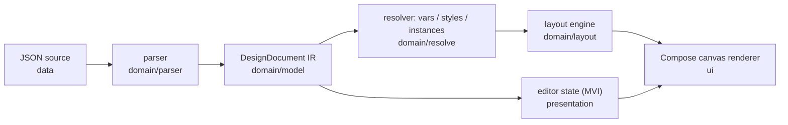

# designdoc — Figma-like JSON design engine

`designdoc` is the JSON-based successor of the YAML `ui_engine` pipeline: a strict,
standalone JSON document (Figma-подобный формат) is parsed into a typed IR,
resolved (variables, styles, component instances), laid out by a pure-Kotlin layout
engine with Figma semantics, and rendered onto a Compose canvas.

## Pipeline

## Packages (clean architecture, dependencies point inward to domain)

- `domain/model` — typed IR: `DesignDocument`, `DesignNode` (+`DesignNodeKind`
  discriminated by `type`), sizing (`fixed|hug|fill`, min/max), constraints,
  auto-layout/grid, paints/strokes/effects/corners, text, components, component
  sets, styles, variables, assets, `Bindable` (`$var` / `$prop`).
- `domain/parser` — forward-compatible JSON → IR mapper with diagnostics: unknown
  fields are ignored, unknown enum values warn and fall back.
- `domain/resolve` — `DesignResolver`: variable modes (`variableModes` per subtree)
  + alias chains (cycle-safe), shared styles, component instance expansion
  (variant sets, prop substitution, id-path overrides) → `ResolvedNode` tree.
- `domain/layout` — `DesignLayoutEngine`: pure-Kotlin Figma-semantics solver
  (auto-layout H/V with gap `auto`, wrap, padding, align/justify; grid tracks and
  placement; absolute + constraints remapping against authored parent size;
  `layoutChild.absolute`). Text measurement is injected via `DesignTextMeasurer`.
- `domain/repository` / `domain/usecase` — `DesignDocumentRepository` contract +
  `LoadDesignDocumentUseCase` / `ParseDesignDocumentUseCase`.
- `data` — bundled mission document JSON + `DefaultDesignDocumentRepository`.
- `presentation` — immutable `DesignEditorState`, `DesignEditorIntent`, pure
  `reduceDesignEditor` (selection, geometry/fill/constraints edits).
- `ui` — `DesignArtboard` composable: resolve → layout → canvas draw with zoom,
  click-to-select (instance internals collapse to the instance), selection overlay;
  `ComposeDesignTextMeasurer` bridges Compose text measurement into the engine.

## Layering rules

- `domain/*`, `data`, `presentation` stay free of Compose; Compose only in `ui`.
- The layout engine never reads platform APIs; text metrics come only through
  `DesignTextMeasurer` (tests use the deterministic `ApproximateTextMeasurer`).

## Documented rendering approximations

- Shadows draw without gaussian blur (offset translucent shape; inner shadows as a
  clipped rim); layer/background blur are ignored.
- `cornerSmoothing` (squircle) is not applied; radii clamp to half of min dimension.
- `booleanOperation` draws its children without path boolean ops.
- SVG path arcs (`A`) are unsupported; `baseline` alignment approximates to center.
- Image fills render as a flat placeholder (no asset loading yet).
- Bindings (`$var`/`$prop`) on rotation, position, size, effect radii and gradient
  stop positions are not resolved yet — the parser emits a warning diagnostic and
  falls back to the default instead of silently dropping them.
- Per-side strokes collapse multiple paint layers to one color; stroke align is not
  applied to freeform vector outlines.
- The selection overlay for rotated nodes draws the unrotated bounds (hit-testing
  does account for rotation).
