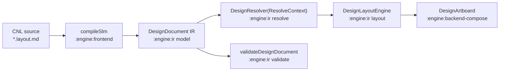

# engine — SLM design engine (frontend · ir · backend-compose)

The `engine/*` Gradle modules are the successor of the `:shared` `designdoc`
pipeline, split so that the document core stays pure Kotlin and Compose appears
only at the very edge:

- `:engine:ir` — the document core (pure Kotlin, KMP):
  - `model` — typed IR (`slm-ir/1.0`): `DesignDocument`, `DesignNode` +
    `DesignNodeKind` (frames, text with i18n content, shapes/vectors, instances,
    media, tables, slots, annotations), sizing/constraints/auto-layout/grid,
    paints/strokes/effects, masks, interactions/transitions, motion, responsive
    variants, handoff/export metadata, `Bindable` (`$var` / `$prop` / `{{data}}`).
  - `serialization` — hand-rolled forward-compatible JSON readers (+ writer,
    `parseDesignNode` for single-node escape hatches); unknown fields are
    ignored, unknown enum values warn and fall back.
  - `resolve` — `DesignResolver(document, ResolveContext)`: variables/modes,
    styles, component instances (libraries, slots, nested overrides), i18n text
    (ICU-lite), data bindings/conditions/repeat, responsive patches, RTL logical
    mapping, and lowering (media → placeholder fill, table → grid) into a
    concrete `ResolvedNode` tree.
  - `layout` — `DesignLayoutEngine`: pure-Kotlin Figma-semantics solver
    (fixed/hug/fill + min/max, auto-layout H/V with wrap/gap `auto`/baseline,
    grid tracks incl. implicit rows, absolute + constraints/anchors, content
    extents, fixed scroll children). Text metrics come only through the injected
    `DesignTextMeasurer`.
  - `validate` — `validateDesignDocument(document, context, options)`: static
    check groups (structure, layout, styles, text/i18n, components, media/assets,
    interactions, responsive, data, handoff/export) plus opt-in resolve/layout
    probes; diagnostics carry `IR-*` codes.
- `:engine:frontend` — the SLM compiler (pure Kotlin): the **primary authoring
  front-slice is CNL** — the `cnl` package parses one English sentence per node
  (see **CNL** below). The markdown/frontmatter/typed-block parsing, semantic
  extraction, normalization and slug/order resolution that turn `*.layout.md`
  sources into the IR are the **internal desugar stage** CNL sentences lower
  into — not an authoring surface.
- `:engine:backend-compose` — this renderer: `DesignArtboard` +
  `ComposeDesignTextMeasurer` + the canvas drawing pass. The only engine module
  that depends on Compose.

## Pipeline

Inside `:engine:frontend`, `compileSlm` first runs `CnlParser`, which **desugars**
each sentence/heading into the same typed patches the YAML block-readers consume;
that typed-block stage is an internal desugar step, not an author-facing layer.
`CnlEmitter` runs the reverse (IR → CNL) for write-back, migration and
round-trip tests. JSON/IR documents enter the same pipeline through `:engine:ir`
`serialization` — an internal/import mechanism, not an authoring surface.

## CNL (controlled natural language)

CNL is **THE authoring format** (`engine/frontend/.../cnl/`): English-only, one
sentence per node, at full IR parity, fully bidirectional — parse (`CnlParser`) +
deterministic emit (`CnlEmitter`, driven by the shared `CnlGrammar` descriptor
registry) + surgical write-back (`CnlWriter`). No author-facing escape hatch. An
element is authored as one sentence — e.g.
`Rectangle 120 by 15 color #00B843 radius 15 padding 10 gap 16` — and the tree is
markdown-heading nesting.

- `CnlGrammar` — the shared descriptor registry (`Descriptor(kind, keyword, order,
  render)`) that drives **BOTH** parse and deterministic emit. Single source of
  truth for phrase syntax and the canonical phrase order in a sentence.
- `CnlVocabulary` — **English-only** keyword tables (nouns → node kind, property
  keywords, enum/direction words). Nouns match only at `token[0]`; property keywords
  only mid-sentence.
- `CnlParser` — tokenizes a line (numbers, `#hex`/`$token`, `«…»`/`"…"` text,
  `( … )` groups) into a positioned `CnlElement`, and **desugars** it into the same
  `node`/`shape`/`layout`/`style`/`text` typed patches the block-readers consume —
  those YAML typed blocks are internal desugar machinery, not an authoring surface.
  Container headings (`## Panel column gap 16`) split into name + a property suffix
  via `CnlParser.parseHeading`.
- `CnlEmitter` — deterministic IR → CNL emit driven by `CnlGrammar`. Powers new-node
  write-back, whole-document YAML → CNL migration/regeneration and round-trip/fidelity
  tests. Orders each sentence's phrases by the descriptors' `order` field.
- `CnlDocumentSections` — document-scoped `#`-heading sections (`# Collection`,
  `# Styles`, `# Prototype Variables`, `# Component:`) parsed alongside element
  sentences and emitted by `CnlEmitter`.
- `CnlDiagnostics` — the dedicated CNL error catalog: every violation names the broken
  rule and how to fix it (with an example), so a generator can self-correct.
- Write-back: `edit/CnlWriter` patches a CNL-owned node in three tiers — **tier-1**
  span-replace (replace a value token in place), **tier-2** phrase-append (append a
  missing property phrase), **tier-3** whole-sentence re-emit (`CnlEmitter` regenerates
  the sentence or stable heading line from the patched node) — guarded by an
  anti-corruption **fidelity veto** (the reducer recompiles the owning source and keeps
  the edit in-memory if the source diverges from the intended node). Nodes it owns are
  recorded in `SlmEditIndex.cnlOwners`; a CNL-owned node **never** falls back to a YAML
  typed block.

CNL depends only on the frontend's markdown/blocks layers (no Compose, no `:engine`
outside `ir`). The YAML typed-block layer is an **internal desugar stage** —
`CnlParser` lowers each sentence into the same typed patches the block-readers consume;
those readers are machinery, not an authoring surface. Contract and authoring guide:
`design-book/semantic-layout-markdown-i18n.md` and `SLM-SKILL.md`.

## Layering rules

- `:engine:ir` and `:engine:frontend` are pure Kotlin — no Compose, no platform
  APIs. Anything platform-specific is injected (e.g. `DesignTextMeasurer`).
- Compose lives only in `:engine:backend-compose`; it depends on `:engine:ir`
  and never on the frontend.
- Rendering math that does not need a brush (crop windows, grid slices, hairline
  positions, mask/hit-test selection) is factored into pure functions
  (`RenderGeometry.kt`) and unit-tested headlessly; the `DrawScope` extensions
  stay a thin drawing layer.

## Renderer surface

`DesignArtboard(document, pageId, …)` resolves, lays out, and draws the first
top-level frame of a page with zoom-to-fit, click-to-select (instance internals
collapse to the instance), and a selection overlay.

- `overlayOptions: DesignOverlayOptions` — opt-in editor overlays: ruler guides
  as full-length hairlines, layout grids (columns/rows/grid, ~8% alpha fills
  honoring count/gutter/margin/alignment), and node-level annotations as
  numbered pins. All off by default; overlays never affect layout.
- `onInteraction: ((ResolvedInteraction, LayoutBox) -> Unit)?` — interaction
  preview. When provided and the tapped node (or nearest ancestor) carries an
  `onClick`/`onPress` interaction, the callback fires **instead of** selection
  for that tap; otherwise taps select as usual. With `onInteraction = null` the
  selection behavior is unchanged.

## Rendering approximations

The renderer favors a fast, dependency-free canvas pass; the following are
deliberate approximations:

- Shadows draw without gaussian blur (offset translucent shape; inner shadows as
  a clipped rim); layer/background blur are ignored.
- `cornerSmoothing` (squircle) is not applied; radii clamp to half of min dimension.
- `booleanOperation` draws its children without path boolean ops.
- SVG path arcs (`A`) are unsupported and end the parse gracefully.
- Bindings (`$var`/`$prop`) on rotation, position, size, effect radii and gradient
  stop positions are not resolved; the parser warns and falls back to defaults.
- Per-side strokes collapse multiple paint layers to one color; stroke align is
  not applied to freeform vector outlines.
- The selection overlay for rotated nodes draws the unrotated bounds
  (hit-testing does account for rotation).
- **No bitmap or video decoding.** Image fills stay a flat placeholder; a media
  node adds a notional crop window (projected from the asset's intrinsic size
  per `fillMode` + `focalPoint` — nothing is actually cropped), a subtle focal
  crosshair, and the asset id label. `Tile` draws a checker pattern; `Stretch`
  draws like `Fill` until real assets load. Video adds a play glyph and poster
  label; a `Video` paint arrives lowered to the same image placeholder.
- **Masks are shape clipping, not alpha sampling.** Alpha, vector, and luminance
  masks all clip their targets (explicit `appliesTo` ids, else following
  siblings) to the mask node's geometry — rounded-rect from box + corner radius,
  ellipse for ellipse shapes, parsed vector path when authored, else the
  bounding box. The mask node itself is not painted.
- **Baseline:** `AlignItems.Baseline` uses the real measured first baseline
  (`ComposeDesignTextMeasurer.firstBaseline`); `BaselineAlign.Last` approximates
  as first baseline + (lineCount − 1) × lineHeight.
- **Tables render as hairlines only:** 1px lines on grid track boundaries
  (derived from laid-out cell edges, centered in the gutters) plus a translucent
  tint over the first grid row as the header band. `headerRows` beyond the first
  row and per-cell alignment are not rendered.
- **Interaction preview is a callback only.** No prototype state machine,
  overlay actions, or transition/easing execution — `onInteraction` reports the
  triggering interaction and hit box, nothing more.
- Overlay data is node-level: guides/layout grids/annotations carried on
  resolved nodes are drawn; document-level handoff annotation targets are not.
