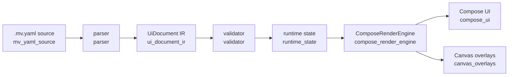

# UI Engine

`ui_engine` is the standalone visualization pipeline for agent-authored UI.
It accepts a strict `.mv.yaml` document, converts it into a typed IR, validates
the result, and renders it through Compose with Canvas overlays for editor
interactions.

## Pipeline

## Packages

- `mv_yaml_source`: bundled `.mv.yaml` sample source.
- `parser`: YAML parsing and syntax diagnostics.
- `ui_document_ir`: `UiDocument`, `UiScreen`, `UiNode`, diagnostics, and
  schema helpers.
- `validator`: semantic validation and the `loadUiDocument` pipeline.
- `runtime_state`: `UiCommand`, `UiVisualizationState`, reducer logic,
  selection behavior, input state, comments, and prompt generation.
- `compose_render_engine`: renderer contracts, registry, render context,
  tokens, and the default render engine.
- `compose_ui`: product UI shell around source, preview, scenarios, and
  inspector panes.
- `canvas_overlays`: Canvas drawing for selected bounds, comment anchors, and
  scenario links.
- `components.<component>`: one renderer provider package per Rich App Kit
  component.

## Layering Rules

- `mv_yaml_source`, `ui_document_ir`, `parser`, `validator`, and
  `runtime_state` must stay free of Compose dependencies.
- `compose_render_engine` owns rendering contracts, registry wiring, and preview
  composition.
- `compose_ui` owns application chrome and editor/inspector composition.
- `canvas_overlays` owns all Canvas overlay drawing.
- Component packages should be small, isolated providers that depend on shared
  render contracts instead of each other.
- Canvas is used for overlays only: selected bounds, hover, anchors, comments,
  and scenario links. The UI itself is rendered by Compose components.
